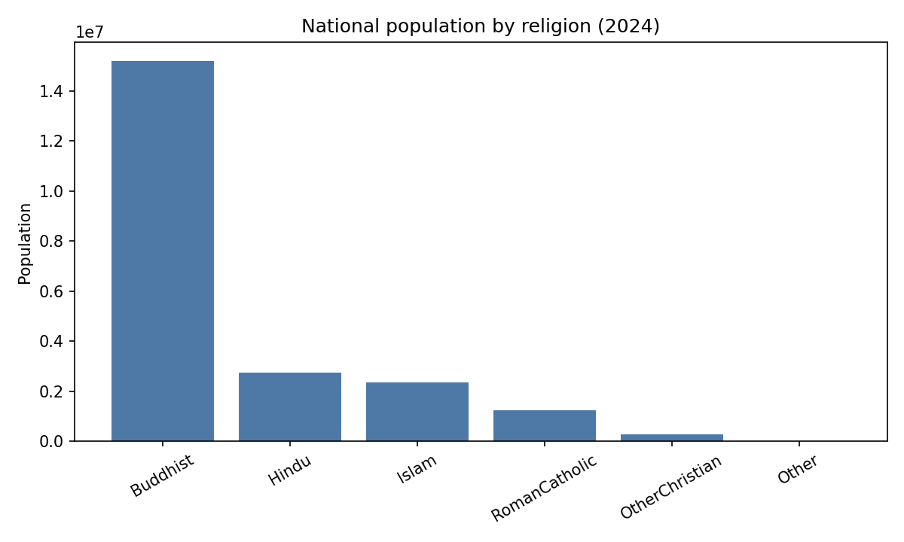
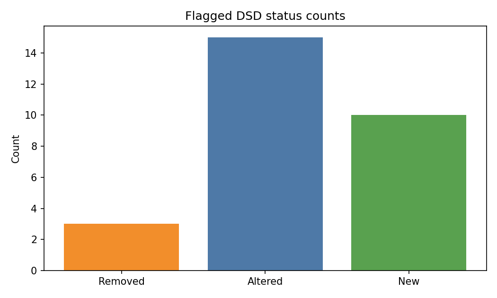
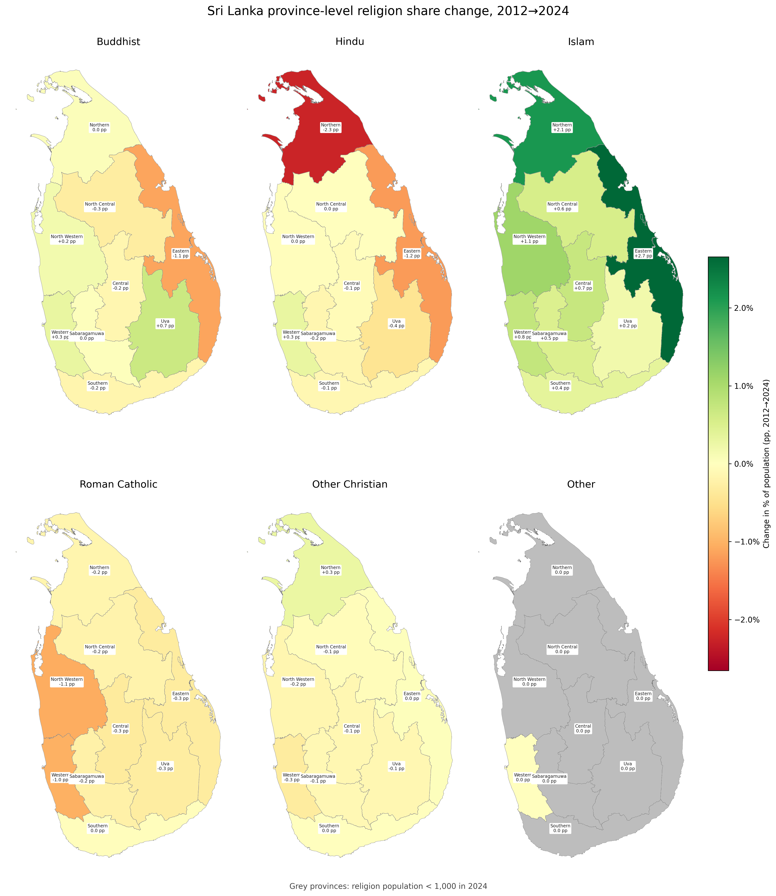

# lk_religion

Analyses of Sri Lanka's religious demographics, comparing the **2012 Census** and **2024 Census**.

Each analysis now lives in its own folder under [`analyses/`](analyses/), together with its own README, workflow script, and related data files. The sections below are copied from those child READMEs.

- [`analyses/a1_national_totals/`](analyses/a1_national_totals/)
- [`analyses/a2_by_district/`](analyses/a2_by_district/)
- [`analyses/a4_by_dsd/`](analyses/a4_by_dsd/)
- [`analyses/a6_by_province/`](analyses/a6_by_province/)
- [`analyses/a7_by_dsd/`](analyses/a7_by_dsd/)

---

## A1. National Population by Religion

| Religion | 2012 | 2024 | Change | Annual Growth | % of Population (2012) | % of Population (2024) | Change in % of Population (pp) |
|---|---:|---:|---:|---:|---:|---:|---:|
| Buddhist | 14,271,183 | 15,199,093 | +927,910 🟩 | +0.53% 🟩 | 70.1% | 69.8% | -0.3 🟥 pp |
| Hindu | 2,561,142 | 2,734,839 | +173,697 🟩 | +0.55% 🟩 | 12.6% | 12.6% | 0.0 pp |
| Islam | 1,967,008 | 2,337,379 | +370,371 🟩 | +1.45% 🟩 | 9.7% | 10.7% | +1.1 🟩 pp |
| RomanCatholic | 1,261,136 | 1,224,348 | -36,788 🟥 | -0.25% 🟥 | 6.2% | 5.6% | -0.6 🟥 pp |
| OtherChristian | 290,920 | 282,185 | -8,735 🟥 | -0.25% 🟥 | 1.4% | 1.3% | -0.1 🟥 pp |
| Other | 6,387 | 3,956 | -2,431 🟥 | -3.91% 🟥 | 0.0% | 0.0% | 0.0 pp |
| **Total** | **20,357,776** | **21,781,800** | **+1,424,024 🟩** | **+0.57% 🟩** | **100.0%** | **100.0%** | **0.0 pp** |

### Commentary

- Sri Lanka's total population grew from **20,357,776** (2012) to **21,781,800** (2024), an increase of **+1,424,024** at an annual rate of **+0.57%**.
- **Buddhism** remains the dominant religion, accounting for **69.8%** of the population in 2024, growing at **+0.53%** per year.
- **Islam** has the fastest growth rate among major religions at **+1.45%** per year, reaching a share of **10.7%** in 2024.
- **Roman Catholic** and **Other Christian** communities show slight declines over the period.

---

## A2. Religion by District: Key Trends

District labels show the **district name** and **change in share of population (pp)**. Districts are shaded by **change in share of population (pp)** from **red (decline)** to **green (growth)**. Districts with absolute share change **< 1.0pp** are shown in **white**.

Tables list only rows where absolute share change is **> 1.0pp**.

### Buddhist

| District | 2012 | 2024 | Change | % of Population (2012) | % of Population (2024) | Change in % of Population (pp) |
|---|---:|---:|---:|---:|---:|---:|
| Mannar `LK-42` | 1,809 | 382 | -1,427 🟥 | 1.8% | 0.3% | -1.5pp 🟥 |
| Ampara `LK-52` | 251,427 | 276,176 | +24,749 🟩 | 38.7% | 37.1% | -1.6pp 🟥 |
| Trincomalee `LK-53` | 99,344 | 106,919 | +7,575 🟩 | 26.2% | 24.1% | -2.0pp 🟥 |

***Trincomalee** saw the steepest share decline at **-2.0pp**. **Ampara** had the largest absolute increase (**+24,749**).*

### Hindu

| District | 2012 | 2024 | Change | % of Population (2012) | % of Population (2024) | Change in % of Population (pp) |
|---|---:|---:|---:|---:|---:|---:|
| Kilinochchi `LK-45` | 92,986 | 110,258 | +17,272 🟩 | 81.9% | 80.7% | -1.3pp 🟥 |
| Batticaloa `LK-51` | 338,882 | 374,836 | +35,954 🟩 | 64.4% | 62.9% | -1.5pp 🟥 |
| Trincomalee `LK-53` | 98,442 | 108,050 | +9,608 🟩 | 25.9% | 24.4% | -1.5pp 🟥 |
| Mullaitivu `LK-44` | 69,377 | 88,738 | +19,361 🟩 | 75.3% | 72.4% | -2.9pp 🟥 |
| Vavuniya `LK-43` | 119,400 | 114,504 | -4,896 🟥 | 69.4% | 66.5% | -2.9pp 🟥 |
| Mannar `LK-42` | 24,027 | 26,214 | +2,187 🟩 | 24.1% | 21.2% | -2.9pp 🟥 |

***Mannar** saw the steepest share decline at **-2.9pp**. **Batticaloa** had the largest absolute increase (**+35,954**).*

### Islam

| District | 2012 | 2024 | Change | % of Population (2012) | % of Population (2024) | Change in % of Population (pp) |
|---|---:|---:|---:|---:|---:|---:|
| Mannar `LK-42` | 16,512 | 33,883 | +17,371 🟩 | 16.6% | 27.4% | +10.8pp 🟩 |
| Trincomalee `LK-53` | 159,418 | 205,664 | +46,246 🟩 | 42.0% | 46.5% | +4.4pp 🟩 |
| Vavuniya `LK-43` | 11,972 | 17,775 | +5,803 🟩 | 7.0% | 10.3% | +3.4pp 🟩 |
| Ampara `LK-52` | 281,987 | 339,896 | +57,909 🟩 | 43.4% | 45.7% | +2.2pp 🟩 |
| Puttalam `LK-62` | 150,404 | 176,963 | +26,559 🟩 | 19.7% | 21.6% | +1.9pp 🟩 |
| Batticaloa `LK-51` | 134,065 | 161,494 | +27,429 🟩 | 25.5% | 27.1% | +1.6pp 🟩 |
| Kalutara `LK-13` | 114,556 | 138,230 | +23,674 🟩 | 9.4% | 10.6% | +1.2pp 🟩 |
| Kegalle `LK-92` | 61,164 | 72,616 | +11,452 🟩 | 7.3% | 8.3% | +1.1pp 🟩 |

***Mannar** gained the most share at **+10.8pp**. **Kegalle** had the smallest share gain at **+1.1pp**. **Ampara** had the largest absolute increase (**+57,909**).*

### Roman Catholic

| District | 2012 | 2024 | Change | % of Population (2012) | % of Population (2024) | Change in % of Population (pp) |
|---|---:|---:|---:|---:|---:|---:|
| Mullaitivu `LK-44` | 9,063 | 13,982 | +4,919 🟩 | 9.8% | 11.4% | +1.6pp 🟩 |
| Colombo `LK-11` | 162,260 | 139,882 | -22,378 🟥 | 7.0% | 5.9% | -1.1pp 🟥 |
| Gampaha `LK-12` | 449,398 | 442,291 | -7,107 🟥 | 19.5% | 18.2% | -1.3pp 🟥 |
| Vavuniya `LK-43` | 15,305 | 12,785 | -2,520 🟥 | 8.9% | 7.4% | -1.5pp 🟥 |
| Puttalam `LK-62` | 240,221 | 240,975 | +754 🟩 | 31.5% | 29.4% | -2.1pp 🟥 |
| Mannar `LK-42` | 52,415 | 57,713 | +5,298 🟩 | 52.6% | 46.6% | -6.0pp 🟥 |

***Mullaitivu** gained the most share at **+1.6pp**. **Mannar** saw the steepest share decline at **-6.0pp**. **Mannar** had the largest absolute increase (**+5,298**).*

### Other Christian

| District | 2012 | 2024 | Change | % of Population (2012) | % of Population (2024) | Change in % of Population (pp) |
|---|---:|---:|---:|---:|---:|---:|
| Mullaitivu `LK-44` | 3,664 | 6,315 | +2,651 🟩 | 4.0% | 5.2% | +1.2pp 🟩 |

***Mullaitivu** gained the most share at **+1.2pp**.*

### Other

| District | 2012 | 2024 | Change | % of Population (2012) | % of Population (2024) | Change in % of Population (pp) |
|---|---:|---:|---:|---:|---:|---:|

*No regions exceed the table share-change threshold.*

---

## A4. DSD Boundary Changes

Districts where the number of DSDs changed between censuses are listed below. Within those districts, DSDs whose population growth deviates from the national rate (+6.99% over 2012–2024) by more than 2× are flagged as **Altered** — their apparent demographic shifts likely reflect re-demarcation rather than genuine change.

**Districts with changed DSD boundaries:**

| District | DSDs 2012 | DSDs 2024 | Δ |
|---|---:|---:|---:|
| Nuwara Eliya `LK-23` | 5 | 10 | +5 🟩 |
| Galle `LK-31` | 19 | 22 | +3 🟩 |
| Batticaloa `LK-51` | 14 | 13 | -1 🟥 |
| Ampara `LK-52` | 20 | 19 | -1 🟥 |
| Ratnapura `LK-91` | 17 | 18 | +1 🟩 |

**New, Altered, and Removed DSDs:**

| Status | DSD | District | Pop 2012 | Pop 2024 | Pop Change |
|---|---|---|---:|---:|---:|
| Removed | LK-5224 `LK-5224` | Ampara `LK-52` | 44,632 | — | — |
| Altered | Addalaichenai `LK-5233` | Ampara `LK-52` | 41,968 | 53,214 | +26.8% 🟩 |
| Altered | Irakkamam `LK-5234` | Ampara `LK-52` | 14,383 | 17,671 | +22.9% 🟩 |
| Altered | Kalmunai `LK-5221` | Ampara `LK-52` | 29,800 | 52,798 | +77.2% 🟩 |
| Altered | Pottuvil `LK-5248` | Ampara `LK-52` | 34,809 | 42,908 | +23.3% 🟩 |
| Removed | Koralai Pattu `LK-5109` | Batticaloa `LK-51` | 23,376 | — | — |
| Removed | LK-5112 `LK-5112` | Batticaloa `LK-51` | 75,478 | — | — |
| Altered | Eravur Pattu `LK-5115` | Batticaloa `LK-51` | 24,643 | 94,237 | +282.4% 🟩 |
| New | Eravur Town `LK-5139` | Batticaloa `LK-51` | — | 26,468 | — |
| Altered | Baddegama `LK-3127` | Galle `LK-31` | 75,008 | 50,956 | -32.1% 🟥 |
| Altered | Hikkaduwa `LK-3136` | Galle `LK-31` | 101,909 | 26,216 | -74.3% 🟥 |
| New | Madampagama `LK-3138` | Galle `LK-31` | — | 33,408 | — |
| New | Rathgama `LK-3137` | Galle `LK-31` | — | 41,456 | — |
| New | Wanduramba `LK-3128` | Galle `LK-31` | — | 27,702 | — |
| Altered | Ambagamuwa Korale `LK-2315` | Nuwara Eliya `LK-23` | 205,723 | 42,538 | -79.3% 🟥 |
| Altered | Hanguranketa `LK-2306` | Nuwara Eliya `LK-23` | 88,528 | 58,931 | -33.4% 🟥 |
| Altered | Kothmale East `LK-2303` | Nuwara Eliya `LK-23` | 101,180 | 61,742 | -39.0% 🟥 |
| Altered | Nuwara Eliya `LK-2312` | Nuwara Eliya `LK-23` | 212,094 | 88,332 | -58.4% 🟥 |
| Altered | Walapane `LK-2309` | Nuwara Eliya `LK-23` | 104,119 | 65,287 | -37.3% 🟥 |
| New | Kothmale West `LK-2304` | Nuwara Eliya `LK-23` | — | 41,955 | — |
| New | Mathurata `LK-2307` | Nuwara Eliya `LK-23` | — | 33,175 | — |
| New | Nildandahinna `LK-2310` | Nuwara Eliya `LK-23` | — | 42,422 | — |
| New | Norwood `LK-2316` | Nuwara Eliya `LK-23` | — | 161,367 | — |
| New | Thalawakele `LK-2313` | Nuwara Eliya `LK-23` | — | 129,531 | — |
| Altered | Balangoda `LK-9118` | Ratnapura `LK-91` | 81,563 | 74,893 | -8.2% 🟥 |
| Altered | Eheliyagoda `LK-9103` | Ratnapura `LK-91` | 88,022 | 74,071 | -15.8% 🟥 |
| Altered | Kuruvita `LK-9106` | Ratnapura `LK-91` | 75,104 | 97,966 | +30.4% 🟩 |
| New | Kalthota `LK-9119` | Ratnapura `LK-91` | — | 13,018 | — |

---

## A6. Religion by Province: Key Trends

Province labels show the **province name** and **change in share of population (pp)**. Provinces are shaded by **change in share of population (pp)** from **red (decline)** to **green (growth)**. Provinces with absolute share change **< 1.0pp** are shown in **white**.

Tables list only rows where absolute share change is **> 1.0pp**.

### Buddhist

| Province | 2012 | 2024 | Change | % of Population (2012) | % of Population (2024) | Change in % of Population (pp) |
|---|---:|---:|---:|---:|---:|---:|
| Eastern `LK-5` | 357,052 | 389,119 | +32,067 🟩 | 23.0% | 21.8% | -1.1pp 🟥 |

***Eastern** saw the steepest share decline at **-1.1pp**.*

### Hindu

| Province | 2012 | 2024 | Change | % of Population (2012) | % of Population (2024) | Change in % of Population (pp) |
|---|---:|---:|---:|---:|---:|---:|
| Eastern `LK-5` | 540,153 | 597,472 | +57,319 🟩 | 34.7% | 33.5% | -1.2pp 🟥 |
| Northern `LK-4` | 789,045 | 829,235 | +40,190 🟩 | 74.4% | 72.1% | -2.3pp 🟥 |

***Northern** saw the steepest share decline at **-2.3pp**.*

### Islam

| Province | 2012 | 2024 | Change | % of Population (2012) | % of Population (2024) | Change in % of Population (pp) |
|---|---:|---:|---:|---:|---:|---:|
| Eastern `LK-5` | 575,470 | 707,054 | +131,584 🟩 | 37.0% | 39.7% | +2.7pp 🟩 |
| Northern `LK-4` | 33,427 | 60,683 | +27,256 🟩 | 3.1% | 5.3% | +2.1pp 🟩 |
| North Western `LK-6` | 268,214 | 320,262 | +52,048 🟩 | 11.3% | 12.4% | +1.1pp 🟩 |

***Eastern** gained the most share at **+2.7pp**. **North Western** had the smallest share gain at **+1.1pp**.*

### Roman Catholic

| Province | 2012 | 2024 | Change | % of Population (2012) | % of Population (2024) | Change in % of Population (pp) |
|---|---:|---:|---:|---:|---:|---:|
| North Western `LK-6` | 283,928 | 281,248 | -2,680 🟥 | 11.9% | 10.9% | -1.1pp 🟥 |

***North Western** saw the steepest share decline at **-1.1pp**.*

### Other Christian

| Province | 2012 | 2024 | Change | % of Population (2012) | % of Population (2024) | Change in % of Population (pp) |
|---|---:|---:|---:|---:|---:|---:|

*No regions exceed the table share-change threshold.*

### Other

| Province | 2012 | 2024 | Change | % of Population (2012) | % of Population (2024) | Change in % of Population (pp) |
|---|---:|---:|---:|---:|---:|---:|

*No regions exceed the table share-change threshold.*

---

## A7. Religion by DSD: Key Trends

DSDs are shaded by **change in share of population (pp)** from **red (decline)** to **green (growth)**. DSD labels are omitted due to map density.  DSDs with religion population **< 1,000 (2024)** are shown in **grey**.

*New, removed, and altered DSDs from A4 are excluded to avoid boundary-change artifacts.*

### Buddhist

| DSD | District | 2012 | 2024 | Change | % of Population (2012) | % of Population (2024) | Change in % of Population (pp) |
|---|---|---:|---:|---:|---:|---:|---:|
| Vavuniya North `LK-4303` | Vavuniya | 511 | 1,149 | +638 🟩 | 4.4% | 7.8% | +3.4pp 🟩 |
| Haldummulla `LK-8142` | Badulla | 19,698 | 21,455 | +1,757 🟩 | 52.4% | 55.3% | +2.9pp 🟩 |
| Kotapola `LK-3206` | Matara | 51,188 | 50,977 | -211 🟥 | 80.9% | 83.6% | +2.6pp 🟩 |
| Kalawana `LK-9133` | Ratnapura | 43,847 | 44,599 | +752 🟩 | 85.5% | 87.9% | +2.4pp 🟩 |
| Meegahakiula `LK-8109` | Badulla | 17,640 | 20,824 | +3,184 🟩 | 89.5% | 91.8% | +2.3pp 🟩 |
| Karuwalagaswewa `LK-6209` | Puttalam | 21,391 | 24,542 | +3,151 🟩 | 91.3% | 93.6% | +2.3pp 🟩 |
| Rambewa `LK-7118` | Anuradhapura | 30,904 | 34,412 | +3,508 🟩 | 84.0% | 86.3% | +2.3pp 🟩 |
| Chilaw `LK-6233` | Puttalam | 22,855 | 24,717 | +1,862 🟩 | 36.6% | 38.8% | +2.3pp 🟩 |
| Dankotuwa `LK-6248` | Puttalam | 41,674 | 43,375 | +1,701 🟩 | 66.8% | 69.0% | +2.2pp 🟩 |
| Nallur `LK-4133` | Jaffna | 273 | 1,718 | +1,445 🟩 | 0.4% | 2.4% | +2.0pp 🟩 |
| Kaduwela `LK-1109` | Colombo | 227,939 | 256,548 | +28,609 🟩 | 90.4% | 92.3% | +1.9pp 🟩 |
| Mahawewa `LK-6239` | Puttalam | 23,204 | 23,033 | -171 🟥 | 45.4% | 47.2% | +1.7pp 🟩 |
| Koralai Pattu Central `LK-5104` | Batticaloa | 67 | 569 | +502 🟩 | 0.3% | 2.0% | +1.7pp 🟩 |
| Kuchchaweli `LK-5306` | Trincomalee | 783 | 1,534 | +751 🟩 | 2.4% | 3.8% | +1.5pp 🟩 |
| Laggala `LK-2224` | Matale | 11,897 | 16,253 | +4,356 🟩 | 98.2% | 99.7% | +1.5pp 🟩 |
| Gangawata Korale `LK-2130` | Kandy | 112,495 | 110,984 | -1,511 🟥 | 70.9% | 72.4% | +1.4pp 🟩 |
| Madampe `LK-6236` | Puttalam | 34,803 | 36,282 | +1,479 🟩 | 72.6% | 74.1% | +1.4pp 🟩 |
| Kurunegala `LK-6154` | Kurunegala | 64,117 | 71,927 | +7,810 🟩 | 79.4% | 80.8% | +1.4pp 🟩 |
| Ayagama `LK-9130` | Ratnapura | 26,626 | 26,217 | -409 🟥 | 86.2% | 87.6% | +1.4pp 🟩 |
| Gampaha `LK-1224` | Gampaha | 173,095 | 182,606 | +9,511 🟩 | 87.6% | 88.8% | +1.2pp 🟩 |
| Thawalama `LK-3118` | Galle | 30,335 | 29,207 | -1,128 🟥 | 93.0% | 94.2% | +1.2pp 🟩 |
| Maharagama `LK-1121` | Colombo | 180,631 | 183,093 | +2,462 🟩 | 92.0% | 93.2% | +1.2pp 🟩 |
| Nuwaragam Palatha East `LK-7133` | Anuradhapura | 64,681 | 71,538 | +6,857 🟩 | 92.7% | 94.0% | +1.2pp 🟩 |
| Pitabaddara `LK-3203` | Matara | 47,583 | 45,984 | -1,599 🟥 | 93.0% | 94.1% | +1.1pp 🟩 |
| Nivithigala `LK-9136` | Ratnapura | 49,161 | 49,271 | +110 🟩 | 81.8% | 82.9% | +1.1pp 🟩 |
| Imbulpe `LK-9115` | Ratnapura | 50,082 | 55,075 | +4,993 🟩 | 84.2% | 85.3% | +1.1pp 🟩 |
| Katharagama `LK-8227` | Monaragala | 17,342 | 17,477 | +135 🟩 | 95.2% | 96.2% | +1.1pp 🟩 |
| Lunugamwehera `LK-3306` | Hambantota | 30,516 | 36,059 | +5,543 🟩 | 96.7% | 97.7% | +1.0pp 🟩 |
| Arachchikattuwa `LK-6230` | Puttalam | 24,853 | 26,320 | +1,467 🟩 | 60.6% | 61.6% | +1.0pp 🟩 |
| Elapatha `LK-9127` | Ratnapura | 35,614 | 36,520 | +906 🟩 | 94.1% | 95.0% | +0.9pp 🟩 |
| Palindanuwara `LK-1336` | Kalutara | 45,795 | 46,610 | +815 🟩 | 90.1% | 91.1% | +0.9pp 🟩 |
| Opanayake `LK-9121` | Ratnapura | 24,284 | 25,134 | +850 🟩 | 91.3% | 92.3% | +0.9pp 🟩 |
| Wennappuwa `LK-6245` | Puttalam | 12,278 | 12,250 | -28 🟥 | 18.0% | 18.9% | +0.9pp 🟩 |
| Manmunai South West `LK-5130` | Batticaloa | 1,039 | 1,349 | +310 🟩 | 4.2% | 5.1% | +0.9pp 🟩 |
| Nattandiya `LK-6242` | Puttalam | 28,213 | 30,286 | +2,073 🟩 | 45.4% | 46.2% | +0.8pp 🟩 |
| Jaffna `LK-4136` | Jaffna | 136 | 529 | +393 🟩 | 0.3% | 1.1% | +0.8pp 🟩 |
| Pasbagekorale `LK-2157` | Kandy | 27,943 | 31,091 | +3,148 🟩 | 46.6% | 47.4% | +0.8pp 🟩 |
| Nachchaduwa `LK-7136` | Anuradhapura | 21,801 | 24,506 | +2,705 🟩 | 85.9% | 86.7% | +0.8pp 🟩 |
| Mahara `LK-1233` | Gampaha | 176,491 | 191,215 | +14,724 🟩 | 84.9% | 85.7% | +0.8pp 🟩 |
| Uvaparanagama `LK-8127` | Badulla | 65,338 | 69,390 | +4,052 🟩 | 83.8% | 84.6% | +0.8pp 🟩 |
| Higurakgoda `LK-7203` | Polonnaruwa | 62,071 | 68,762 | +6,691 🟩 | 96.5% | 97.3% | +0.8pp 🟩 |
| Pallepola `LK-2212` | Matale | 27,223 | 29,369 | +2,146 🟩 | 92.1% | 92.9% | +0.8pp 🟩 |
| Karachchi `LK-4509` | Kilinochchi | 747 | 1,482 | +735 🟩 | 1.2% | 2.0% | +0.8pp 🟩 |
| Dodangoda `LK-1327` | Kalutara | 55,657 | 58,894 | +3,237 🟩 | 87.0% | 87.8% | +0.8pp 🟩 |
| Ampara `LK-5215` | Ampara | 42,584 | 46,871 | +4,287 🟩 | 97.2% | 97.9% | +0.8pp 🟩 |
| Kandeketiya `LK-8112` | Badulla | 21,654 | 25,458 | +3,804 🟩 | 93.8% | 94.6% | +0.8pp 🟩 |
| Sri Jayawardanapura Kotte `LK-1124` | Colombo | 83,139 | 74,848 | -8,291 🟥 | 77.1% | 77.8% | +0.7pp 🟩 |
| Bingiriya `LK-6142` | Kurunegala | 53,272 | 57,503 | +4,231 🟩 | 85.4% | 86.2% | +0.7pp 🟩 |
| Dehiattakandiya `LK-5203` | Ampara | 59,492 | 66,971 | +7,479 🟩 | 98.9% | 99.5% | +0.7pp 🟩 |
| Yakkalamulla `LK-3148` | Galle | 42,941 | 43,954 | +1,013 🟩 | 93.5% | 94.1% | +0.7pp 🟩 |
| Nawagattegama `LK-6212` | Puttalam | 14,239 | 17,390 | +3,151 🟩 | 98.3% | 99.0% | +0.7pp 🟩 |
| Soranathota `LK-8115` | Badulla | 18,082 | 19,709 | +1,627 🟩 | 80.1% | 80.8% | +0.6pp 🟩 |
| Doluwa `LK-2142` | Kandy | 36,702 | 39,190 | +2,488 🟩 | 73.6% | 74.2% | +0.6pp 🟩 |
| Kegalle `LK-9212` | Kegalle | 85,380 | 89,192 | +3,812 🟩 | 94.0% | 94.6% | +0.6pp 🟩 |
| Udubaddawa `LK-6175` | Kurunegala | 38,640 | 40,616 | +1,976 🟩 | 74.0% | 74.6% | +0.6pp 🟩 |
| Thissamaharama `LK-3309` | Hambantota | 65,858 | 71,643 | +5,785 🟩 | 96.0% | 96.6% | +0.6pp 🟩 |
| Kolonna `LK-9151` | Ratnapura | 41,370 | 45,356 | +3,986 🟩 | 90.0% | 90.6% | +0.6pp 🟩 |
| Ja Ela `LK-1221` | Gampaha | 87,772 | 90,297 | +2,525 🟩 | 43.6% | 44.1% | +0.5pp 🟩 |
| Bulathkohipitiya `LK-9224` | Kegalle | 38,623 | 37,337 | -1,286 🟥 | 82.0% | 82.5% | +0.5pp 🟩 |
| Hatharaliyadda `LK-2134` | Kandy | 27,862 | 29,096 | +1,234 🟩 | 92.9% | 93.4% | +0.5pp 🟩 |
| Dompe `LK-1230` | Gampaha | 145,586 | 161,461 | +15,875 🟩 | 94.5% | 95.0% | +0.5pp 🟩 |
| Mundel `LK-6218` | Puttalam | 10,264 | 12,452 | +2,188 🟩 | 16.7% | 17.2% | +0.5pp 🟩 |
| Anamaduwa `LK-6224` | Puttalam | 35,961 | 41,078 | +5,117 🟩 | 93.9% | 94.4% | +0.4pp 🟩 |
| Minuwangoda `LK-1215` | Gampaha | 157,739 | 176,692 | +18,953 🟩 | 88.5% | 88.9% | +0.4pp 🟩 |
| Yatinuwara `LK-2136` | Kandy | 94,149 | 100,496 | +6,347 🟩 | 88.8% | 89.2% | +0.4pp 🟩 |
| Ganga Ihala Korale `LK-2154` | Kandy | 44,364 | 47,735 | +3,371 🟩 | 80.3% | 80.7% | +0.4pp 🟩 |
| Wellawaya `LK-8221` | Monaragala | 58,180 | 71,292 | +13,112 🟩 | 96.9% | 97.3% | +0.4pp 🟩 |
| Deraniyagala `LK-9233` | Kegalle | 35,862 | 34,585 | -1,277 🟥 | 78.2% | 78.6% | +0.4pp 🟩 |
| Ambanpola `LK-6112` | Kurunegala | 22,314 | 24,990 | +2,676 🟩 | 97.5% | 97.9% | +0.4pp 🟩 |
| Pelmadulla `LK-9124` | Ratnapura | 76,321 | 80,404 | +4,083 🟩 | 85.3% | 85.7% | +0.4pp 🟩 |
| Puttalam `LK-6215` | Puttalam | 15,027 | 17,652 | +2,625 🟩 | 18.2% | 18.6% | +0.4pp 🟩 |
| Padaviya `LK-7103` | Anuradhapura | 22,724 | 24,293 | +1,569 🟩 | 98.8% | 99.2% | +0.4pp 🟩 |
| Mahakumbukkadawala `LK-6221` | Puttalam | 15,857 | 18,690 | +2,833 🟩 | 85.1% | 85.5% | +0.4pp 🟩 |
| Thalawa `LK-7148` | Anuradhapura | 56,554 | 60,125 | +3,571 🟩 | 97.9% | 98.2% | +0.4pp 🟩 |
| Dambulla `LK-2206` | Matale | 68,323 | 77,050 | +8,727 🟩 | 94.5% | 94.8% | +0.4pp 🟩 |
| Town & Gravets `LK-5315` | Trincomalee | 20,197 | 21,115 | +918 🟩 | 20.7% | 21.1% | +0.3pp 🟩 |
| Nagoda `LK-3124` | Galle | 49,306 | 47,836 | -1,470 🟥 | 91.6% | 91.9% | +0.3pp 🟩 |
| Kesbewa `LK-1136` | Colombo | 228,138 | 246,021 | +17,883 🟩 | 93.0% | 93.4% | +0.3pp 🟩 |
| Homagama `LK-1112` | Colombo | 228,829 | 270,923 | +42,094 🟩 | 96.2% | 96.5% | +0.3pp 🟩 |
| Tangalle `LK-3333` | Hambantota | 70,859 | 77,974 | +7,115 🟩 | 97.7% | 98.0% | +0.3pp 🟩 |
| Moratuwa `LK-1133` | Colombo | 114,784 | 109,743 | -5,041 🟥 | 68.2% | 68.5% | +0.3pp 🟩 |
| Kiriella `LK-9109` | Ratnapura | 34,638 | 32,480 | -2,158 🟥 | 96.3% | 96.6% | +0.3pp 🟩 |
| Elpitiya `LK-3112` | Galle | 62,688 | 64,758 | +2,070 🟩 | 96.9% | 97.1% | +0.3pp 🟩 |
| Mahaoya `LK-5209` | Ampara | 20,691 | 23,625 | +2,934 🟩 | 99.3% | 99.6% | +0.3pp 🟩 |
| Divulapitiya `LK-1209` | Gampaha | 122,905 | 133,909 | +11,004 🟩 | 85.1% | 85.3% | +0.3pp 🟩 |
| Agalawatta `LK-1333` | Kalutara | 35,475 | 35,487 | +12 🟩 | 96.7% | 97.0% | +0.2pp 🟩 |
| Nuwaragam Palatha Central `LK-7115` | Anuradhapura | 54,331 | 63,651 | +9,320 🟩 | 88.7% | 89.0% | +0.2pp 🟩 |
| Rambukkana `LK-9203` | Kegalle | 75,323 | 79,429 | +4,106 🟩 | 91.0% | 91.2% | +0.2pp 🟩 |
| Thambuththegama `LK-7145` | Anuradhapura | 41,073 | 45,654 | +4,581 🟩 | 96.8% | 97.0% | +0.2pp 🟩 |
| Padiyathalawa `LK-5206` | Ampara | 18,141 | 20,711 | +2,570 🟩 | 99.2% | 99.4% | +0.2pp 🟩 |
| Ududumbara `LK-2118` | Kandy | 20,574 | 21,119 | +545 🟩 | 91.4% | 91.6% | +0.2pp 🟩 |
| Buttala `LK-8224` | Monaragala | 52,042 | 59,547 | +7,505 🟩 | 98.0% | 98.3% | +0.2pp 🟩 |
| Padavi Sri Pura `LK-5303` | Trincomalee | 11,697 | 11,918 | +221 🟩 | 98.4% | 98.7% | +0.2pp 🟩 |
| Nochchiyagama `LK-7139` | Anuradhapura | 46,917 | 52,281 | +5,364 🟩 | 94.0% | 94.2% | +0.2pp 🟩 |
| Lahugala `LK-5251` | Ampara | 8,293 | 9,711 | +1,418 🟩 | 93.0% | 93.2% | +0.2pp 🟩 |
| Kuliyapitiya West `LK-6172` | Kurunegala | 69,513 | 74,412 | +4,899 🟩 | 89.9% | 90.1% | +0.2pp 🟩 |
| Weerabugedara `LK-6166` | Kurunegala | 33,276 | 35,523 | +2,247 🟩 | 96.9% | 97.1% | +0.2pp 🟩 |
| Dimbulagala `LK-7212` | Polonnaruwa | 76,487 | 82,634 | +6,147 🟩 | 96.0% | 96.2% | +0.2pp 🟩 |
| Nikaweratiya `LK-6121` | Kurunegala | 37,994 | 40,838 | +2,844 🟩 | 93.9% | 94.1% | +0.2pp 🟩 |
| Bentota `LK-3103` | Galle | 48,544 | 48,312 | -232 🟥 | 97.1% | 97.3% | +0.2pp 🟩 |
| Galigamuwa `LK-9215` | Kegalle | 70,040 | 69,494 | -546 🟥 | 94.0% | 94.2% | +0.2pp 🟩 |
| Weligepola `LK-9145` | Ratnapura | 30,577 | 33,774 | +3,197 🟩 | 98.7% | 98.8% | +0.2pp 🟩 |
| Millaniya `LK-1318` | Kalutara | 50,122 | 54,041 | +3,919 🟩 | 96.1% | 96.2% | +0.2pp 🟩 |
| Wariyapola `LK-6136` | Kurunegala | 59,466 | 64,464 | +4,998 🟩 | 96.8% | 97.0% | +0.1pp 🟩 |
| Rideemaliyadda `LK-8106` | Badulla | 51,351 | 60,652 | +9,301 🟩 | 99.5% | 99.6% | +0.1pp 🟩 |
| Padukka `LK-1118` | Colombo | 61,756 | 69,188 | +7,432 🟩 | 94.6% | 94.8% | +0.1pp 🟩 |
| Minipe `LK-2121` | Kandy | 51,422 | 54,927 | +3,505 🟩 | 99.1% | 99.3% | +0.1pp 🟩 |
| Mahawilachchiya `LK-7112` | Anuradhapura | 22,209 | 23,947 | +1,738 🟩 | 98.9% | 99.0% | +0.1pp 🟩 |
| Damana `LK-5242` | Ampara | 38,312 | 39,977 | +1,665 🟩 | 99.0% | 99.1% | +0.1pp 🟩 |
| Pathahewaheta `LK-2145` | Kandy | 52,105 | 54,367 | +2,262 🟩 | 89.5% | 89.7% | +0.1pp 🟩 |
| Madulla `LK-8206` | Monaragala | 31,062 | 36,280 | +5,218 🟩 | 99.4% | 99.5% | +0.1pp 🟩 |
| Beliatta `LK-3330` | Hambantota | 55,746 | 58,480 | +2,734 🟩 | 99.6% | 99.7% | +0.1pp 🟩 |
| Kalpitiya `LK-6203` | Puttalam | 5,547 | 6,329 | +782 🟩 | 6.4% | 6.5% | +0.1pp 🟩 |
| Embilipitiya `LK-9148` | Ratnapura | 134,041 | 159,374 | +25,333 🟩 | 99.5% | 99.6% | +0.1pp 🟩 |
| Sammanthurai `LK-5218` | Ampara | 392 | 539 | +147 🟩 | 0.6% | 0.7% | +0.1pp 🟩 |
| Alawwa `LK-6184` | Kurunegala | 63,075 | 65,134 | +2,059 🟩 | 99.1% | 99.2% | +0.1pp 🟩 |
| Mahiyanganaya `LK-8103` | Badulla | 73,410 | 86,376 | +12,966 🟩 | 96.9% | 97.0% | +0.1pp 🟩 |
| Madurawala `LK-1315` | Kalutara | 31,384 | 33,551 | +2,167 🟩 | 91.3% | 91.4% | +0.1pp 🟩 |
| Manmunai Pattu `LK-5127` | Batticaloa | 63 | 101 | +38 🟩 | 0.2% | 0.3% | +0.1pp 🟩 |
| Vavuniya `LK-4309` | Vavuniya | 3,084 | 3,151 | +67 🟩 | 2.6% | 2.7% | +0.1pp 🟩 |
| Polpitigama `LK-6127` | Kurunegala | 75,509 | 85,752 | +10,243 🟩 | 99.2% | 99.2% | +0.1pp 🟩 |
| Narammala `LK-6181` | Kurunegala | 51,763 | 55,045 | +3,282 🟩 | 92.0% | 92.0% | +0.1pp 🟩 |
| Vanathavilluwa `LK-6206` | Puttalam | 6,826 | 7,828 | +1,002 🟩 | 39.1% | 39.2% | +0.1pp 🟩 |
| Bibile `LK-8203` | Monaragala | 38,222 | 44,824 | +6,602 🟩 | 94.8% | 94.8% | +0.1pp 🟩 |
| Bope-Poddala `LK-3142` | Galle | 47,868 | 55,087 | +7,219 🟩 | 95.1% | 95.2% | +0.1pp 🟩 |
| Balapitiya `LK-3106` | Galle | 65,993 | 66,727 | +734 🟩 | 97.9% | 97.9% | 0.0pp |
| Kirinda Puhulwella `LK-3233` | Matara | 19,602 | 19,936 | +334 🟩 | 96.6% | 96.7% | 0.0pp |
| Sooriyawewa `LK-3303` | Hambantota | 42,959 | 52,554 | +9,595 🟩 | 99.7% | 99.7% | 0.0pp |
| Okewela `LK-3327` | Hambantota | 18,979 | 19,956 | +977 🟩 | 99.8% | 99.8% | 0.0pp |
| Matara Four Gravets `LK-3242` | Matara | 110,335 | 118,046 | +7,711 🟩 | 95.3% | 95.3% | 0.0pp |
| Walasmulla `LK-3325` | Hambantota | 42,184 | 47,778 | +5,594 🟩 | 99.8% | 99.8% | 0.0pp |
| Ehetuwewa `LK-6109` | Kurunegala | 24,958 | 27,418 | +2,460 🟩 | 96.8% | 96.8% | 0.0pp |
| Ambalangoda `LK-3133` | Galle | 56,563 | 59,209 | +2,646 🟩 | 99.3% | 99.3% | 0.0pp |
| Sainthamaruthu `LK-5225` | Ampara | 18 | 19 | +1 🟩 | 0.1% | 0.1% | 0.0pp |
| Uhana `LK-5212` | Ampara | 58,095 | 61,966 | +3,871 🟩 | 99.6% | 99.6% | 0.0pp |
| Karainagar `LK-4104` | Jaffna | 6 | 5 | -1 🟥 | 0.1% | 0.1% | 0.0pp |
| Ambanganga `LK-2221` | Matale | 11,714 | 11,887 | +173 🟩 | 74.9% | 74.9% | 0.0pp |
| Nintavur `LK-5230` | Ampara | 17 | 16 | -1 🟥 | 0.1% | 0.1% | 0.0pp |
| Sevanagala `LK-8233` | Monaragala | 41,801 | 49,252 | +7,451 🟩 | 99.8% | 99.7% | 0.0pp |
| Wilgamuwa `LK-2227` | Matale | 29,446 | 33,653 | +4,207 🟩 | 99.8% | 99.8% | 0.0pp |
| Kalutara `LK-1321` | Kalutara | 134,970 | 140,789 | +5,819 🟩 | 84.5% | 84.5% | 0.0pp |
| Thenmaradchi (Chavakachcheri) `LK-4130` | Jaffna | 153 | 145 | -8 🟥 | 0.2% | 0.2% | 0.0pp |
| Kotawehera `LK-6115` | Kurunegala | 21,090 | 23,830 | +2,740 🟩 | 99.2% | 99.2% | 0.0pp |
| Kattankudy `LK-5124` | Batticaloa | 38 | 31 | -7 🟥 | 0.1% | 0.1% | 0.0pp |
| Thanamalwila `LK-8230` | Monaragala | 26,547 | 31,070 | +4,523 🟩 | 99.5% | 99.5% | 0.0pp |
| Islands North (Kayts) `LK-4103` | Jaffna | 20 | 17 | -3 🟥 | 0.2% | 0.2% | 0.0pp |
| Katuwana `LK-3324` | Hambantota | 46,707 | 52,070 | +5,363 🟩 | 99.9% | 99.8% | -0.1pp 🟥 |
| Siyambalanduwa `LK-8212` | Monaragala | 53,861 | 62,813 | +8,952 🟩 | 99.7% | 99.6% | -0.1pp 🟥 |
| Habaraduwa `LK-3154` | Galle | 61,847 | 62,715 | +868 🟩 | 99.1% | 99.1% | -0.1pp 🟥 |
| Ambalantota `LK-3315` | Hambantota | 70,759 | 78,046 | +7,287 🟩 | 97.0% | 96.9% | -0.1pp 🟥 |
| Karaitivu `LK-5227` | Ampara | 30 | 22 | -8 🟥 | 0.2% | 0.1% | -0.1pp 🟥 |
| Koralai Pattu West `LK-5106` | Batticaloa | 22 | 6 | -16 🟥 | 0.1% | 0.0% | -0.1pp 🟥 |
| Panvila `LK-2115` | Kandy | 9,963 | 9,699 | -264 🟥 | 37.9% | 37.8% | -0.1pp 🟥 |
| Puthukkudiyiruppu `LK-4409` | Mullaitivu | 44 | 41 | -3 🟥 | 0.2% | 0.1% | -0.1pp 🟥 |
| Angunakolapelessa `LK-3318` | Hambantota | 48,243 | 53,299 | +5,056 🟩 | 99.9% | 99.8% | -0.1pp 🟥 |
| Thihagoda `LK-3236` | Matara | 33,437 | 34,176 | +739 🟩 | 99.7% | 99.6% | -0.1pp 🟥 |
| Rajanganaya `LK-7142` | Anuradhapura | 33,022 | 35,641 | +2,619 🟩 | 98.4% | 98.4% | -0.1pp 🟥 |
| Elahera `LK-7218` | Polonnaruwa | 43,714 | 48,299 | +4,585 🟩 | 99.5% | 99.5% | -0.1pp 🟥 |
| Horana `LK-1309` | Kalutara | 109,930 | 129,510 | +19,580 🟩 | 97.0% | 96.9% | -0.1pp 🟥 |
| Niyagama `LK-3115` | Galle | 35,174 | 35,315 | +141 🟩 | 98.9% | 98.8% | -0.1pp 🟥 |
| Hakmana `LK-3230` | Matara | 30,633 | 31,894 | +1,261 🟩 | 96.8% | 96.7% | -0.1pp 🟥 |
| Imaduwa `LK-3151` | Galle | 44,652 | 47,909 | +3,257 🟩 | 99.5% | 99.4% | -0.1pp 🟥 |
| Devinuwara `LK-3245` | Matara | 47,320 | 48,267 | +947 🟩 | 98.1% | 98.0% | -0.1pp 🟥 |
| Vadamaradchchi East `LK-4124` | Jaffna | 16 | 2 | -14 🟥 | 0.1% | 0.0% | -0.1pp 🟥 |
| Kahawattha `LK-9139` | Ratnapura | 33,092 | 33,355 | +263 🟩 | 76.4% | 76.3% | -0.1pp 🟥 |
| Godakawela `LK-9142` | Ratnapura | 59,074 | 60,584 | +1,510 🟩 | 77.3% | 77.1% | -0.1pp 🟥 |
| Welivitiya-Divitura `LK-3130` | Galle | 28,022 | 27,996 | -26 🟥 | 95.5% | 95.4% | -0.1pp 🟥 |
| Valikamam East (Kopay) `LK-4118` | Jaffna | 176 | 90 | -86 🟥 | 0.2% | 0.1% | -0.1pp 🟥 |
| Vadamaradchchi South-West (Karaveddy) `LK-4121` | Jaffna | 83 | 23 | -60 🟥 | 0.2% | 0.1% | -0.1pp 🟥 |
| Seethawaka `LK-1115` | Colombo | 92,746 | 99,364 | +6,618 🟩 | 81.5% | 81.4% | -0.1pp 🟥 |
| Mulatiyana `LK-3212` | Matara | 50,004 | 51,488 | +1,484 🟩 | 99.5% | 99.3% | -0.2pp 🟥 |
| Panduwasnuwara East `LK-6148` | Kurunegala | 28,711 | 30,369 | +1,658 🟩 | 95.7% | 95.5% | -0.2pp 🟥 |
| Galnewa `LK-7163` | Anuradhapura | 32,269 | 36,572 | +4,303 🟩 | 92.8% | 92.7% | -0.2pp 🟥 |
| Gomarankadawala `LK-5309` | Trincomalee | 7,341 | 8,338 | +997 🟩 | 99.4% | 99.3% | -0.2pp 🟥 |
| Valikamam West (Chankanai) `LK-4106` | Jaffna | 109 | 32 | -77 🟥 | 0.2% | 0.1% | -0.2pp 🟥 |
| Weeraketiya `LK-3321` | Hambantota | 40,714 | 47,170 | +6,456 🟩 | 98.0% | 97.8% | -0.2pp 🟥 |
| Medirigiriya `LK-7206` | Polonnaruwa | 64,078 | 70,700 | +6,622 🟩 | 97.7% | 97.5% | -0.2pp 🟥 |
| Matale `LK-2218` | Matale | 45,871 | 49,101 | +3,230 🟩 | 61.3% | 61.1% | -0.2pp 🟥 |
| Rattota `LK-2230` | Matale | 36,659 | 38,198 | +1,539 🟩 | 71.4% | 71.2% | -0.2pp 🟥 |
| Mirigama `LK-1212` | Gampaha | 153,905 | 164,914 | +11,009 🟩 | 93.5% | 93.3% | -0.2pp 🟥 |
| Malimbada `LK-3224` | Matara | 34,219 | 35,392 | +1,173 🟩 | 98.2% | 98.0% | -0.2pp 🟥 |
| Matugama `LK-1330` | Kalutara | 70,792 | 74,770 | +3,978 🟩 | 87.1% | 86.9% | -0.2pp 🟥 |
| Palugaswewa `LK-7157` | Anuradhapura | 15,251 | 17,713 | +2,462 🟩 | 97.9% | 97.7% | -0.2pp 🟥 |
| Manmunai South & Eruvil Pattu `LK-5136` | Batticaloa | 236 | 103 | -133 🟥 | 0.4% | 0.2% | -0.2pp 🟥 |
| Valikamam South West (Sandilipay) `LK-4109` | Jaffna | 137 | 16 | -121 🟥 | 0.3% | 0.0% | -0.2pp 🟥 |
| Maho `LK-6124` | Kurunegala | 53,668 | 59,715 | +6,047 🟩 | 93.4% | 93.1% | -0.2pp 🟥 |
| Verugal `LK-5333` | Trincomalee | 51 | 30 | -21 🟥 | 0.4% | 0.2% | -0.2pp 🟥 |
| Walallawita `LK-1339` | Kalutara | 52,880 | 53,425 | +545 🟩 | 96.8% | 96.6% | -0.2pp 🟥 |
| Thirappane `LK-7151` | Anuradhapura | 24,554 | 28,176 | +3,622 🟩 | 90.8% | 90.5% | -0.3pp 🟥 |
| Ratnapura `LK-9112` | Ratnapura | 93,970 | 94,405 | +435 🟩 | 78.2% | 77.9% | -0.3pp 🟥 |
| Yatiyantota `LK-9227` | Kegalle | 44,639 | 45,325 | +686 🟩 | 73.1% | 72.8% | -0.3pp 🟥 |
| Karandeniya `LK-3109` | Galle | 61,436 | 62,611 | +1,175 🟩 | 98.3% | 98.0% | -0.3pp 🟥 |
| Akkaraipattu `LK-5236` | Ampara | 173 | 76 | -97 🟥 | 0.4% | 0.2% | -0.3pp 🟥 |
| Galgamuwa `LK-6106` | Kurunegala | 50,475 | 56,429 | +5,954 🟩 | 91.6% | 91.4% | -0.3pp 🟥 |
| Kaburupitiya `LK-3227` | Matara | 40,853 | 42,577 | +1,724 🟩 | 99.7% | 99.4% | -0.3pp 🟥 |
| Koralai Pattu South `LK-5110` | Batticaloa | 123 | 54 | -69 🟥 | 0.5% | 0.2% | -0.3pp 🟥 |
| Alayadivembu `LK-5239` | Ampara | 237 | 192 | -45 🟥 | 1.1% | 0.8% | -0.3pp 🟥 |
| Gonapinuwala `LK-3134` | Galle | 21,491 | 22,922 | +1,431 🟩 | 98.8% | 98.5% | -0.3pp 🟥 |
| Aranayake `LK-9209` | Kegalle | 61,625 | 61,972 | +347 🟩 | 90.0% | 89.7% | -0.3pp 🟥 |
| Neluwa `LK-3121` | Galle | 27,132 | 26,202 | -930 🟥 | 94.7% | 94.4% | -0.3pp 🟥 |
| Tirukkovil `LK-5245` | Ampara | 119 | 47 | -72 🟥 | 0.5% | 0.2% | -0.3pp 🟥 |
| Kinniya `LK-5324` | Trincomalee | 253 | 61 | -192 🟥 | 0.4% | 0.1% | -0.3pp 🟥 |
| Yatawatta `LK-2215` | Matale | 25,085 | 26,782 | +1,697 🟩 | 82.9% | 82.6% | -0.3pp 🟥 |
| Bandarawela `LK-8133` | Badulla | 47,274 | 47,050 | -224 🟥 | 72.2% | 71.8% | -0.3pp 🟥 |
| Pannala `LK-6178` | Kurunegala | 107,649 | 117,261 | +9,612 🟩 | 86.7% | 86.3% | -0.3pp 🟥 |
| Harispattuwa `LK-2133` | Kandy | 75,442 | 80,125 | +4,683 🟩 | 85.6% | 85.2% | -0.3pp 🟥 |
| Ingiriya `LK-1310` | Kalutara | 48,168 | 51,949 | +3,781 🟩 | 89.4% | 89.0% | -0.4pp 🟥 |
| Hambantota `LK-3312` | Hambantota | 46,820 | 54,707 | +7,887 🟩 | 81.8% | 81.4% | -0.4pp 🟥 |
| Islands South (Velanai) `LK-4139` | Jaffna | 75 | 14 | -61 🟥 | 0.4% | 0.1% | -0.4pp 🟥 |
| Valikamam South (Uduvil) `LK-4115` | Jaffna | 257 | 61 | -196 🟥 | 0.5% | 0.1% | -0.4pp 🟥 |
| Muthur `LK-5327` | Trincomalee | 459 | 315 | -144 🟥 | 0.8% | 0.4% | -0.4pp 🟥 |
| Vadamaradchi North (Point Pedro) `LK-4127` | Jaffna | 256 | 68 | -188 🟥 | 0.5% | 0.2% | -0.4pp 🟥 |
| Deltota `LK-2148` | Kandy | 12,103 | 12,602 | +499 🟩 | 39.9% | 39.5% | -0.4pp 🟥 |
| Biyagama `LK-1239` | Gampaha | 161,364 | 178,329 | +16,965 🟩 | 86.5% | 86.1% | -0.4pp 🟥 |
| Giribawa `LK-6103` | Kurunegala | 28,639 | 31,704 | +3,065 🟩 | 91.2% | 90.8% | -0.4pp 🟥 |
| Bamunakotuwa `LK-6149` | Kurunegala | 34,774 | 37,709 | +2,935 🟩 | 96.0% | 95.6% | -0.4pp 🟥 |
| Galenbidunuwewa `LK-7127` | Anuradhapura | 45,433 | 50,009 | +4,576 🟩 | 96.7% | 96.3% | -0.4pp 🟥 |
| Porativu Pattu `LK-5133` | Batticaloa | 375 | 226 | -149 🟥 | 1.0% | 0.6% | -0.5pp 🟥 |
| Dehiowita `LK-9230` | Kegalle | 64,423 | 66,913 | +2,490 🟩 | 79.2% | 78.8% | -0.5pp 🟥 |
| Kandavalai `LK-4506` | Kilinochchi | 117 | 7 | -110 🟥 | 0.5% | 0.0% | -0.5pp 🟥 |
| Dikwella `LK-3248` | Matara | 51,739 | 53,168 | +1,429 🟩 | 94.6% | 94.2% | -0.5pp 🟥 |
| Koralai Pattu North `LK-5103` | Batticaloa | 244 | 166 | -78 🟥 | 1.1% | 0.7% | -0.5pp 🟥 |
| Kekirawa `LK-7154` | Anuradhapura | 46,174 | 50,581 | +4,407 🟩 | 77.9% | 77.4% | -0.5pp 🟥 |
| Welikanda `LK-7210` | Polonnaruwa | 24,924 | 27,995 | +3,071 🟩 | 73.8% | 73.3% | -0.5pp 🟥 |
| Medawachchiya `LK-7109` | Anuradhapura | 43,592 | 48,517 | +4,925 🟩 | 92.9% | 92.4% | -0.5pp 🟥 |
| Polgahawela `LK-6187` | Kurunegala | 56,492 | 58,139 | +1,647 🟩 | 86.7% | 86.2% | -0.5pp 🟥 |
| Bulathsinhala `LK-1312` | Kalutara | 54,770 | 55,217 | +447 🟩 | 84.8% | 84.2% | -0.5pp 🟥 |
| Ganewatta `LK-6133` | Kurunegala | 37,627 | 40,474 | +2,847 🟩 | 93.7% | 93.2% | -0.6pp 🟥 |
| Rasnayakapura `LK-6118` | Kurunegala | 17,320 | 19,566 | +2,246 🟩 | 79.1% | 78.5% | -0.6pp 🟥 |
| Navithanveli `LK-5216` | Ampara | 182 | 83 | -99 🟥 | 1.0% | 0.4% | -0.6pp 🟥 |
| Monaragala `LK-8215` | Monaragala | 42,571 | 48,622 | +6,051 🟩 | 86.0% | 85.4% | -0.6pp 🟥 |
| Akuressa `LK-3218` | Matara | 51,529 | 51,918 | +389 🟩 | 97.4% | 96.8% | -0.6pp 🟥 |
| Manmunai West `LK-5121` | Batticaloa | 192 | 26 | -166 🟥 | 0.7% | 0.1% | -0.6pp 🟥 |
| Badulla `LK-8121` | Badulla | 51,643 | 56,647 | +5,004 🟩 | 68.8% | 68.2% | -0.6pp 🟥 |
| Kebithigollewa `LK-7106` | Anuradhapura | 20,178 | 23,731 | +3,553 🟩 | 90.4% | 89.8% | -0.6pp 🟥 |
| Badalkumbura `LK-8218` | Monaragala | 34,324 | 39,597 | +5,273 🟩 | 85.6% | 85.0% | -0.6pp 🟥 |
| Hali-Ela `LK-8124` | Badulla | 58,154 | 59,899 | +1,745 🟩 | 64.2% | 63.6% | -0.6pp 🟥 |
| Pallama `LK-6227` | Puttalam | 16,713 | 18,924 | +2,211 🟩 | 68.4% | 67.7% | -0.6pp 🟥 |
| Maspotha `LK-6151` | Kurunegala | 31,542 | 38,268 | +6,726 🟩 | 92.1% | 91.4% | -0.7pp 🟥 |
| Medadumbara `LK-2124` | Kandy | 45,641 | 47,828 | +2,187 🟩 | 74.8% | 74.1% | -0.7pp 🟥 |
| Pasgoda `LK-3209` | Matara | 57,462 | 58,982 | +1,520 🟩 | 97.1% | 96.4% | -0.7pp 🟥 |
| Bandaragama `LK-1306` | Kalutara | 93,708 | 105,601 | +11,893 🟩 | 85.8% | 85.1% | -0.7pp 🟥 |
| Poonakary `LK-4512` | Kilinochchi | 174 | 31 | -143 🟥 | 0.9% | 0.1% | -0.7pp 🟥 |
| Galewela `LK-2203` | Matale | 56,346 | 62,683 | +6,337 🟩 | 80.4% | 79.7% | -0.7pp 🟥 |
| Akmeemana `LK-3145` | Galle | 74,622 | 82,001 | +7,379 🟩 | 95.9% | 95.2% | -0.7pp 🟥 |
| Mawathagama `LK-6160` | Kurunegala | 52,308 | 57,291 | +4,983 🟩 | 81.6% | 80.8% | -0.8pp 🟥 |
| Ruwanwella `LK-9221` | Kegalle | 55,217 | 56,321 | +1,104 🟩 | 86.4% | 85.6% | -0.8pp 🟥 |
| Athuraliya `LK-3215` | Matara | 29,842 | 30,049 | +207 🟩 | 92.4% | 91.6% | -0.8pp 🟥 |
| Palagala `LK-7166` | Anuradhapura | 28,952 | 32,444 | +3,492 🟩 | 85.1% | 84.3% | -0.8pp 🟥 |
| Welioya `LK-4418` | Mullaitivu | 6,843 | 9,894 | +3,051 🟩 | 99.1% | 98.3% | -0.8pp 🟥 |
| Thamankaduwa `LK-7215` | Polonnaruwa | 67,106 | 74,194 | +7,088 🟩 | 81.4% | 80.6% | -0.8pp 🟥 |
| Ella `LK-8136` | Badulla | 29,951 | 32,363 | +2,412 🟩 | 66.3% | 65.5% | -0.8pp 🟥 |
| Manmunai North `LK-5118` | Batticaloa | 1,293 | 625 | -668 🟥 | 1.5% | 0.7% | -0.8pp 🟥 |
| Poojapitiya `LK-2106` | Kandy | 46,318 | 47,728 | +1,410 🟩 | 80.0% | 79.1% | -0.8pp 🟥 |
| Tumpane `LK-2103` | Kandy | 34,574 | 35,275 | +701 🟩 | 91.8% | 91.0% | -0.9pp 🟥 |
| Maritimepattu `LK-4415` | Mullaitivu | 300 | 48 | -252 🟥 | 1.0% | 0.1% | -0.9pp 🟥 |
| Naula `LK-2209` | Matale | 28,843 | 28,407 | -436 🟥 | 93.4% | 92.5% | -0.9pp 🟥 |
| Delft `LK-4142` | Jaffna | 40 | 4 | -36 🟥 | 1.0% | 0.1% | -0.9pp 🟥 |
| Ibbagamuwa `LK-6130` | Kurunegala | 76,728 | 84,174 | +7,446 🟩 | 90.3% | 89.4% | -0.9pp 🟥 |
| Ipalogama `LK-7160` | Anuradhapura | 32,964 | 35,204 | +2,240 🟩 | 84.8% | 83.9% | -0.9pp 🟥 |
| Kantale `LK-5321` | Trincomalee | 37,262 | 39,988 | +2,726 🟩 | 79.6% | 78.7% | -1.0pp 🟥 |
| Warakapola `LK-9218` | Kegalle | 102,661 | 105,968 | +3,307 🟩 | 90.8% | 89.8% | -1.0pp 🟥 |
| Nanaddan `LK-4212` | Mannar | 251 | 83 | -168 🟥 | 1.4% | 0.4% | -1.0pp 🟥 |
| Passara `LK-8118` | Badulla | 27,201 | 27,171 | -30 🟥 | 55.7% | 54.7% | -1.0pp 🟥 |
| Thimbirigasyaya `LK-1127` | Colombo | 113,810 | 101,553 | -12,257 🟥 | 47.9% | 46.8% | -1.1pp 🟥 |
| Mihinthale `LK-7130` | Anuradhapura | 33,046 | 40,807 | +7,761 🟩 | 93.6% | 92.5% | -1.1pp 🟥 |
| Musali `LK-4215` | Mannar | 129 | 83 | -46 🟥 | 1.6% | 0.5% | -1.1pp 🟥 |
| Lunugala `LK-8119` | Badulla | 12,976 | 12,807 | -169 🟥 | 41.3% | 40.2% | -1.2pp 🟥 |
| Mallawapitiya `LK-6157` | Kurunegala | 41,729 | 46,464 | +4,735 🟩 | 79.3% | 78.1% | -1.2pp 🟥 |
| Negombo `LK-1203` | Gampaha | 15,732 | 13,506 | -2,226 🟥 | 11.1% | 9.8% | -1.3pp 🟥 |
| Valikamam North (Thllippalai) `LK-4112` | Jaffna | 431 | 64 | -367 🟥 | 1.5% | 0.1% | -1.3pp 🟥 |
| Weligama `LK-3239` | Matara | 65,046 | 66,983 | +1,937 🟩 | 89.3% | 88.0% | -1.3pp 🟥 |
| Kundasale `LK-2127` | Kandy | 103,484 | 115,594 | +12,110 🟩 | 81.4% | 80.1% | -1.4pp 🟥 |
| Mannar Town `LK-4203` | Mannar | 811 | 96 | -715 🟥 | 1.6% | 0.2% | -1.4pp 🟥 |
| Thunukkai `LK-4403` | Mullaitivu | 168 | 31 | -137 🟥 | 1.7% | 0.3% | -1.4pp 🟥 |
| Panduwasnuwara West `LK-6145` | Kurunegala | 55,271 | 58,481 | +3,210 🟩 | 83.6% | 82.2% | -1.4pp 🟥 |
| Medagama `LK-8209` | Monaragala | 30,810 | 37,662 | +6,852 🟩 | 85.9% | 84.4% | -1.4pp 🟥 |
| Kelaniya `LK-1236` | Gampaha | 102,634 | 97,990 | -4,644 🟥 | 74.7% | 73.3% | -1.5pp 🟥 |
| Attanagalla `LK-1227` | Gampaha | 151,786 | 164,206 | +12,420 🟩 | 84.5% | 83.0% | -1.5pp 🟥 |
| Panadura `LK-1303` | Kalutara | 143,301 | 144,521 | +1,220 🟩 | 78.6% | 77.1% | -1.5pp 🟥 |
| Rideegama `LK-6163` | Kurunegala | 75,598 | 80,308 | +4,710 🟩 | 85.2% | 83.7% | -1.5pp 🟥 |
| Udunuwara `LK-2139` | Kandy | 79,869 | 85,290 | +5,421 🟩 | 72.0% | 70.5% | -1.5pp 🟥 |
| Vavuniya South `LK-4306` | Vavuniya | 12,532 | 13,946 | +1,414 🟩 | 95.5% | 94.0% | -1.6pp 🟥 |
| Thambalagamuwa `LK-5318` | Trincomalee | 6,760 | 7,440 | +680 🟩 | 23.7% | 22.1% | -1.6pp 🟥 |
| Wattala `LK-1218` | Gampaha | 52,405 | 51,544 | -861 🟥 | 29.9% | 28.2% | -1.6pp 🟥 |
| Welimada `LK-8130` | Badulla | 71,215 | 72,755 | +1,540 🟩 | 70.6% | 69.0% | -1.7pp 🟥 |
| Ukuwela `LK-2233` | Matale | 43,744 | 45,225 | +1,481 🟩 | 64.3% | 62.5% | -1.8pp 🟥 |
| Manthai East `LK-4406` | Mullaitivu | 163 | 34 | -129 🟥 | 2.3% | 0.4% | -1.8pp 🟥 |
| Haputale `LK-8139` | Badulla | 26,212 | 24,432 | -1,780 🟥 | 52.6% | 50.6% | -2.0pp 🟥 |
| Udapalatha `LK-2151` | Kandy | 50,471 | 54,676 | +4,205 🟩 | 55.0% | 53.0% | -2.0pp 🟥 |
| Vengalacheddikulam `LK-4312` | Vavuniya | 672 | 46 | -626 🟥 | 2.2% | 0.2% | -2.1pp 🟥 |
| Pathadumbara `LK-2112` | Kandy | 65,000 | 66,522 | +1,522 🟩 | 73.3% | 71.2% | -2.1pp 🟥 |
| Kobeigane `LK-6139` | Kurunegala | 31,165 | 34,325 | +3,160 🟩 | 86.6% | 84.4% | -2.2pp 🟥 |
| Manthai West `LK-4206` | Mannar | 350 | 19 | -331 🟥 | 2.4% | 0.1% | -2.3pp 🟥 |
| Madhu `LK-4209` | Mannar | 268 | 101 | -167 🟥 | 3.5% | 1.1% | -2.4pp 🟥 |
| Morawewa `LK-5312` | Trincomalee | 5,736 | 6,393 | +657 🟩 | 72.0% | 69.5% | -2.4pp 🟥 |
| Beruwala `LK-1324` | Kalutara | 91,957 | 96,273 | +4,316 🟩 | 55.7% | 53.2% | -2.5pp 🟥 |
| Akurana `LK-2109` | Kandy | 18,739 | 19,167 | +428 🟩 | 29.6% | 27.0% | -2.6pp 🟥 |
| Welipitiya `LK-3221` | Matara | 45,531 | 47,466 | +1,935 🟩 | 87.4% | 84.8% | -2.6pp 🟥 |
| Oddusuddan `LK-4412` | Mullaitivu | 622 | 245 | -377 🟥 | 4.0% | 1.3% | -2.6pp 🟥 |
| Colombo `LK-1103` | Colombo | 61,448 | 47,726 | -13,722 🟥 | 19.0% | 16.3% | -2.7pp 🟥 |
| Pachchilaipalli `LK-4503` | Kilinochchi | 237 | 13 | -224 🟥 | 2.8% | 0.1% | -2.7pp 🟥 |
| Kuliyapitiya East `LK-6169` | Kurunegala | 36,275 | 39,425 | +3,150 🟩 | 67.1% | 64.4% | -2.7pp 🟥 |
| Mawanella `LK-9206` | Kegalle | 76,124 | 82,393 | +6,269 🟩 | 68.1% | 65.4% | -2.8pp 🟥 |
| Horowpathana `LK-7124` | Anuradhapura | 26,965 | 28,932 | +1,967 🟩 | 72.9% | 70.1% | -2.8pp 🟥 |
| Kahatagasdigiliya `LK-7121` | Anuradhapura | 31,772 | 34,073 | +2,301 🟩 | 78.8% | 75.9% | -2.9pp 🟥 |
| Katana `LK-1206` | Gampaha | 141,353 | 137,806 | -3,547 🟥 | 60.1% | 57.1% | -2.9pp 🟥 |
| Lankapura `LK-7209` | Polonnaruwa | 25,849 | 26,904 | +1,055 🟩 | 70.9% | 67.8% | -3.1pp 🟥 |
| Galle 4 Gravets `LK-3139` | Galle | 66,840 | 67,502 | +662 🟩 | 65.7% | 62.3% | -3.4pp 🟥 |
| Seruvila `LK-5330` | Trincomalee | 8,805 | 9,787 | +982 🟩 | 64.6% | 61.1% | -3.4pp 🟥 |
| Ratmalana `LK-1131` | Colombo | 66,808 | 57,385 | -9,423 🟥 | 70.0% | 65.2% | -4.8pp 🟥 |
| Kolonnawa `LK-1106` | Colombo | 123,787 | 122,559 | -1,228 🟥 | 64.6% | 57.3% | -7.3pp 🟥 |
| Dehiwala `LK-1130` | Colombo | 48,310 | 43,573 | -4,737 🟥 | 54.3% | 46.4% | -7.9pp 🟥 |

***Vavuniya North** gained the most share at **+3.4pp**. **Dehiwala** saw the steepest share decline at **-7.9pp**. **Homagama** had the largest absolute increase (**+42,094**).*

### Hindu

| DSD | District | 2012 | 2024 | Change | % of Population (2012) | % of Population (2024) | Change in % of Population (pp) |
|---|---|---:|---:|---:|---:|---:|---:|
| Koralai Pattu Central `LK-5104` | Batticaloa | 580 | 23,383 | +22,803 🟩 | 2.3% | 81.3% | +79.0pp 🟩 |
| Wattala `LK-1218` | Gampaha | 22,782 | 30,805 | +8,023 🟩 | 13.0% | 16.9% | +3.9pp 🟩 |
| Dehiwala `LK-1130` | Colombo | 10,783 | 14,406 | +3,623 🟩 | 12.1% | 15.4% | +3.2pp 🟩 |
| Morawewa `LK-5312` | Trincomalee | 833 | 1,200 | +367 🟩 | 10.5% | 13.1% | +2.6pp 🟩 |
| Vadamaradchi North (Point Pedro) `LK-4127` | Jaffna | 39,886 | 37,472 | -2,414 🟥 | 83.9% | 86.4% | +2.5pp 🟩 |
| Ratmalana `LK-1131` | Colombo | 5,739 | 7,316 | +1,577 🟩 | 6.0% | 8.3% | +2.3pp 🟩 |
| Pachchilaipalli `LK-4503` | Kilinochchi | 7,176 | 11,271 | +4,095 🟩 | 84.1% | 86.4% | +2.3pp 🟩 |
| Kelaniya `LK-1236` | Gampaha | 6,415 | 8,886 | +2,471 🟩 | 4.7% | 6.6% | +2.0pp 🟩 |
| Lunugala `LK-8119` | Badulla | 15,284 | 16,140 | +856 🟩 | 48.7% | 50.6% | +1.9pp 🟩 |
| Thimbirigasyaya `LK-1127` | Colombo | 53,469 | 52,962 | -507 🟥 | 22.5% | 24.4% | +1.9pp 🟩 |
| Colombo `LK-1103` | Colombo | 73,374 | 71,811 | -1,563 🟥 | 22.7% | 24.6% | +1.9pp 🟩 |
| Haputale `LK-8139` | Badulla | 17,312 | 17,674 | +362 🟩 | 34.8% | 36.6% | +1.8pp 🟩 |
| Passara `LK-8118` | Badulla | 17,178 | 18,256 | +1,078 🟩 | 35.2% | 36.8% | +1.6pp 🟩 |
| Kundasale `LK-2127` | Kandy | 12,216 | 16,116 | +3,900 🟩 | 9.6% | 11.2% | +1.5pp 🟩 |
| Manmunai South & Eruvil Pattu `LK-5136` | Batticaloa | 57,103 | 59,997 | +2,894 🟩 | 93.9% | 95.4% | +1.4pp 🟩 |
| Panvila `LK-2115` | Kandy | 13,720 | 13,754 | +34 🟩 | 52.2% | 53.6% | +1.4pp 🟩 |
| Monaragala `LK-8215` | Monaragala | 5,927 | 7,625 | +1,698 🟩 | 12.0% | 13.4% | +1.4pp 🟩 |
| Seethawaka `LK-1115` | Colombo | 9,690 | 12,066 | +2,376 🟩 | 8.5% | 9.9% | +1.4pp 🟩 |
| Ella `LK-8136` | Badulla | 12,338 | 14,108 | +1,770 🟩 | 27.3% | 28.5% | +1.2pp 🟩 |
| Oddusuddan `LK-4412` | Mullaitivu | 13,421 | 15,685 | +2,264 🟩 | 85.4% | 86.4% | +1.1pp 🟩 |
| Manthai East `LK-4406` | Mullaitivu | 6,351 | 6,898 | +547 🟩 | 89.2% | 90.2% | +0.9pp 🟩 |
| Valikamam South West (Sandilipay) `LK-4109` | Jaffna | 39,278 | 39,652 | +374 🟩 | 75.1% | 76.1% | +0.9pp 🟩 |
| Bulathsinhala `LK-1312` | Kalutara | 6,584 | 7,218 | +634 🟩 | 10.2% | 11.0% | +0.8pp 🟩 |
| Udapalatha `LK-2151` | Kandy | 17,909 | 20,988 | +3,079 🟩 | 19.5% | 20.3% | +0.8pp 🟩 |
| Bandarawela `LK-8133` | Badulla | 11,519 | 12,044 | +525 🟩 | 17.6% | 18.4% | +0.8pp 🟩 |
| Naula `LK-2209` | Matale | 1,390 | 1,625 | +235 🟩 | 4.5% | 5.3% | +0.8pp 🟩 |
| Hali-Ela `LK-8124` | Badulla | 26,229 | 28,031 | +1,802 🟩 | 29.0% | 29.7% | +0.8pp 🟩 |
| Dehiowita `LK-9230` | Kegalle | 10,909 | 12,066 | +1,157 🟩 | 13.4% | 14.2% | +0.8pp 🟩 |
| Madhu `LK-4209` | Mannar | 3,709 | 4,637 | +928 🟩 | 48.1% | 48.8% | +0.7pp 🟩 |
| Manmunai West `LK-5121` | Batticaloa | 27,680 | 32,137 | +4,457 🟩 | 97.2% | 97.9% | +0.7pp 🟩 |
| Katana `LK-1206` | Gampaha | 3,923 | 5,728 | +1,805 🟩 | 1.7% | 2.4% | +0.7pp 🟩 |
| Ingiriya `LK-1310` | Kalutara | 4,736 | 5,540 | +804 🟩 | 8.8% | 9.5% | +0.7pp 🟩 |
| Biyagama `LK-1239` | Gampaha | 1,565 | 3,125 | +1,560 🟩 | 0.8% | 1.5% | +0.7pp 🟩 |
| Karainagar `LK-4104` | Jaffna | 9,153 | 8,786 | -367 🟥 | 95.6% | 96.2% | +0.6pp 🟩 |
| Sri Jayawardanapura Kotte `LK-1124` | Colombo | 4,880 | 4,957 | +77 🟩 | 4.5% | 5.2% | +0.6pp 🟩 |
| Badulla `LK-8121` | Badulla | 13,496 | 15,442 | +1,946 🟩 | 18.0% | 18.6% | +0.6pp 🟩 |
| Moratuwa `LK-1133` | Colombo | 3,549 | 4,317 | +768 🟩 | 2.1% | 2.7% | +0.6pp 🟩 |
| Badalkumbura `LK-8218` | Monaragala | 3,624 | 4,483 | +859 🟩 | 9.0% | 9.6% | +0.6pp 🟩 |
| Welioya `LK-4418` | Mullaitivu | 5 | 65 | +60 🟩 | 0.1% | 0.6% | +0.6pp 🟩 |
| Valikamam South (Uduvil) `LK-4115` | Jaffna | 46,855 | 44,954 | -1,901 🟥 | 88.4% | 88.9% | +0.6pp 🟩 |
| Verugal `LK-5333` | Trincomalee | 10,858 | 13,459 | +2,601 🟩 | 95.2% | 95.7% | +0.5pp 🟩 |
| Yatawatta `LK-2215` | Matale | 2,691 | 3,055 | +364 🟩 | 8.9% | 9.4% | +0.5pp 🟩 |
| Seruvila `LK-5330` | Trincomalee | 2,260 | 2,731 | +471 🟩 | 16.6% | 17.1% | +0.5pp 🟩 |
| Mahakumbukkadawala `LK-6221` | Puttalam | 371 | 540 | +169 🟩 | 2.0% | 2.5% | +0.5pp 🟩 |
| Deltota `LK-2148` | Kandy | 10,078 | 10,738 | +660 🟩 | 33.2% | 33.7% | +0.4pp 🟩 |
| Yatiyantota `LK-9227` | Kegalle | 12,118 | 12,613 | +495 🟩 | 19.8% | 20.3% | +0.4pp 🟩 |
| Kahawattha `LK-9139` | Ratnapura | 7,650 | 7,906 | +256 🟩 | 17.7% | 18.1% | +0.4pp 🟩 |
| Vadamaradchchi South-West (Karaveddy) `LK-4121` | Jaffna | 43,870 | 39,599 | -4,271 🟥 | 95.9% | 96.3% | +0.4pp 🟩 |
| Pasgoda `LK-3209` | Matara | 1,336 | 1,629 | +293 🟩 | 2.3% | 2.7% | +0.4pp 🟩 |
| Ruwanwella `LK-9221` | Kegalle | 3,950 | 4,327 | +377 🟩 | 6.2% | 6.6% | +0.4pp 🟩 |
| Walallawita `LK-1339` | Kalutara | 1,456 | 1,686 | +230 🟩 | 2.7% | 3.0% | +0.4pp 🟩 |
| Ambanganga `LK-2221` | Matale | 3,613 | 3,726 | +113 🟩 | 23.1% | 23.5% | +0.4pp 🟩 |
| Mihinthale `LK-7130` | Anuradhapura | 84 | 266 | +182 🟩 | 0.2% | 0.6% | +0.4pp 🟩 |
| Kesbewa `LK-1136` | Colombo | 2,260 | 3,388 | +1,128 🟩 | 0.9% | 1.3% | +0.4pp 🟩 |
| Ratnapura `LK-9112` | Ratnapura | 16,888 | 17,447 | +559 🟩 | 14.0% | 14.4% | +0.4pp 🟩 |
| Alayadivembu `LK-5239` | Ampara | 19,196 | 21,312 | +2,116 🟩 | 85.5% | 85.8% | +0.3pp 🟩 |
| Bingiriya `LK-6142` | Kurunegala | 182 | 410 | +228 🟩 | 0.3% | 0.6% | +0.3pp 🟩 |
| Akuressa `LK-3218` | Matara | 1,083 | 1,269 | +186 🟩 | 2.0% | 2.4% | +0.3pp 🟩 |
| Udubaddawa `LK-6175` | Kurunegala | 223 | 402 | +179 🟩 | 0.4% | 0.7% | +0.3pp 🟩 |
| Negombo `LK-1203` | Gampaha | 8,317 | 8,471 | +154 🟩 | 5.9% | 6.1% | +0.3pp 🟩 |
| Neluwa `LK-3121` | Galle | 1,094 | 1,139 | +45 🟩 | 3.8% | 4.1% | +0.3pp 🟩 |
| Anamaduwa `LK-6224` | Puttalam | 67 | 194 | +127 🟩 | 0.2% | 0.4% | +0.3pp 🟩 |
| Tumpane `LK-2103` | Kandy | 191 | 298 | +107 🟩 | 0.5% | 0.8% | +0.3pp 🟩 |
| Imaduwa `LK-3151` | Galle | 31 | 156 | +125 🟩 | 0.1% | 0.3% | +0.3pp 🟩 |
| Homagama `LK-1112` | Colombo | 1,827 | 2,854 | +1,027 🟩 | 0.8% | 1.0% | +0.2pp 🟩 |
| Vavuniya South `LK-4306` | Vavuniya | 323 | 402 | +79 🟩 | 2.5% | 2.7% | +0.2pp 🟩 |
| Bamunakotuwa `LK-6149` | Kurunegala | 53 | 154 | +101 🟩 | 0.1% | 0.4% | +0.2pp 🟩 |
| Maharagama `LK-1121` | Colombo | 2,921 | 3,381 | +460 🟩 | 1.5% | 1.7% | +0.2pp 🟩 |
| Warakapola `LK-9218` | Kegalle | 3,065 | 3,471 | +406 🟩 | 2.7% | 2.9% | +0.2pp 🟩 |
| Maspotha `LK-6151` | Kurunegala | 349 | 521 | +172 🟩 | 1.0% | 1.2% | +0.2pp 🟩 |
| Mahara `LK-1233` | Gampaha | 1,333 | 1,911 | +578 🟩 | 0.6% | 0.9% | +0.2pp 🟩 |
| Pannala `LK-6178` | Kurunegala | 835 | 1,202 | +367 🟩 | 0.7% | 0.9% | +0.2pp 🟩 |
| Porativu Pattu `LK-5133` | Batticaloa | 35,305 | 37,730 | +2,425 🟩 | 97.5% | 97.7% | +0.2pp 🟩 |
| Manmunai North `LK-5118` | Batticaloa | 56,040 | 62,008 | +5,968 🟩 | 65.0% | 65.2% | +0.2pp 🟩 |
| Divulapitiya `LK-1209` | Gampaha | 616 | 985 | +369 🟩 | 0.4% | 0.6% | +0.2pp 🟩 |
| Matale `LK-2218` | Matale | 12,480 | 13,559 | +1,079 🟩 | 16.7% | 16.9% | +0.2pp 🟩 |
| Nattandiya `LK-6242` | Puttalam | 1,079 | 1,262 | +183 🟩 | 1.7% | 1.9% | +0.2pp 🟩 |
| Akmeemana `LK-3145` | Galle | 661 | 896 | +235 🟩 | 0.8% | 1.0% | +0.2pp 🟩 |
| Kobeigane `LK-6139` | Kurunegala | 20 | 99 | +79 🟩 | 0.1% | 0.2% | +0.2pp 🟩 |
| Kaburupitiya `LK-3227` | Matara | 24 | 104 | +80 🟩 | 0.1% | 0.2% | +0.2pp 🟩 |
| Deraniyagala `LK-9233` | Kegalle | 9,028 | 8,742 | -286 🟥 | 19.7% | 19.9% | +0.2pp 🟩 |
| Gomarankadawala `LK-5309` | Trincomalee | 26 | 45 | +19 🟩 | 0.4% | 0.5% | +0.2pp 🟩 |
| Akkaraipattu `LK-5236` | Ampara | 60 | 150 | +90 🟩 | 0.2% | 0.3% | +0.2pp 🟩 |
| Thamankaduwa `LK-7215` | Polonnaruwa | 735 | 981 | +246 🟩 | 0.9% | 1.1% | +0.2pp 🟩 |
| Polpitigama `LK-6127` | Kurunegala | 47 | 203 | +156 🟩 | 0.1% | 0.2% | +0.2pp 🟩 |
| Mahawewa `LK-6239` | Puttalam | 390 | 456 | +66 🟩 | 0.8% | 0.9% | +0.2pp 🟩 |
| Pathadumbara `LK-2112` | Kandy | 2,113 | 2,377 | +264 🟩 | 2.4% | 2.5% | +0.2pp 🟩 |
| Niyagama `LK-3115` | Galle | 283 | 341 | +58 🟩 | 0.8% | 1.0% | +0.2pp 🟩 |
| Mirigama `LK-1212` | Gampaha | 651 | 973 | +322 🟩 | 0.4% | 0.6% | +0.2pp 🟩 |
| Rideegama `LK-6163` | Kurunegala | 2,346 | 2,685 | +339 🟩 | 2.6% | 2.8% | +0.2pp 🟩 |
| Attanagalla `LK-1227` | Gampaha | 1,105 | 1,491 | +386 🟩 | 0.6% | 0.8% | +0.1pp 🟩 |
| Panduwasnuwara West `LK-6145` | Kurunegala | 230 | 346 | +116 🟩 | 0.3% | 0.5% | +0.1pp 🟩 |
| Kalutara `LK-1321` | Kalutara | 1,451 | 1,741 | +290 🟩 | 0.9% | 1.0% | +0.1pp 🟩 |
| Karandeniya `LK-3109` | Galle | 84 | 172 | +88 🟩 | 0.1% | 0.3% | +0.1pp 🟩 |
| Elahera `LK-7218` | Polonnaruwa | 35 | 102 | +67 🟩 | 0.1% | 0.2% | +0.1pp 🟩 |
| Gonapinuwala `LK-3134` | Galle | 10 | 41 | +31 🟩 | 0.0% | 0.2% | +0.1pp 🟩 |
| Pathahewaheta `LK-2145` | Kandy | 3,602 | 3,829 | +227 🟩 | 6.2% | 6.3% | +0.1pp 🟩 |
| Madampe `LK-6236` | Puttalam | 652 | 726 | +74 🟩 | 1.4% | 1.5% | +0.1pp 🟩 |
| Nikaweratiya `LK-6121` | Kurunegala | 229 | 298 | +69 🟩 | 0.6% | 0.7% | +0.1pp 🟩 |
| Buttala `LK-8224` | Monaragala | 340 | 461 | +121 🟩 | 0.6% | 0.8% | +0.1pp 🟩 |
| Kaduwela `LK-1109` | Colombo | 3,524 | 4,210 | +686 🟩 | 1.4% | 1.5% | +0.1pp 🟩 |
| Mulatiyana `LK-3212` | Matara | 238 | 304 | +66 🟩 | 0.5% | 0.6% | +0.1pp 🟩 |
| Weeraketiya `LK-3321` | Hambantota | 16 | 73 | +57 🟩 | 0.0% | 0.2% | +0.1pp 🟩 |
| Kuliyapitiya East `LK-6169` | Kurunegala | 146 | 234 | +88 🟩 | 0.3% | 0.4% | +0.1pp 🟩 |
| Ja Ela `LK-1221` | Gampaha | 4,235 | 4,533 | +298 🟩 | 2.1% | 2.2% | +0.1pp 🟩 |
| Dompe `LK-1230` | Gampaha | 514 | 754 | +240 🟩 | 0.3% | 0.4% | +0.1pp 🟩 |
| Doluwa `LK-2142` | Kandy | 9,274 | 9,879 | +605 🟩 | 18.6% | 18.7% | +0.1pp 🟩 |
| Weerabugedara `LK-6166` | Kurunegala | 66 | 110 | +44 🟩 | 0.2% | 0.3% | +0.1pp 🟩 |
| Nuwaragam Palatha Central `LK-7115` | Anuradhapura | 402 | 546 | +144 🟩 | 0.7% | 0.8% | +0.1pp 🟩 |
| Rambewa `LK-7118` | Anuradhapura | 19 | 63 | +44 🟩 | 0.1% | 0.2% | +0.1pp 🟩 |
| Rattota `LK-2230` | Matale | 11,467 | 12,036 | +569 🟩 | 22.3% | 22.4% | +0.1pp 🟩 |
| Balapitiya `LK-3106` | Galle | 77 | 149 | +72 🟩 | 0.1% | 0.2% | +0.1pp 🟩 |
| Ampara `LK-5215` | Ampara | 145 | 207 | +62 🟩 | 0.3% | 0.4% | +0.1pp 🟩 |
| Devinuwara `LK-3245` | Matara | 51 | 101 | +50 🟩 | 0.1% | 0.2% | +0.1pp 🟩 |
| Habaraduwa `LK-3154` | Galle | 55 | 118 | +63 🟩 | 0.1% | 0.2% | +0.1pp 🟩 |
| Horana `LK-1309` | Kalutara | 1,530 | 1,935 | +405 🟩 | 1.3% | 1.4% | +0.1pp 🟩 |
| Wilgamuwa `LK-2227` | Matale | 8 | 41 | +33 🟩 | 0.0% | 0.1% | +0.1pp 🟩 |
| Ganewatta `LK-6133` | Kurunegala | 64 | 109 | +45 🟩 | 0.2% | 0.3% | +0.1pp 🟩 |
| Athuraliya `LK-3215` | Matara | 514 | 552 | +38 🟩 | 1.6% | 1.7% | +0.1pp 🟩 |
| Angunakolapelessa `LK-3318` | Hambantota | 6 | 54 | +48 🟩 | 0.0% | 0.1% | +0.1pp 🟩 |
| Mahawilachchiya `LK-7112` | Anuradhapura | 6 | 27 | +21 🟩 | 0.0% | 0.1% | +0.1pp 🟩 |
| Kotawehera `LK-6115` | Kurunegala | 7 | 28 | +21 🟩 | 0.0% | 0.1% | +0.1pp 🟩 |
| Padukka `LK-1118` | Colombo | 1,237 | 1,444 | +207 🟩 | 1.9% | 2.0% | +0.1pp 🟩 |
| Galigamuwa `LK-9215` | Kegalle | 2,487 | 2,524 | +37 🟩 | 3.3% | 3.4% | +0.1pp 🟩 |
| Mahaoya `LK-5209` | Ampara | 14 | 35 | +21 🟩 | 0.1% | 0.1% | +0.1pp 🟩 |
| Medagama `LK-8209` | Monaragala | 36 | 80 | +44 🟩 | 0.1% | 0.2% | +0.1pp 🟩 |
| Medawachchiya `LK-7109` | Anuradhapura | 86 | 137 | +51 🟩 | 0.2% | 0.3% | +0.1pp 🟩 |
| Dimbulagala `LK-7212` | Polonnaruwa | 2,367 | 2,618 | +251 🟩 | 3.0% | 3.0% | +0.1pp 🟩 |
| Sooriyawewa `LK-3303` | Hambantota | 16 | 59 | +43 🟩 | 0.0% | 0.1% | +0.1pp 🟩 |
| Minuwangoda `LK-1215` | Gampaha | 662 | 884 | +222 🟩 | 0.4% | 0.4% | +0.1pp 🟩 |
| Ambanpola `LK-6112` | Kurunegala | 13 | 33 | +20 🟩 | 0.1% | 0.1% | +0.1pp 🟩 |
| Giribawa `LK-6103` | Kurunegala | 14 | 40 | +26 🟩 | 0.0% | 0.1% | +0.1pp 🟩 |
| Siyambalanduwa `LK-8212` | Monaragala | 40 | 90 | +50 🟩 | 0.1% | 0.1% | +0.1pp 🟩 |
| Madulla `LK-8206` | Monaragala | 19 | 47 | +28 🟩 | 0.1% | 0.1% | +0.1pp 🟩 |
| Ududumbara `LK-2118` | Kandy | 1,639 | 1,694 | +55 🟩 | 7.3% | 7.4% | +0.1pp 🟩 |
| Padiyathalawa `LK-5206` | Ampara | 22 | 38 | +16 🟩 | 0.1% | 0.2% | +0.1pp 🟩 |
| Thanamalwila `LK-8230` | Monaragala | 17 | 38 | +21 🟩 | 0.1% | 0.1% | +0.1pp 🟩 |
| Ibbagamuwa `LK-6130` | Kurunegala | 689 | 818 | +129 🟩 | 0.8% | 0.9% | +0.1pp 🟩 |
| Thambuththegama `LK-7145` | Anuradhapura | 17 | 46 | +29 🟩 | 0.0% | 0.1% | +0.1pp 🟩 |
| Katuwana `LK-3324` | Hambantota | 25 | 57 | +32 🟩 | 0.1% | 0.1% | +0.1pp 🟩 |
| Beruwala `LK-1324` | Kalutara | 1,286 | 1,509 | +223 🟩 | 0.8% | 0.8% | +0.1pp 🟩 |
| Bope-Poddala `LK-3142` | Galle | 410 | 503 | +93 🟩 | 0.8% | 0.9% | +0.1pp 🟩 |
| Weligama `LK-3239` | Matara | 158 | 206 | +48 🟩 | 0.2% | 0.3% | +0.1pp 🟩 |
| Thirappane `LK-7151` | Anuradhapura | 42 | 65 | +23 🟩 | 0.2% | 0.2% | +0.1pp 🟩 |
| Ehetuwewa `LK-6109` | Kurunegala | 10 | 26 | +16 🟩 | 0.0% | 0.1% | +0.1pp 🟩 |
| Galewela `LK-2203` | Matale | 875 | 1,024 | +149 🟩 | 1.2% | 1.3% | +0.1pp 🟩 |
| Kirinda Puhulwella `LK-3233` | Matara | 6 | 17 | +11 🟩 | 0.0% | 0.1% | +0.1pp 🟩 |
| Medirigiriya `LK-7206` | Polonnaruwa | 26 | 67 | +41 🟩 | 0.0% | 0.1% | +0.1pp 🟩 |
| Vadamaradchchi East `LK-4124` | Jaffna | 8,741 | 9,276 | +535 🟩 | 68.5% | 68.5% | +0.1pp 🟩 |
| Matara Four Gravets `LK-3242` | Matara | 271 | 354 | +83 🟩 | 0.2% | 0.3% | +0.1pp 🟩 |
| Gangawata Korale `LK-2130` | Kandy | 16,127 | 15,674 | -453 🟥 | 10.2% | 10.2% | +0.1pp 🟩 |
| Galenbidunuwewa `LK-7127` | Anuradhapura | 43 | 74 | +31 🟩 | 0.1% | 0.1% | +0.1pp 🟩 |
| Palugaswewa `LK-7157` | Anuradhapura | 61 | 80 | +19 🟩 | 0.4% | 0.4% | 0.0pp |
| Padavi Sri Pura `LK-5303` | Trincomalee | 8 | 14 | +6 🟩 | 0.1% | 0.1% | 0.0pp |
| Sevanagala `LK-8233` | Monaragala | 19 | 46 | +27 🟩 | 0.0% | 0.1% | 0.0pp |
| Kebithigollewa `LK-7106` | Anuradhapura | 14 | 29 | +15 🟩 | 0.1% | 0.1% | 0.0pp |
| Bandaragama `LK-1306` | Kalutara | 321 | 422 | +101 🟩 | 0.3% | 0.3% | 0.0pp |
| Rasnayakapura `LK-6118` | Kurunegala | 26 | 41 | +15 🟩 | 0.1% | 0.2% | 0.0pp |
| Harispattuwa `LK-2133` | Kandy | 1,591 | 1,739 | +148 🟩 | 1.8% | 1.8% | 0.0pp |
| Hakmana `LK-3230` | Matara | 9 | 24 | +15 🟩 | 0.0% | 0.1% | 0.0pp |
| Rajanganaya `LK-7142` | Anuradhapura | 13 | 30 | +17 🟩 | 0.0% | 0.1% | 0.0pp |
| Pasbagekorale `LK-2157` | Kandy | 19,043 | 20,863 | +1,820 🟩 | 31.8% | 31.8% | 0.0pp |
| Mawathagama `LK-6160` | Kurunegala | 2,706 | 3,024 | +318 🟩 | 4.2% | 4.3% | 0.0pp |
| Thihagoda `LK-3236` | Matara | 20 | 35 | +15 🟩 | 0.1% | 0.1% | 0.0pp |
| Walasmulla `LK-3325` | Hambantota | 15 | 36 | +21 🟩 | 0.0% | 0.1% | 0.0pp |
| Panadura `LK-1303` | Kalutara | 969 | 1,069 | +100 🟩 | 0.5% | 0.6% | 0.0pp |
| Uhana `LK-5212` | Ampara | 22 | 47 | +25 🟩 | 0.0% | 0.1% | 0.0pp |
| Bentota `LK-3103` | Galle | 88 | 105 | +17 🟩 | 0.2% | 0.2% | 0.0pp |
| Kolonnawa `LK-1106` | Colombo | 13,050 | 14,647 | +1,597 🟩 | 6.8% | 6.8% | 0.0pp |
| Horowpathana `LK-7124` | Anuradhapura | 38 | 56 | +18 🟩 | 0.1% | 0.1% | 0.0pp |
| Embilipitiya `LK-9148` | Ratnapura | 93 | 158 | +65 🟩 | 0.1% | 0.1% | 0.0pp |
| Maho `LK-6124` | Kurunegala | 234 | 279 | +45 🟩 | 0.4% | 0.4% | 0.0pp |
| Damana `LK-5242` | Ampara | 33 | 44 | +11 🟩 | 0.1% | 0.1% | 0.0pp |
| Tirukkovil `LK-5245` | Ampara | 23,952 | 27,725 | +3,773 🟩 | 94.8% | 94.8% | 0.0pp |
| Thalawa `LK-7148` | Anuradhapura | 95 | 114 | +19 🟩 | 0.2% | 0.2% | 0.0pp |
| Lankapura `LK-7209` | Polonnaruwa | 18 | 28 | +10 🟩 | 0.0% | 0.1% | 0.0pp |
| Galnewa `LK-7163` | Anuradhapura | 80 | 99 | +19 🟩 | 0.2% | 0.3% | 0.0pp |
| Welipitiya `LK-3221` | Matara | 69 | 84 | +15 🟩 | 0.1% | 0.2% | 0.0pp |
| Ambalantota `LK-3315` | Hambantota | 197 | 231 | +34 🟩 | 0.3% | 0.3% | 0.0pp |
| Kuliyapitiya West `LK-6172` | Kurunegala | 626 | 681 | +55 🟩 | 0.8% | 0.8% | 0.0pp |
| Vanathavilluwa `LK-6206` | Puttalam | 727 | 835 | +108 🟩 | 4.2% | 4.2% | 0.0pp |
| Hatharaliyadda `LK-2134` | Kandy | 448 | 469 | +21 🟩 | 1.5% | 1.5% | 0.0pp |
| Palagala `LK-7166` | Anuradhapura | 95 | 112 | +17 🟩 | 0.3% | 0.3% | 0.0pp |
| Lunugamwehera `LK-3306` | Hambantota | 35 | 45 | +10 🟩 | 0.1% | 0.1% | 0.0pp |
| Okewela `LK-3327` | Hambantota | 4 | 6 | +2 🟩 | 0.0% | 0.0% | 0.0pp |
| Bibile `LK-8203` | Monaragala | 888 | 1,045 | +157 🟩 | 2.2% | 2.2% | 0.0pp |
| Nochchiyagama `LK-7139` | Anuradhapura | 215 | 244 | +29 🟩 | 0.4% | 0.4% | 0.0pp |
| Karuwalagaswewa `LK-6209` | Puttalam | 49 | 57 | +8 🟩 | 0.2% | 0.2% | 0.0pp |
| Minipe `LK-2121` | Kandy | 32 | 38 | +6 🟩 | 0.1% | 0.1% | 0.0pp |
| Welimada `LK-8130` | Badulla | 11,383 | 11,919 | +536 🟩 | 11.3% | 11.3% | 0.0pp |
| Dikwella `LK-3248` | Matara | 68 | 72 | +4 🟩 | 0.1% | 0.1% | 0.0pp |
| Mahiyanganaya `LK-8103` | Badulla | 81 | 97 | +16 🟩 | 0.1% | 0.1% | 0.0pp |
| Wellawaya `LK-8221` | Monaragala | 413 | 505 | +92 🟩 | 0.7% | 0.7% | 0.0pp |
| Panduwasnuwara East `LK-6148` | Kurunegala | 59 | 62 | +3 🟩 | 0.2% | 0.2% | 0.0pp |
| Gampaha `LK-1224` | Gampaha | 855 | 883 | +28 🟩 | 0.4% | 0.4% | 0.0pp |
| Dehiattakandiya `LK-5203` | Ampara | 55 | 59 | +4 🟩 | 0.1% | 0.1% | 0.0pp |
| Ambalangoda `LK-3133` | Galle | 128 | 131 | +3 🟩 | 0.2% | 0.2% | 0.0pp |
| Matugama `LK-1330` | Kalutara | 6,357 | 6,725 | +368 🟩 | 7.8% | 7.8% | 0.0pp |
| Wariyapola `LK-6136` | Kurunegala | 212 | 225 | +13 🟩 | 0.3% | 0.3% | 0.0pp |
| Madurawala `LK-1315` | Kalutara | 2,669 | 2,848 | +179 🟩 | 7.8% | 7.8% | 0.0pp |
| Rideemaliyadda `LK-8106` | Badulla | 101 | 114 | +13 🟩 | 0.2% | 0.2% | 0.0pp |
| Nawagattegama `LK-6212` | Puttalam | 22 | 25 | +3 🟩 | 0.2% | 0.1% | 0.0pp |
| Mallawapitiya `LK-6157` | Kurunegala | 923 | 1,035 | +112 🟩 | 1.8% | 1.7% | 0.0pp |
| Mawanella `LK-9206` | Kegalle | 1,049 | 1,164 | +115 🟩 | 0.9% | 0.9% | 0.0pp |
| Rambukkana `LK-9203` | Kegalle | 811 | 838 | +27 🟩 | 1.0% | 1.0% | 0.0pp |
| Beliatta `LK-3330` | Hambantota | 56 | 48 | -8 🟥 | 0.1% | 0.1% | 0.0pp |
| Padaviya `LK-7103` | Anuradhapura | 14 | 9 | -5 🟥 | 0.1% | 0.0% | 0.0pp |
| Godakawela `LK-9142` | Ratnapura | 12,287 | 12,597 | +310 🟩 | 16.1% | 16.0% | 0.0pp |
| Dankotuwa `LK-6248` | Puttalam | 734 | 719 | -15 🟥 | 1.2% | 1.1% | 0.0pp |
| Alawwa `LK-6184` | Kurunegala | 120 | 101 | -19 🟥 | 0.2% | 0.2% | 0.0pp |
| Ukuwela `LK-2233` | Matale | 8,890 | 9,424 | +534 🟩 | 13.1% | 13.0% | 0.0pp |
| Kahatagasdigiliya `LK-7121` | Anuradhapura | 145 | 145 | +0 | 0.4% | 0.3% | 0.0pp |
| Millaniya `LK-1318` | Kalutara | 1,264 | 1,340 | +76 🟩 | 2.4% | 2.4% | 0.0pp |
| Polgahawela `LK-6187` | Kurunegala | 1,285 | 1,305 | +20 🟩 | 2.0% | 1.9% | 0.0pp |
| Tangalle `LK-3333` | Hambantota | 114 | 94 | -20 🟥 | 0.2% | 0.1% | 0.0pp |
| Welivitiya-Divitura `LK-3130` | Galle | 935 | 923 | -12 🟥 | 3.2% | 3.1% | 0.0pp |
| Pallama `LK-6227` | Puttalam | 243 | 264 | +21 🟩 | 1.0% | 0.9% | 0.0pp |
| Sainthamaruthu `LK-5225` | Ampara | 30 | 20 | -10 🟥 | 0.1% | 0.1% | -0.1pp 🟥 |
| Udunuwara `LK-2139` | Kandy | 2,535 | 2,695 | +160 🟩 | 2.3% | 2.2% | -0.1pp 🟥 |
| Higurakgoda `LK-7203` | Polonnaruwa | 197 | 174 | -23 🟥 | 0.3% | 0.2% | -0.1pp 🟥 |
| Malimbada `LK-3224` | Matara | 52 | 31 | -21 🟥 | 0.1% | 0.1% | -0.1pp 🟥 |
| Galgamuwa `LK-6106` | Kurunegala | 177 | 159 | -18 🟥 | 0.3% | 0.3% | -0.1pp 🟥 |
| Nachchaduwa `LK-7136` | Anuradhapura | 32 | 17 | -15 🟥 | 0.1% | 0.1% | -0.1pp 🟥 |
| Agalawatta `LK-1333` | Kalutara | 782 | 755 | -27 🟥 | 2.1% | 2.1% | -0.1pp 🟥 |
| Kattankudy `LK-5124` | Batticaloa | 50 | 23 | -27 🟥 | 0.1% | 0.1% | -0.1pp 🟥 |
| Kegalle `LK-9212` | Kegalle | 2,020 | 2,027 | +7 🟩 | 2.2% | 2.1% | -0.1pp 🟥 |
| Wennappuwa `LK-6245` | Puttalam | 789 | 698 | -91 🟥 | 1.2% | 1.1% | -0.1pp 🟥 |
| Arachchikattuwa `LK-6230` | Puttalam | 1,263 | 1,278 | +15 🟩 | 3.1% | 3.0% | -0.1pp 🟥 |
| Narammala `LK-6181` | Kurunegala | 325 | 289 | -36 🟥 | 0.6% | 0.5% | -0.1pp 🟥 |
| Valikamam West (Chankanai) `LK-4106` | Jaffna | 43,591 | 42,348 | -1,243 🟥 | 93.9% | 93.8% | -0.1pp 🟥 |
| Thissamaharama `LK-3309` | Hambantota | 300 | 252 | -48 🟥 | 0.4% | 0.3% | -0.1pp 🟥 |
| Galle 4 Gravets `LK-3139` | Galle | 724 | 661 | -63 🟥 | 0.7% | 0.6% | -0.1pp 🟥 |
| Hambantota `LK-3312` | Hambantota | 438 | 446 | +8 🟩 | 0.8% | 0.7% | -0.1pp 🟥 |
| Kekirawa `LK-7154` | Anuradhapura | 1,232 | 1,276 | +44 🟩 | 2.1% | 2.0% | -0.1pp 🟥 |
| Elpitiya `LK-3112` | Galle | 1,475 | 1,434 | -41 🟥 | 2.3% | 2.2% | -0.1pp 🟥 |
| Weligepola `LK-9145` | Ratnapura | 348 | 339 | -9 🟥 | 1.1% | 1.0% | -0.1pp 🟥 |
| Ipalogama `LK-7160` | Anuradhapura | 134 | 82 | -52 🟥 | 0.3% | 0.2% | -0.1pp 🟥 |
| Bulathkohipitiya `LK-9224` | Kegalle | 7,621 | 7,247 | -374 🟥 | 16.2% | 16.0% | -0.2pp 🟥 |
| Aranayake `LK-9209` | Kegalle | 1,292 | 1,180 | -112 🟥 | 1.9% | 1.7% | -0.2pp 🟥 |
| Nanaddan `LK-4212` | Mannar | 3,436 | 3,743 | +307 🟩 | 19.2% | 19.0% | -0.2pp 🟥 |
| Soranathota `LK-8115` | Badulla | 3,977 | 4,256 | +279 🟩 | 17.6% | 17.4% | -0.2pp 🟥 |
| Yatinuwara `LK-2136` | Kandy | 2,310 | 2,227 | -83 🟥 | 2.2% | 2.0% | -0.2pp 🟥 |
| Sammanthurai `LK-5218` | Ampara | 7,051 | 8,342 | +1,291 🟩 | 11.7% | 11.5% | -0.2pp 🟥 |
| Nuwaragam Palatha East `LK-7133` | Anuradhapura | 364 | 238 | -126 🟥 | 0.5% | 0.3% | -0.2pp 🟥 |
| Kurunegala `LK-6154` | Kurunegala | 2,500 | 2,568 | +68 🟩 | 3.1% | 2.9% | -0.2pp 🟥 |
| Dambulla `LK-2206` | Matale | 741 | 659 | -82 🟥 | 1.0% | 0.8% | -0.2pp 🟥 |
| Poojapitiya `LK-2106` | Kandy | 1,585 | 1,521 | -64 🟥 | 2.7% | 2.5% | -0.2pp 🟥 |
| Koralai Pattu West `LK-5106` | Batticaloa | 72 | 26 | -46 🟥 | 0.3% | 0.1% | -0.2pp 🟥 |
| Lahugala `LK-5251` | Ampara | 566 | 638 | +72 🟩 | 6.3% | 6.1% | -0.2pp 🟥 |
| Pelmadulla `LK-9124` | Ratnapura | 11,306 | 11,641 | +335 🟩 | 12.6% | 12.4% | -0.2pp 🟥 |
| Akurana `LK-2109` | Kandy | 3,211 | 3,430 | +219 🟩 | 5.1% | 4.8% | -0.2pp 🟥 |
| Kantale `LK-5321` | Trincomalee | 1,514 | 1,525 | +11 🟩 | 3.2% | 3.0% | -0.2pp 🟥 |
| Kandavalai `LK-4506` | Kilinochchi | 20,504 | 21,966 | +1,462 🟩 | 88.4% | 88.1% | -0.3pp 🟥 |
| Kiriella `LK-9109` | Ratnapura | 1,064 | 907 | -157 🟥 | 3.0% | 2.7% | -0.3pp 🟥 |
| Medadumbara `LK-2124` | Kandy | 9,891 | 10,271 | +380 🟩 | 16.2% | 15.9% | -0.3pp 🟥 |
| Imbulpe `LK-9115` | Ratnapura | 7,563 | 8,019 | +456 🟩 | 12.7% | 12.4% | -0.3pp 🟥 |
| Yakkalamulla `LK-3148` | Galle | 2,470 | 2,366 | -104 🟥 | 5.4% | 5.1% | -0.3pp 🟥 |
| Opanayake `LK-9121` | Ratnapura | 1,764 | 1,717 | -47 🟥 | 6.6% | 6.3% | -0.3pp 🟥 |
| Kalpitiya `LK-6203` | Puttalam | 3,955 | 4,107 | +152 🟩 | 4.6% | 4.2% | -0.3pp 🟥 |
| Nagoda `LK-3124` | Galle | 3,506 | 3,185 | -321 🟥 | 6.5% | 6.1% | -0.4pp 🟥 |
| Kandeketiya `LK-8112` | Badulla | 768 | 780 | +12 🟩 | 3.3% | 2.9% | -0.4pp 🟥 |
| Nintavur `LK-5230` | Ampara | 976 | 1,002 | +26 🟩 | 3.7% | 3.3% | -0.4pp 🟥 |
| Valikamam East (Kopay) `LK-4118` | Jaffna | 66,581 | 68,751 | +2,170 🟩 | 90.9% | 90.5% | -0.4pp 🟥 |
| Pallepola `LK-2212` | Matale | 1,071 | 996 | -75 🟥 | 3.6% | 3.1% | -0.5pp 🟥 |
| Kolonna `LK-9151` | Ratnapura | 3,986 | 4,105 | +119 🟩 | 8.7% | 8.2% | -0.5pp 🟥 |
| Elapatha `LK-9127` | Ratnapura | 1,780 | 1,594 | -186 🟥 | 4.7% | 4.1% | -0.6pp 🟥 |
| Palindanuwara `LK-1336` | Kalutara | 3,758 | 3,492 | -266 🟥 | 7.4% | 6.8% | -0.6pp 🟥 |
| Chilaw `LK-6233` | Puttalam | 4,288 | 3,981 | -307 🟥 | 6.9% | 6.3% | -0.6pp 🟥 |
| Uvaparanagama `LK-8127` | Badulla | 9,614 | 9,612 | -2 🟥 | 12.3% | 11.7% | -0.6pp 🟥 |
| Katharagama `LK-8227` | Monaragala | 674 | 554 | -120 🟥 | 3.7% | 3.1% | -0.6pp 🟥 |
| Nivithigala `LK-9136` | Ratnapura | 9,430 | 8,934 | -496 🟥 | 15.7% | 15.0% | -0.7pp 🟥 |
| Dodangoda `LK-1327` | Kalutara | 6,378 | 6,248 | -130 🟥 | 10.0% | 9.3% | -0.7pp 🟥 |
| Manmunai South West `LK-5130` | Batticaloa | 23,436 | 25,073 | +1,637 🟩 | 94.8% | 94.0% | -0.8pp 🟥 |
| Ayagama `LK-9130` | Ratnapura | 3,840 | 3,483 | -357 🟥 | 12.4% | 11.6% | -0.8pp 🟥 |
| Muthur `LK-5327` | Trincomalee | 18,687 | 23,131 | +4,444 🟩 | 33.0% | 32.2% | -0.8pp 🟥 |
| Town & Gravets `LK-5315` | Trincomalee | 47,792 | 48,282 | +490 🟩 | 49.0% | 48.2% | -0.9pp 🟥 |
| Valikamam North (Thllippalai) `LK-4112` | Jaffna | 25,325 | 38,119 | +12,794 🟩 | 85.8% | 84.9% | -0.9pp 🟥 |
| Thenmaradchi (Chavakachcheri) `LK-4130` | Jaffna | 59,949 | 62,137 | +2,188 🟩 | 92.7% | 91.7% | -1.0pp 🟥 |
| Jaffna `LK-4136` | Jaffna | 19,033 | 17,820 | -1,213 🟥 | 37.7% | 36.7% | -1.0pp 🟥 |
| Kinniya `LK-5324` | Trincomalee | 2,439 | 2,378 | -61 🟥 | 3.8% | 2.7% | -1.0pp 🟥 |
| Ganga Ihala Korale `LK-2154` | Kandy | 6,229 | 6,018 | -211 🟥 | 11.3% | 10.2% | -1.1pp 🟥 |
| Puttalam `LK-6215` | Puttalam | 4,854 | 4,446 | -408 🟥 | 5.9% | 4.7% | -1.2pp 🟥 |
| Thunukkai `LK-4403` | Mullaitivu | 8,682 | 9,188 | +506 🟩 | 89.5% | 88.3% | -1.3pp 🟥 |
| Thawalama `LK-3118` | Galle | 1,661 | 1,183 | -478 🟥 | 5.1% | 3.8% | -1.3pp 🟥 |
| Manthai West `LK-4206` | Mannar | 6,127 | 7,488 | +1,361 🟩 | 41.5% | 40.1% | -1.4pp 🟥 |
| Maritimepattu `LK-4415` | Mullaitivu | 20,709 | 25,829 | +5,120 🟩 | 71.6% | 70.2% | -1.4pp 🟥 |
| Laggala `LK-2224` | Matale | 206 | 36 | -170 🟥 | 1.7% | 0.2% | -1.5pp 🟥 |
| Koralai Pattu North `LK-5103` | Batticaloa | 17,356 | 20,144 | +2,788 🟩 | 80.6% | 79.1% | -1.5pp 🟥 |
| Navithanveli `LK-5216` | Ampara | 10,271 | 11,635 | +1,364 🟩 | 54.8% | 53.2% | -1.6pp 🟥 |
| Karachchi `LK-4509` | Kilinochchi | 51,086 | 60,727 | +9,641 🟩 | 83.1% | 81.4% | -1.7pp 🟥 |
| Pitabaddara `LK-3203` | Matara | 3,092 | 2,094 | -998 🟥 | 6.0% | 4.3% | -1.8pp 🟥 |
| Meegahakiula `LK-8109` | Badulla | 1,883 | 1,767 | -116 🟥 | 9.5% | 7.8% | -1.8pp 🟥 |
| Welikanda `LK-7210` | Polonnaruwa | 3,508 | 3,245 | -263 🟥 | 10.4% | 8.5% | -1.9pp 🟥 |
| Thambalagamuwa `LK-5318` | Trincomalee | 4,873 | 5,089 | +216 🟩 | 17.1% | 15.1% | -2.0pp 🟥 |
| Kuchchaweli `LK-5306` | Trincomalee | 9,152 | 10,196 | +1,044 🟩 | 27.6% | 25.6% | -2.0pp 🟥 |
| Musali `LK-4215` | Mannar | 354 | 419 | +65 🟩 | 4.4% | 2.3% | -2.1pp 🟥 |
| Karaitivu `LK-5227` | Ampara | 9,788 | 10,919 | +1,131 🟩 | 58.1% | 56.0% | -2.1pp 🟥 |
| Haldummulla `LK-8142` | Badulla | 16,445 | 16,140 | -305 🟥 | 43.8% | 41.6% | -2.2pp 🟥 |
| Kotapola `LK-3206` | Matara | 9,430 | 7,749 | -1,681 🟥 | 14.9% | 12.7% | -2.2pp 🟥 |
| Kalawana `LK-9133` | Ratnapura | 6,789 | 5,584 | -1,205 🟥 | 13.2% | 11.0% | -2.2pp 🟥 |
| Mundel `LK-6218` | Puttalam | 9,328 | 9,244 | -84 🟥 | 15.1% | 12.7% | -2.4pp 🟥 |
| Poonakary `LK-4512` | Kilinochchi | 14,220 | 16,294 | +2,074 🟩 | 70.0% | 67.6% | -2.5pp 🟥 |
| Vavuniya `LK-4309` | Vavuniya | 92,034 | 88,683 | -3,351 🟥 | 78.3% | 75.8% | -2.5pp 🟥 |
| Islands North (Kayts) `LK-4103` | Jaffna | 5,401 | 5,170 | -231 🟥 | 54.7% | 52.1% | -2.6pp 🟥 |
| Koralai Pattu South `LK-5110` | Batticaloa | 24,280 | 25,536 | +1,256 🟩 | 92.9% | 90.2% | -2.6pp 🟥 |
| Mannar Town `LK-4203` | Mannar | 10,401 | 9,927 | -474 🟥 | 20.4% | 17.2% | -3.2pp 🟥 |
| Islands South (Velanai) `LK-4139` | Jaffna | 12,584 | 11,846 | -738 🟥 | 75.2% | 71.4% | -3.8pp 🟥 |
| Vavuniya North `LK-4303` | Vavuniya | 10,363 | 12,616 | +2,253 🟩 | 89.9% | 85.8% | -4.2pp 🟥 |
| Nallur `LK-4133` | Jaffna | 61,569 | 62,589 | +1,020 🟩 | 90.4% | 85.9% | -4.5pp 🟥 |
| Delft `LK-4142` | Jaffna | 1,439 | 1,002 | -437 🟥 | 37.6% | 31.7% | -5.9pp 🟥 |
| Vengalacheddikulam `LK-4312` | Vavuniya | 16,680 | 12,803 | -3,877 🟥 | 55.8% | 49.7% | -6.1pp 🟥 |
| Manmunai Pattu `LK-5127` | Batticaloa | 21,350 | 23,159 | +1,809 🟩 | 69.6% | 63.4% | -6.2pp 🟥 |
| Puthukkudiyiruppu `LK-4409` | Mullaitivu | 20,209 | 31,073 | +10,864 🟩 | 84.8% | 78.6% | -6.2pp 🟥 |

***Koralai Pattu Central** gained the most share at **+79.0pp**. **Puthukkudiyiruppu** saw the steepest share decline at **-6.2pp**.*

### Islam

| DSD | District | 2012 | 2024 | Change | % of Population (2012) | % of Population (2024) | Change in % of Population (pp) |
|---|---|---:|---:|---:|---:|---:|---:|
| Musali `LK-4215` | Mannar | 4,848 | 13,581 | +8,733 🟩 | 59.7% | 74.9% | +15.1pp 🟩 |
| Vengalacheddikulam `LK-4312` | Vavuniya | 6,909 | 9,146 | +2,237 🟩 | 23.1% | 35.5% | +12.4pp 🟩 |
| Mannar Town `LK-4203` | Mannar | 9,098 | 15,373 | +6,275 🟩 | 17.8% | 26.6% | +8.8pp 🟩 |
| Kolonnawa `LK-1106` | Colombo | 44,189 | 67,100 | +22,911 🟩 | 23.1% | 31.3% | +8.3pp 🟩 |
| Dehiwala `LK-1130` | Colombo | 20,109 | 28,538 | +8,429 🟩 | 22.6% | 30.4% | +7.8pp 🟩 |
| Manmunai Pattu `LK-5127` | Batticaloa | 7,565 | 11,254 | +3,689 🟩 | 24.6% | 30.8% | +6.2pp 🟩 |
| Madhu `LK-4209` | Mannar | 559 | 1,196 | +637 🟩 | 7.2% | 12.6% | +5.3pp 🟩 |
| Ratmalana `LK-1131` | Colombo | 10,837 | 13,852 | +3,015 🟩 | 11.3% | 15.7% | +4.4pp 🟩 |
| Galle 4 Gravets `LK-3139` | Galle | 32,865 | 39,021 | +6,156 🟩 | 32.3% | 36.0% | +3.7pp 🟩 |
| Beruwala `LK-1324` | Kalutara | 57,228 | 69,141 | +11,913 🟩 | 34.7% | 38.2% | +3.5pp 🟩 |
| Nanaddan `LK-4212` | Mannar | 668 | 1,405 | +737 🟩 | 3.7% | 7.1% | +3.4pp 🟩 |
| Manthai West `LK-4206` | Mannar | 1,339 | 2,328 | +989 🟩 | 9.1% | 12.5% | +3.4pp 🟩 |
| Thambalagamuwa `LK-5318` | Trincomalee | 16,256 | 20,286 | +4,030 🟩 | 57.0% | 60.3% | +3.3pp 🟩 |
| Mundel `LK-6218` | Puttalam | 23,770 | 30,384 | +6,614 🟩 | 38.6% | 41.9% | +3.3pp 🟩 |
| Lankapura `LK-7209` | Polonnaruwa | 10,377 | 12,589 | +2,212 🟩 | 28.5% | 31.7% | +3.3pp 🟩 |
| Vavuniya `LK-4309` | Vavuniya | 5,037 | 8,612 | +3,575 🟩 | 4.3% | 7.4% | +3.1pp 🟩 |
| Akurana `LK-2109` | Kandy | 41,117 | 48,201 | +7,084 🟩 | 64.9% | 67.9% | +3.0pp 🟩 |
| Kahatagasdigiliya `LK-7121` | Anuradhapura | 8,198 | 10,466 | +2,268 🟩 | 20.3% | 23.3% | +3.0pp 🟩 |
| Negombo `LK-1203` | Gampaha | 20,374 | 23,788 | +3,414 🟩 | 14.3% | 17.2% | +2.9pp 🟩 |
| Welikanda `LK-7210` | Polonnaruwa | 4,929 | 6,663 | +1,734 🟩 | 14.6% | 17.4% | +2.8pp 🟩 |
| Horowpathana `LK-7124` | Anuradhapura | 9,829 | 12,135 | +2,306 🟩 | 26.6% | 29.4% | +2.8pp 🟩 |
| Mawanella `LK-9206` | Kegalle | 34,008 | 41,933 | +7,925 🟩 | 30.4% | 33.3% | +2.8pp 🟩 |
| Kuliyapitiya East `LK-6169` | Kurunegala | 17,087 | 21,068 | +3,981 🟩 | 31.6% | 34.4% | +2.8pp 🟩 |
| Panadura `LK-1303` | Kalutara | 26,306 | 32,306 | +6,000 🟩 | 14.4% | 17.2% | +2.8pp 🟩 |
| Welipitiya `LK-3221` | Matara | 6,339 | 8,220 | +1,881 🟩 | 12.2% | 14.7% | +2.5pp 🟩 |
| Jaffna `LK-4136` | Jaffna | 1,732 | 2,881 | +1,149 🟩 | 3.4% | 5.9% | +2.5pp 🟩 |
| Pallama `LK-6227` | Puttalam | 3,977 | 5,235 | +1,258 🟩 | 16.3% | 18.7% | +2.5pp 🟩 |
| Seruvila `LK-5330` | Trincomalee | 2,430 | 3,234 | +804 🟩 | 17.8% | 20.2% | +2.4pp 🟩 |
| Puttalam `LK-6215` | Puttalam | 52,934 | 63,101 | +10,167 🟩 | 64.2% | 66.6% | +2.4pp 🟩 |
| Karaitivu `LK-5227` | Ampara | 6,760 | 8,285 | +1,525 🟩 | 40.1% | 42.5% | +2.4pp 🟩 |
| Kobeigane `LK-6139` | Kurunegala | 3,862 | 5,322 | +1,460 🟩 | 10.7% | 13.1% | +2.4pp 🟩 |
| Maritimepattu `LK-4415` | Mullaitivu | 1,766 | 3,092 | +1,326 🟩 | 6.1% | 8.4% | +2.3pp 🟩 |
| Navithanveli `LK-5216` | Ampara | 6,402 | 7,967 | +1,565 🟩 | 34.2% | 36.5% | +2.3pp 🟩 |
| Pathadumbara `LK-2112` | Kandy | 20,239 | 23,313 | +3,074 🟩 | 22.8% | 24.9% | +2.1pp 🟩 |
| Attanagalla `LK-1227` | Gampaha | 22,303 | 28,406 | +6,103 🟩 | 12.4% | 14.4% | +1.9pp 🟩 |
| Ukuwela `LK-2233` | Matale | 14,180 | 16,475 | +2,295 🟩 | 20.8% | 22.8% | +1.9pp 🟩 |
| Panduwasnuwara West `LK-6145` | Kurunegala | 8,452 | 10,464 | +2,012 🟩 | 12.8% | 14.7% | +1.9pp 🟩 |
| Welimada `LK-8130` | Badulla | 16,921 | 19,720 | +2,799 🟩 | 16.8% | 18.7% | +1.9pp 🟩 |
| Udunuwara `LK-2139` | Kandy | 27,186 | 31,951 | +4,765 🟩 | 24.5% | 26.4% | +1.9pp 🟩 |
| Mallawapitiya `LK-6157` | Kurunegala | 7,924 | 10,018 | +2,094 🟩 | 15.1% | 16.8% | +1.8pp 🟩 |
| Udapalatha `LK-2151` | Kandy | 20,784 | 25,206 | +4,422 🟩 | 22.7% | 24.4% | +1.8pp 🟩 |
| Town & Gravets `LK-5315` | Trincomalee | 13,501 | 15,605 | +2,104 🟩 | 13.8% | 15.6% | +1.7pp 🟩 |
| Kuchchaweli `LK-5306` | Trincomalee | 21,308 | 26,239 | +4,931 🟩 | 64.1% | 65.8% | +1.7pp 🟩 |
| Kelaniya `LK-1236` | Gampaha | 12,439 | 14,312 | +1,873 🟩 | 9.1% | 10.7% | +1.6pp 🟩 |
| Rideegama `LK-6163` | Kurunegala | 10,022 | 12,391 | +2,369 🟩 | 11.3% | 12.9% | +1.6pp 🟩 |
| Muthur `LK-5327` | Trincomalee | 35,088 | 45,658 | +10,570 🟩 | 62.0% | 63.5% | +1.5pp 🟩 |
| Medagama `LK-8209` | Monaragala | 4,939 | 6,827 | +1,888 🟩 | 13.8% | 15.3% | +1.5pp 🟩 |
| Nattandiya `LK-6242` | Puttalam | 6,609 | 7,939 | +1,330 🟩 | 10.6% | 12.1% | +1.5pp 🟩 |
| Poonakary `LK-4512` | Kilinochchi | 469 | 909 | +440 🟩 | 2.3% | 3.8% | +1.5pp 🟩 |
| Manmunai North `LK-5118` | Batticaloa | 4,585 | 6,424 | +1,839 🟩 | 5.3% | 6.8% | +1.4pp 🟩 |
| Kantale `LK-5321` | Trincomalee | 7,633 | 9,020 | +1,387 🟩 | 16.3% | 17.7% | +1.4pp 🟩 |
| Kinniya `LK-5324` | Trincomalee | 61,880 | 84,032 | +22,152 🟩 | 95.8% | 97.1% | +1.4pp 🟩 |
| Colombo `LK-1103` | Colombo | 135,000 | 125,890 | -9,110 🟥 | 41.8% | 43.1% | +1.3pp 🟩 |
| Ganga Ihala Korale `LK-2154` | Kandy | 3,779 | 4,795 | +1,016 🟩 | 6.8% | 8.1% | +1.3pp 🟩 |
| Haputale `LK-8139` | Badulla | 3,665 | 4,165 | +500 🟩 | 7.4% | 8.6% | +1.3pp 🟩 |
| Poojapitiya `LK-2106` | Kandy | 9,571 | 10,718 | +1,147 🟩 | 16.5% | 17.8% | +1.2pp 🟩 |
| Weligama `LK-3239` | Matara | 7,379 | 8,652 | +1,273 🟩 | 10.1% | 11.4% | +1.2pp 🟩 |
| Mawathagama `LK-6160` | Kurunegala | 7,199 | 8,803 | +1,604 🟩 | 11.2% | 12.4% | +1.2pp 🟩 |
| Udubaddawa `LK-6175` | Kurunegala | 5,412 | 6,270 | +858 🟩 | 10.4% | 11.5% | +1.2pp 🟩 |
| Wattala `LK-1218` | Gampaha | 11,407 | 13,918 | +2,511 🟩 | 6.5% | 7.6% | +1.1pp 🟩 |
| Pannala `LK-6178` | Kurunegala | 7,205 | 9,398 | +2,193 🟩 | 5.8% | 6.9% | +1.1pp 🟩 |
| Koralai Pattu North `LK-5103` | Batticaloa | 699 | 1,095 | +396 🟩 | 3.2% | 4.3% | +1.1pp 🟩 |
| Thimbirigasyaya `LK-1127` | Colombo | 41,447 | 40,132 | -1,315 🟥 | 17.4% | 18.5% | +1.1pp 🟩 |
| Thamankaduwa `LK-7215` | Polonnaruwa | 13,210 | 15,680 | +2,470 🟩 | 16.0% | 17.0% | +1.0pp 🟩 |
| Palagala `LK-7166` | Anuradhapura | 4,797 | 5,804 | +1,007 🟩 | 14.1% | 15.1% | +1.0pp 🟩 |
| Warakapola `LK-9218` | Kegalle | 6,326 | 7,750 | +1,424 🟩 | 5.6% | 6.6% | +1.0pp 🟩 |
| Medadumbara `LK-2124` | Kandy | 4,008 | 4,863 | +855 🟩 | 6.6% | 7.5% | +1.0pp 🟩 |
| Biyagama `LK-1239` | Gampaha | 13,030 | 16,468 | +3,438 🟩 | 7.0% | 7.9% | +1.0pp 🟩 |
| Bandaragama `LK-1306` | Kalutara | 12,252 | 15,120 | +2,868 🟩 | 11.2% | 12.2% | +1.0pp 🟩 |
| Galewela `LK-2203` | Matale | 9,325 | 11,221 | +1,896 🟩 | 13.3% | 14.3% | +1.0pp 🟩 |
| Ibbagamuwa `LK-6130` | Kurunegala | 6,551 | 8,137 | +1,586 🟩 | 7.7% | 8.6% | +0.9pp 🟩 |
| Kekirawa `LK-7154` | Anuradhapura | 11,044 | 12,767 | +1,723 🟩 | 18.6% | 19.5% | +0.9pp 🟩 |
| Ipalogama `LK-7160` | Anuradhapura | 5,421 | 6,222 | +801 🟩 | 13.9% | 14.8% | +0.9pp 🟩 |
| Polgahawela `LK-6187` | Kurunegala | 6,013 | 6,780 | +767 🟩 | 9.2% | 10.0% | +0.8pp 🟩 |
| Kalutara `LK-1321` | Kalutara | 12,530 | 14,397 | +1,867 🟩 | 7.8% | 8.6% | +0.8pp 🟩 |
| Tumpane `LK-2103` | Kandy | 2,610 | 2,989 | +379 🟩 | 6.9% | 7.7% | +0.8pp 🟩 |
| Ganewatta `LK-6133` | Kurunegala | 1,948 | 2,441 | +493 🟩 | 4.9% | 5.6% | +0.8pp 🟩 |
| Rasnayakapura `LK-6118` | Kurunegala | 4,138 | 4,898 | +760 🟩 | 18.9% | 19.7% | +0.8pp 🟩 |
| Maspotha `LK-6151` | Kurunegala | 889 | 1,388 | +499 🟩 | 2.6% | 3.3% | +0.7pp 🟩 |
| Giribawa `LK-6103` | Kurunegala | 2,500 | 3,027 | +527 🟩 | 8.0% | 8.7% | +0.7pp 🟩 |
| Nallur `LK-4133` | Jaffna | 91 | 579 | +488 🟩 | 0.1% | 0.8% | +0.7pp 🟩 |
| Ratnapura `LK-9112` | Ratnapura | 6,325 | 7,169 | +844 🟩 | 5.3% | 5.9% | +0.7pp 🟩 |
| Ruwanwella `LK-9221` | Kegalle | 3,806 | 4,325 | +519 🟩 | 6.0% | 6.6% | +0.6pp 🟩 |
| Kebithigollewa `LK-7106` | Anuradhapura | 2,086 | 2,631 | +545 🟩 | 9.3% | 10.0% | +0.6pp 🟩 |
| Morawewa `LK-5312` | Trincomalee | 1,306 | 1,561 | +255 🟩 | 16.4% | 17.0% | +0.6pp 🟩 |
| Athuraliya `LK-3215` | Matara | 1,736 | 1,952 | +216 🟩 | 5.4% | 5.9% | +0.6pp 🟩 |
| Matale `LK-2218` | Matale | 14,337 | 15,853 | +1,516 🟩 | 19.2% | 19.7% | +0.6pp 🟩 |
| Koralai Pattu South `LK-5110` | Batticaloa | 28 | 189 | +161 🟩 | 0.1% | 0.7% | +0.6pp 🟩 |
| Matugama `LK-1330` | Kalutara | 2,980 | 3,632 | +652 🟩 | 3.7% | 4.2% | +0.6pp 🟩 |
| Islands South (Velanai) `LK-4139` | Jaffna | 156 | 246 | +90 🟩 | 0.9% | 1.5% | +0.6pp 🟩 |
| Medawachchiya `LK-7109` | Anuradhapura | 2,893 | 3,526 | +633 🟩 | 6.2% | 6.7% | +0.5pp 🟩 |
| Katana `LK-1206` | Gampaha | 4,799 | 6,242 | +1,443 🟩 | 2.0% | 2.6% | +0.5pp 🟩 |
| Rambukkana `LK-9203` | Kegalle | 2,851 | 3,470 | +619 🟩 | 3.4% | 4.0% | +0.5pp 🟩 |
| Maho `LK-6124` | Kurunegala | 3,041 | 3,731 | +690 🟩 | 5.3% | 5.8% | +0.5pp 🟩 |
| Thirappane `LK-7151` | Anuradhapura | 1,662 | 2,077 | +415 🟩 | 6.1% | 6.7% | +0.5pp 🟩 |
| Pasbagekorale `LK-2157` | Kandy | 9,130 | 10,328 | +1,198 🟩 | 15.2% | 15.8% | +0.5pp 🟩 |
| Hambantota `LK-3312` | Hambantota | 9,382 | 11,352 | +1,970 🟩 | 16.4% | 16.9% | +0.5pp 🟩 |
| Sri Jayawardanapura Kotte `LK-1124` | Colombo | 6,798 | 6,535 | -263 🟥 | 6.3% | 6.8% | +0.5pp 🟩 |
| Galenbidunuwewa `LK-7127` | Anuradhapura | 1,393 | 1,794 | +401 🟩 | 3.0% | 3.5% | +0.5pp 🟩 |
| Galgamuwa `LK-6106` | Kurunegala | 3,484 | 4,202 | +718 🟩 | 6.3% | 6.8% | +0.5pp 🟩 |
| Dikwella `LK-3248` | Matara | 2,761 | 3,119 | +358 🟩 | 5.1% | 5.5% | +0.5pp 🟩 |
| Mihinthale `LK-7130` | Anuradhapura | 1,706 | 2,332 | +626 🟩 | 4.8% | 5.3% | +0.5pp 🟩 |
| Harispattuwa `LK-2133` | Kandy | 9,630 | 10,694 | +1,064 🟩 | 10.9% | 11.4% | +0.5pp 🟩 |
| Yatiyantota `LK-9227` | Kegalle | 2,781 | 3,110 | +329 🟩 | 4.6% | 5.0% | +0.4pp 🟩 |
| Nintavur `LK-5230` | Ampara | 25,342 | 29,614 | +4,272 🟩 | 96.1% | 96.6% | +0.4pp 🟩 |
| Ella `LK-8136` | Badulla | 1,920 | 2,300 | +380 🟩 | 4.2% | 4.7% | +0.4pp 🟩 |
| Panduwasnuwara East `LK-6148` | Kurunegala | 675 | 839 | +164 🟩 | 2.2% | 2.6% | +0.4pp 🟩 |
| Akmeemana `LK-3145` | Galle | 1,816 | 2,341 | +525 🟩 | 2.3% | 2.7% | +0.4pp 🟩 |
| Hali-Ela `LK-8124` | Badulla | 4,136 | 4,661 | +525 🟩 | 4.6% | 4.9% | +0.4pp 🟩 |
| Aranayake `LK-9209` | Kegalle | 5,233 | 5,525 | +292 🟩 | 7.6% | 8.0% | +0.4pp 🟩 |
| Chilaw `LK-6233` | Puttalam | 5,205 | 5,519 | +314 🟩 | 8.3% | 8.7% | +0.3pp 🟩 |
| Kuliyapitiya West `LK-6172` | Kurunegala | 2,059 | 2,484 | +425 🟩 | 2.7% | 3.0% | +0.3pp 🟩 |
| Koralai Pattu West `LK-5106` | Batticaloa | 22,076 | 24,550 | +2,474 🟩 | 99.5% | 99.9% | +0.3pp 🟩 |
| Badulla `LK-8121` | Badulla | 7,760 | 8,868 | +1,108 🟩 | 10.3% | 10.7% | +0.3pp 🟩 |
| Narammala `LK-6181` | Kurunegala | 3,425 | 3,838 | +413 🟩 | 6.1% | 6.4% | +0.3pp 🟩 |
| Nochchiyagama `LK-7139` | Anuradhapura | 2,010 | 2,416 | +406 🟩 | 4.0% | 4.4% | +0.3pp 🟩 |
| Bingiriya `LK-6142` | Kurunegala | 1,945 | 2,295 | +350 🟩 | 3.1% | 3.4% | +0.3pp 🟩 |
| Yatinuwara `LK-2136` | Kandy | 7,716 | 8,550 | +834 🟩 | 7.3% | 7.6% | +0.3pp 🟩 |
| Nuwaragam Palatha Central `LK-7115` | Anuradhapura | 5,335 | 6,452 | +1,117 🟩 | 8.7% | 9.0% | +0.3pp 🟩 |
| Medirigiriya `LK-7206` | Polonnaruwa | 1,166 | 1,504 | +338 🟩 | 1.8% | 2.1% | +0.3pp 🟩 |
| Mirigama `LK-1212` | Gampaha | 7,676 | 8,768 | +1,092 🟩 | 4.7% | 5.0% | +0.3pp 🟩 |
| Badalkumbura `LK-8218` | Monaragala | 1,814 | 2,243 | +429 🟩 | 4.5% | 4.8% | +0.3pp 🟩 |
| Rattota `LK-2230` | Matale | 2,101 | 2,344 | +243 🟩 | 4.1% | 4.4% | +0.3pp 🟩 |
| Galnewa `LK-7163` | Anuradhapura | 2,289 | 2,708 | +419 🟩 | 6.6% | 6.9% | +0.3pp 🟩 |
| Bulathsinhala `LK-1312` | Kalutara | 2,237 | 2,450 | +213 🟩 | 3.5% | 3.7% | +0.3pp 🟩 |
| Karachchi `LK-4509` | Kilinochchi | 195 | 440 | +245 🟩 | 0.3% | 0.6% | +0.3pp 🟩 |
| Passara `LK-8118` | Badulla | 2,454 | 2,625 | +171 🟩 | 5.0% | 5.3% | +0.3pp 🟩 |
| Dehiowita `LK-9230` | Kegalle | 3,538 | 3,916 | +378 🟩 | 4.4% | 4.6% | +0.3pp 🟩 |
| Moratuwa `LK-1133` | Colombo | 3,339 | 3,549 | +210 🟩 | 2.0% | 2.2% | +0.2pp 🟩 |
| Mahara `LK-1233` | Gampaha | 9,255 | 10,437 | +1,182 🟩 | 4.5% | 4.7% | +0.2pp 🟩 |
| Bamunakotuwa `LK-6149` | Kurunegala | 772 | 929 | +157 🟩 | 2.1% | 2.4% | +0.2pp 🟩 |
| Thunukkai `LK-4403` | Mullaitivu | 7 | 30 | +23 🟩 | 0.1% | 0.3% | +0.2pp 🟩 |
| Bandarawela `LK-8133` | Badulla | 3,628 | 3,761 | +133 🟩 | 5.5% | 5.7% | +0.2pp 🟩 |
| Kundasale `LK-2127` | Kandy | 7,496 | 8,808 | +1,312 🟩 | 5.9% | 6.1% | +0.2pp 🟩 |
| Malimbada `LK-3224` | Matara | 480 | 570 | +90 🟩 | 1.4% | 1.6% | +0.2pp 🟩 |
| Uvaparanagama `LK-8127` | Badulla | 2,239 | 2,516 | +277 🟩 | 2.9% | 3.1% | +0.2pp 🟩 |
| Valikamam South (Uduvil) `LK-4115` | Jaffna | 59 | 152 | +93 🟩 | 0.1% | 0.3% | +0.2pp 🟩 |
| Mahiyanganaya `LK-8103` | Badulla | 1,876 | 2,373 | +497 🟩 | 2.5% | 2.7% | +0.2pp 🟩 |
| Weeraketiya `LK-3321` | Hambantota | 760 | 968 | +208 🟩 | 1.8% | 2.0% | +0.2pp 🟩 |
| Godakawela `LK-9142` | Ratnapura | 2,937 | 3,138 | +201 🟩 | 3.8% | 4.0% | +0.2pp 🟩 |
| Kahawattha `LK-9139` | Ratnapura | 1,479 | 1,558 | +79 🟩 | 3.4% | 3.6% | +0.1pp 🟩 |
| Ambalantota `LK-3315` | Hambantota | 1,604 | 1,887 | +283 🟩 | 2.2% | 2.3% | +0.1pp 🟩 |
| Devinuwara `LK-3245` | Matara | 669 | 753 | +84 🟩 | 1.4% | 1.5% | +0.1pp 🟩 |
| Madampe `LK-6236` | Puttalam | 2,754 | 2,885 | +131 🟩 | 5.7% | 5.9% | +0.1pp 🟩 |
| Gangawata Korale `LK-2130` | Kandy | 18,985 | 18,558 | -427 🟥 | 12.0% | 12.1% | +0.1pp 🟩 |
| Wariyapola `LK-6136` | Kurunegala | 873 | 1,027 | +154 🟩 | 1.4% | 1.5% | +0.1pp 🟩 |
| Naula `LK-2209` | Matale | 408 | 443 | +35 🟩 | 1.3% | 1.4% | +0.1pp 🟩 |
| Kurunegala `LK-6154` | Kurunegala | 9,505 | 10,581 | +1,076 🟩 | 11.8% | 11.9% | +0.1pp 🟩 |
| Kesbewa `LK-1136` | Colombo | 2,160 | 2,600 | +440 🟩 | 0.9% | 1.0% | +0.1pp 🟩 |
| Alayadivembu `LK-5239` | Ampara | 26 | 55 | +29 🟩 | 0.1% | 0.2% | +0.1pp 🟩 |
| Palindanuwara `LK-1336` | Kalutara | 581 | 639 | +58 🟩 | 1.1% | 1.2% | +0.1pp 🟩 |
| Kattankudy `LK-5124` | Batticaloa | 40,254 | 44,725 | +4,471 🟩 | 99.7% | 99.8% | +0.1pp 🟩 |
| Sammanthurai `LK-5218` | Ampara | 52,350 | 63,096 | +10,746 🟩 | 86.6% | 86.7% | +0.1pp 🟩 |
| Thenmaradchi (Chavakachcheri) `LK-4130` | Jaffna | 63 | 132 | +69 🟩 | 0.1% | 0.2% | +0.1pp 🟩 |
| Akkaraipattu `LK-5236` | Ampara | 38,919 | 44,739 | +5,820 🟩 | 99.4% | 99.5% | +0.1pp 🟩 |
| Valikamam East (Kopay) `LK-4118` | Jaffna | 116 | 193 | +77 🟩 | 0.2% | 0.3% | +0.1pp 🟩 |
| Yatawatta `LK-2215` | Matale | 1,976 | 2,145 | +169 🟩 | 6.5% | 6.6% | +0.1pp 🟩 |
| Puthukkudiyiruppu `LK-4409` | Mullaitivu | 23 | 71 | +48 🟩 | 0.1% | 0.2% | +0.1pp 🟩 |
| Sainthamaruthu `LK-5225` | Ampara | 25,402 | 29,828 | +4,426 🟩 | 99.8% | 99.8% | +0.1pp 🟩 |
| Dambulla `LK-2206` | Matale | 2,179 | 2,509 | +330 🟩 | 3.0% | 3.1% | +0.1pp 🟩 |
| Verugal `LK-5333` | Trincomalee | 11 | 24 | +13 🟩 | 0.1% | 0.2% | +0.1pp 🟩 |
| Ingiriya `LK-1310` | Kalutara | 37 | 83 | +46 🟩 | 0.1% | 0.1% | +0.1pp 🟩 |
| Dankotuwa `LK-6248` | Puttalam | 384 | 433 | +49 🟩 | 0.6% | 0.7% | +0.1pp 🟩 |
| Kaburupitiya `LK-3227` | Matara | 14 | 45 | +31 🟩 | 0.0% | 0.1% | +0.1pp 🟩 |
| Lunugamwehera `LK-3306` | Hambantota | 535 | 652 | +117 🟩 | 1.7% | 1.8% | +0.1pp 🟩 |
| Weligepola `LK-9145` | Ratnapura | 6 | 27 | +21 🟩 | 0.0% | 0.1% | +0.1pp 🟩 |
| Ehetuwewa `LK-6109` | Kurunegala | 727 | 815 | +88 🟩 | 2.8% | 2.9% | +0.1pp 🟩 |
| Welioya `LK-4418` | Mullaitivu | 3 | 10 | +7 🟩 | 0.0% | 0.1% | +0.1pp 🟩 |
| Hakmana `LK-3230` | Matara | 963 | 1,022 | +59 🟩 | 3.0% | 3.1% | +0.1pp 🟩 |
| Bibile `LK-8203` | Monaragala | 1,020 | 1,217 | +197 🟩 | 2.5% | 2.6% | 0.0pp |
| Damana `LK-5242` | Ampara | 150 | 174 | +24 🟩 | 0.4% | 0.4% | 0.0pp |
| Karandeniya `LK-3109` | Galle | 567 | 606 | +39 🟩 | 0.9% | 0.9% | 0.0pp |
| Walallawita `LK-1339` | Kalutara | 16 | 39 | +23 🟩 | 0.0% | 0.1% | 0.0pp |
| Thawalama `LK-3118` | Galle | 9 | 20 | +11 🟩 | 0.0% | 0.1% | 0.0pp |
| Matara Four Gravets `LK-3242` | Matara | 4,374 | 4,724 | +350 🟩 | 3.8% | 3.8% | 0.0pp |
| Delft `LK-4142` | Jaffna | 0 | 1 | +1 🟩 | 0.0% | 0.0% | 0.0pp |
| Valikamam South West (Sandilipay) `LK-4109` | Jaffna | 38 | 54 | +16 🟩 | 0.1% | 0.1% | 0.0pp |
| Welivitiya-Divitura `LK-3130` | Galle | 5 | 13 | +8 🟩 | 0.0% | 0.0% | 0.0pp |
| Rajanganaya `LK-7142` | Anuradhapura | 2 | 12 | +10 🟩 | 0.0% | 0.0% | 0.0pp |
| Mahawewa `LK-6239` | Puttalam | 34 | 45 | +11 🟩 | 0.1% | 0.1% | 0.0pp |
| Valikamam West (Chankanai) `LK-4106` | Jaffna | 15 | 26 | +11 🟩 | 0.0% | 0.1% | 0.0pp |
| Manmunai West `LK-5121` | Batticaloa | 15 | 25 | +10 🟩 | 0.1% | 0.1% | 0.0pp |
| Sevanagala `LK-8233` | Monaragala | 3 | 15 | +12 🟩 | 0.0% | 0.0% | 0.0pp |
| Laggala `LK-2224` | Matale | 1 | 5 | +4 🟩 | 0.0% | 0.0% | 0.0pp |
| Habaraduwa `LK-3154` | Galle | 28 | 42 | +14 🟩 | 0.0% | 0.1% | 0.0pp |
| Pasgoda `LK-3209` | Matara | 2 | 15 | +13 🟩 | 0.0% | 0.0% | 0.0pp |
| Imbulpe `LK-9115` | Ratnapura | 87 | 108 | +21 🟩 | 0.1% | 0.2% | 0.0pp |
| Mahakumbukkadawala `LK-6221` | Puttalam | 14 | 21 | +7 🟩 | 0.1% | 0.1% | 0.0pp |
| Mahawilachchiya `LK-7112` | Anuradhapura | 13 | 19 | +6 🟩 | 0.1% | 0.1% | 0.0pp |
| Deraniyagala `LK-9233` | Kegalle | 48 | 55 | +7 🟩 | 0.1% | 0.1% | 0.0pp |
| Agalawatta `LK-1333` | Kalutara | 84 | 91 | +7 🟩 | 0.2% | 0.2% | 0.0pp |
| Vadamaradchchi South-West (Karaveddy) `LK-4121` | Jaffna | 20 | 26 | +6 🟩 | 0.0% | 0.1% | 0.0pp |
| Madurawala `LK-1315` | Kalutara | 21 | 29 | +8 🟩 | 0.1% | 0.1% | 0.0pp |
| Kalpitiya `LK-6203` | Puttalam | 47,178 | 52,977 | +5,799 🟩 | 54.6% | 54.6% | 0.0pp |
| Mulatiyana `LK-3212` | Matara | 1 | 9 | +8 🟩 | 0.0% | 0.0% | 0.0pp |
| Uhana `LK-5212` | Ampara | 10 | 20 | +10 🟩 | 0.0% | 0.0% | 0.0pp |
| Okewela `LK-3327` | Hambantota | 20 | 24 | +4 🟩 | 0.1% | 0.1% | 0.0pp |
| Tirukkovil `LK-5245` | Ampara | 4 | 9 | +5 🟩 | 0.0% | 0.0% | 0.0pp |
| Nawagattegama `LK-6212` | Puttalam | 3 | 6 | +3 🟩 | 0.0% | 0.0% | 0.0pp |
| Katuwana `LK-3324` | Hambantota | 9 | 17 | +8 🟩 | 0.0% | 0.0% | 0.0pp |
| Manmunai South & Eruvil Pattu `LK-5136` | Batticaloa | 20 | 29 | +9 🟩 | 0.0% | 0.0% | 0.0pp |
| Padaviya `LK-7103` | Anuradhapura | 3 | 6 | +3 🟩 | 0.0% | 0.0% | 0.0pp |
| Karainagar `LK-4104` | Jaffna | 0 | 1 | +1 🟩 | 0.0% | 0.0% | 0.0pp |
| Siyambalanduwa `LK-8212` | Monaragala | 29 | 40 | +11 🟩 | 0.1% | 0.1% | 0.0pp |
| Kegalle `LK-9212` | Kegalle | 1,229 | 1,285 | +56 🟩 | 1.4% | 1.4% | 0.0pp |
| Elahera `LK-7218` | Polonnaruwa | 7 | 12 | +5 🟩 | 0.0% | 0.0% | 0.0pp |
| Padavi Sri Pura `LK-5303` | Trincomalee | 3 | 4 | +1 🟩 | 0.0% | 0.0% | 0.0pp |
| Horana `LK-1309` | Kalutara | 151 | 188 | +37 🟩 | 0.1% | 0.1% | 0.0pp |
| Elpitiya `LK-3112` | Galle | 14 | 19 | +5 🟩 | 0.0% | 0.0% | 0.0pp |
| Kiriella `LK-9109` | Ratnapura | 14 | 15 | +1 🟩 | 0.0% | 0.0% | 0.0pp |
| Niyagama `LK-3115` | Galle | 2 | 4 | +2 🟩 | 0.0% | 0.0% | 0.0pp |
| Thihagoda `LK-3236` | Matara | 8 | 10 | +2 🟩 | 0.0% | 0.0% | 0.0pp |
| Polpitigama `LK-6127` | Kurunegala | 28 | 36 | +8 🟩 | 0.0% | 0.0% | 0.0pp |
| Angunakolapelessa `LK-3318` | Hambantota | 8 | 10 | +2 🟩 | 0.0% | 0.0% | 0.0pp |
| Akuressa `LK-3218` | Matara | 14 | 15 | +1 🟩 | 0.0% | 0.0% | 0.0pp |
| Kandavalai `LK-4506` | Kilinochchi | 23 | 25 | +2 🟩 | 0.1% | 0.1% | 0.0pp |
| Pachchilaipalli `LK-4503` | Kilinochchi | 13 | 20 | +7 🟩 | 0.2% | 0.2% | 0.0pp |
| Ambalangoda `LK-3133` | Galle | 17 | 18 | +1 🟩 | 0.0% | 0.0% | 0.0pp |
| Thambuththegama `LK-7145` | Anuradhapura | 9 | 10 | +1 🟩 | 0.0% | 0.0% | 0.0pp |
| Rideemaliyadda `LK-8106` | Badulla | 18 | 21 | +3 🟩 | 0.0% | 0.0% | 0.0pp |
| Alawwa `LK-6184` | Kurunegala | 19 | 19 | +0 | 0.0% | 0.0% | 0.0pp |
| Divulapitiya `LK-1209` | Gampaha | 151 | 162 | +11 🟩 | 0.1% | 0.1% | 0.0pp |
| Wilgamuwa `LK-2227` | Matale | 5 | 5 | +0 | 0.0% | 0.0% | 0.0pp |
| Gonapinuwala `LK-3134` | Galle | 10 | 10 | +0 | 0.0% | 0.0% | 0.0pp |
| Homagama `LK-1112` | Colombo | 1,484 | 1,740 | +256 🟩 | 0.6% | 0.6% | 0.0pp |
| Galigamuwa `LK-9215` | Kegalle | 1,179 | 1,164 | -15 🟥 | 1.6% | 1.6% | 0.0pp |
| Sooriyawewa `LK-3303` | Hambantota | 14 | 14 | +0 | 0.0% | 0.0% | 0.0pp |
| Nagoda `LK-3124` | Galle | 17 | 13 | -4 🟥 | 0.0% | 0.0% | 0.0pp |
| Madulla `LK-8206` | Monaragala | 10 | 9 | -1 🟥 | 0.0% | 0.0% | 0.0pp |
| Minuwangoda `LK-1215` | Gampaha | 6,315 | 7,022 | +707 🟩 | 3.5% | 3.5% | 0.0pp |
| Doluwa `LK-2142` | Kandy | 2,636 | 2,787 | +151 🟩 | 5.3% | 5.3% | 0.0pp |
| Vadamaradchi North (Point Pedro) `LK-4127` | Jaffna | 41 | 33 | -8 🟥 | 0.1% | 0.1% | 0.0pp |
| Imaduwa `LK-3151` | Galle | 13 | 8 | -5 🟥 | 0.0% | 0.0% | 0.0pp |
| Thanamalwila `LK-8230` | Monaragala | 11 | 9 | -2 🟥 | 0.0% | 0.0% | 0.0pp |
| Beliatta `LK-3330` | Hambantota | 13 | 6 | -7 🟥 | 0.0% | 0.0% | 0.0pp |
| Embilipitiya `LK-9148` | Ratnapura | 63 | 54 | -9 🟥 | 0.0% | 0.0% | 0.0pp |
| Anamaduwa `LK-6224` | Puttalam | 740 | 835 | +95 🟩 | 1.9% | 1.9% | 0.0pp |
| Nivithigala `LK-9136` | Ratnapura | 554 | 539 | -15 🟥 | 0.9% | 0.9% | 0.0pp |
| Gomarankadawala `LK-5309` | Trincomalee | 2 | 1 | -1 🟥 | 0.0% | 0.0% | 0.0pp |
| Valikamam North (Thllippalai) `LK-4112` | Jaffna | 21 | 24 | +3 🟩 | 0.1% | 0.1% | 0.0pp |
| Meegahakiula `LK-8109` | Badulla | 15 | 13 | -2 🟥 | 0.1% | 0.1% | 0.0pp |
| Millaniya `LK-1318` | Kalutara | 62 | 56 | -6 🟥 | 0.1% | 0.1% | 0.0pp |
| Islands North (Kayts) `LK-4103` | Jaffna | 3 | 1 | -2 🟥 | 0.0% | 0.0% | 0.0pp |
| Porativu Pattu `LK-5133` | Batticaloa | 13 | 6 | -7 🟥 | 0.0% | 0.0% | 0.0pp |
| Pelmadulla `LK-9124` | Ratnapura | 652 | 663 | +11 🟩 | 0.7% | 0.7% | 0.0pp |
| Dodangoda `LK-1327` | Kalutara | 71 | 59 | -12 🟥 | 0.1% | 0.1% | 0.0pp |
| Kolonna `LK-9151` | Ratnapura | 41 | 33 | -8 🟥 | 0.1% | 0.1% | 0.0pp |
| Karuwalagaswewa `LK-6209` | Puttalam | 12 | 7 | -5 🟥 | 0.1% | 0.0% | 0.0pp |
| Yakkalamulla `LK-3148` | Galle | 20 | 8 | -12 🟥 | 0.0% | 0.0% | 0.0pp |
| Manmunai South West `LK-5130` | Batticaloa | 8 | 1 | -7 🟥 | 0.0% | 0.0% | 0.0pp |
| Wennappuwa `LK-6245` | Puttalam | 111 | 87 | -24 🟥 | 0.2% | 0.1% | 0.0pp |
| Walasmulla `LK-3325` | Hambantota | 38 | 29 | -9 🟥 | 0.1% | 0.1% | 0.0pp |
| Lahugala `LK-5251` | Ampara | 3 | 0 | -3 🟥 | 0.0% | 0.0% | 0.0pp |
| Kalawana `LK-9133` | Ratnapura | 41 | 23 | -18 🟥 | 0.1% | 0.0% | 0.0pp |
| Thissamaharama `LK-3309` | Hambantota | 1,834 | 1,955 | +121 🟩 | 2.7% | 2.6% | 0.0pp |
| Haldummulla `LK-8142` | Badulla | 461 | 461 | +0 | 1.2% | 1.2% | 0.0pp |
| Ambanganga `LK-2221` | Matale | 77 | 72 | -5 🟥 | 0.5% | 0.5% | 0.0pp |
| Pitabaddara `LK-3203` | Matara | 28 | 7 | -21 🟥 | 0.1% | 0.0% | 0.0pp |
| Vadamaradchchi East `LK-4124` | Jaffna | 8 | 3 | -5 🟥 | 0.1% | 0.0% | 0.0pp |
| Manthai East `LK-4406` | Mullaitivu | 15 | 13 | -2 🟥 | 0.2% | 0.2% | 0.0pp |
| Katharagama `LK-8227` | Monaragala | 55 | 47 | -8 🟥 | 0.3% | 0.3% | 0.0pp |
| Neluwa `LK-3121` | Galle | 19 | 5 | -14 🟥 | 0.1% | 0.0% | 0.0pp |
| Vavuniya South `LK-4306` | Vavuniya | 9 | 3 | -6 🟥 | 0.1% | 0.0% | 0.0pp |
| Palugaswewa `LK-7157` | Anuradhapura | 25 | 20 | -5 🟥 | 0.2% | 0.1% | -0.1pp 🟥 |
| Ayagama `LK-9130` | Ratnapura | 31 | 15 | -16 🟥 | 0.1% | 0.1% | -0.1pp 🟥 |
| Vavuniya North `LK-4303` | Vavuniya | 17 | 14 | -3 🟥 | 0.1% | 0.1% | -0.1pp 🟥 |
| Pallepola `LK-2212` | Matale | 1,093 | 1,152 | +59 🟩 | 3.7% | 3.6% | -0.1pp 🟥 |
| Dompe `LK-1230` | Gampaha | 2,419 | 2,574 | +155 🟩 | 1.6% | 1.5% | -0.1pp 🟥 |
| Gampaha `LK-1224` | Gampaha | 463 | 365 | -98 🟥 | 0.2% | 0.2% | -0.1pp 🟥 |
| Balapitiya `LK-3106` | Galle | 1,136 | 1,109 | -27 🟥 | 1.7% | 1.6% | -0.1pp 🟥 |
| Ambanpola `LK-6112` | Kurunegala | 364 | 391 | +27 🟩 | 1.6% | 1.5% | -0.1pp 🟥 |
| Kotawehera `LK-6115` | Kurunegala | 104 | 103 | -1 🟥 | 0.5% | 0.4% | -0.1pp 🟥 |
| Tangalle `LK-3333` | Hambantota | 987 | 1,033 | +46 🟩 | 1.4% | 1.3% | -0.1pp 🟥 |
| Arachchikattuwa `LK-6230` | Puttalam | 169 | 148 | -21 🟥 | 0.4% | 0.3% | -0.1pp 🟥 |
| Dimbulagala `LK-7212` | Polonnaruwa | 105 | 54 | -51 🟥 | 0.1% | 0.1% | -0.1pp 🟥 |
| Padukka `LK-1118` | Colombo | 1,157 | 1,242 | +85 🟩 | 1.8% | 1.7% | -0.1pp 🟥 |
| Oddusuddan `LK-4412` | Mullaitivu | 66 | 63 | -3 🟥 | 0.4% | 0.3% | -0.1pp 🟥 |
| Thalawa `LK-7148` | Anuradhapura | 616 | 606 | -10 🟥 | 1.1% | 1.0% | -0.1pp 🟥 |
| Weerabugedara `LK-6166` | Kurunegala | 84 | 61 | -23 🟥 | 0.2% | 0.2% | -0.1pp 🟥 |
| Kaduwela `LK-1109` | Colombo | 3,735 | 3,898 | +163 🟩 | 1.5% | 1.4% | -0.1pp 🟥 |
| Bope-Poddala `LK-3142` | Galle | 1,481 | 1,650 | +169 🟩 | 2.9% | 2.9% | -0.1pp 🟥 |
| Ja Ela `LK-1221` | Gampaha | 2,115 | 1,960 | -155 🟥 | 1.0% | 1.0% | -0.1pp 🟥 |
| Opanayake `LK-9121` | Ratnapura | 258 | 238 | -20 🟥 | 1.0% | 0.9% | -0.1pp 🟥 |
| Kirinda Puhulwella `LK-3233` | Matara | 666 | 655 | -11 🟥 | 3.3% | 3.2% | -0.1pp 🟥 |
| Deltota `LK-2148` | Kandy | 7,626 | 7,983 | +357 🟩 | 25.1% | 25.0% | -0.1pp 🟥 |
| Kandeketiya `LK-8112` | Badulla | 551 | 611 | +60 🟩 | 2.4% | 2.3% | -0.1pp 🟥 |
| Kotapola `LK-3206` | Matara | 180 | 90 | -90 🟥 | 0.3% | 0.1% | -0.1pp 🟥 |
| Elapatha `LK-9127` | Ratnapura | 105 | 53 | -52 🟥 | 0.3% | 0.1% | -0.1pp 🟥 |
| Pathahewaheta `LK-2145` | Kandy | 1,399 | 1,372 | -27 🟥 | 2.4% | 2.3% | -0.1pp 🟥 |
| Minipe `LK-2121` | Kandy | 312 | 252 | -60 🟥 | 0.6% | 0.5% | -0.1pp 🟥 |
| Mahaoya `LK-5209` | Ampara | 45 | 16 | -29 🟥 | 0.2% | 0.1% | -0.1pp 🟥 |
| Ampara `LK-5215` | Ampara | 322 | 275 | -47 🟥 | 0.7% | 0.6% | -0.2pp 🟥 |
| Nikaweratiya `LK-6121` | Kurunegala | 1,503 | 1,543 | +40 🟩 | 3.7% | 3.6% | -0.2pp 🟥 |
| Maharagama `LK-1121` | Colombo | 2,780 | 2,458 | -322 🟥 | 1.4% | 1.3% | -0.2pp 🟥 |
| Bulathkohipitiya `LK-9224` | Kegalle | 165 | 83 | -82 🟥 | 0.4% | 0.2% | -0.2pp 🟥 |
| Seethawaka `LK-1115` | Colombo | 1,032 | 888 | -144 🟥 | 0.9% | 0.7% | -0.2pp 🟥 |
| Buttala `LK-8224` | Monaragala | 468 | 425 | -43 🟥 | 0.9% | 0.7% | -0.2pp 🟥 |
| Bentota `LK-3103` | Galle | 1,155 | 1,057 | -98 🟥 | 2.3% | 2.1% | -0.2pp 🟥 |
| Higurakgoda `LK-7203` | Polonnaruwa | 671 | 595 | -76 🟥 | 1.0% | 0.8% | -0.2pp 🟥 |
| Lunugala `LK-8119` | Badulla | 1,253 | 1,208 | -45 🟥 | 4.0% | 3.8% | -0.2pp 🟥 |
| Padiyathalawa `LK-5206` | Ampara | 88 | 56 | -32 🟥 | 0.5% | 0.3% | -0.2pp 🟥 |
| Ududumbara `LK-2118` | Kandy | 183 | 134 | -49 🟥 | 0.8% | 0.6% | -0.2pp 🟥 |
| Soranathota `LK-8115` | Badulla | 295 | 260 | -35 🟥 | 1.3% | 1.1% | -0.2pp 🟥 |
| Wellawaya `LK-8221` | Monaragala | 1,088 | 1,147 | +59 🟩 | 1.8% | 1.6% | -0.2pp 🟥 |
| Monaragala `LK-8215` | Monaragala | 372 | 283 | -89 🟥 | 0.8% | 0.5% | -0.3pp 🟥 |
| Panvila `LK-2115` | Kandy | 1,107 | 991 | -116 🟥 | 4.2% | 3.9% | -0.3pp 🟥 |
| Nuwaragam Palatha East `LK-7133` | Anuradhapura | 3,114 | 3,135 | +21 🟩 | 4.5% | 4.1% | -0.3pp 🟥 |
| Hatharaliyadda `LK-2134` | Kandy | 1,562 | 1,504 | -58 🟥 | 5.2% | 4.8% | -0.4pp 🟥 |
| Nachchaduwa `LK-7136` | Anuradhapura | 3,365 | 3,599 | +234 🟩 | 13.3% | 12.7% | -0.5pp 🟥 |
| Dehiattakandiya `LK-5203` | Ampara | 404 | 90 | -314 🟥 | 0.7% | 0.1% | -0.5pp 🟥 |
| Vanathavilluwa `LK-6206` | Puttalam | 6,510 | 7,341 | +831 🟩 | 37.3% | 36.7% | -0.6pp 🟥 |
| Rambewa `LK-7118` | Anuradhapura | 5,683 | 5,242 | -441 🟥 | 15.5% | 13.2% | -2.3pp 🟥 |
| Koralai Pattu Central `LK-5104` | Batticaloa | 24,965 | 94 | -24,871 🟥 | 97.2% | 0.3% | -96.9pp 🟥 |

***Musali** gained the most share at **+15.1pp**. **Koralai Pattu Central** saw the steepest share decline at **-96.9pp**. **Kolonnawa** had the largest absolute increase (**+22,911**).*

### Roman Catholic

| DSD | District | 2012 | 2024 | Change | % of Population (2012) | % of Population (2024) | Change in % of Population (pp) |
|---|---|---:|---:|---:|---:|---:|---:|
| Delft `LK-4142` | Jaffna | 2,077 | 1,924 | -153 🟥 | 54.3% | 60.9% | +6.6pp 🟩 |
| Puthukkudiyiruppu `LK-4409` | Mullaitivu | 2,305 | 5,817 | +3,512 🟩 | 9.7% | 14.7% | +5.0pp 🟩 |
| Koralai Pattu Central `LK-5104` | Batticaloa | 63 | 1,257 | +1,194 🟩 | 0.2% | 4.4% | +4.1pp 🟩 |
| Islands South (Velanai) `LK-4139` | Jaffna | 3,619 | 4,263 | +644 🟩 | 21.6% | 25.7% | +4.1pp 🟩 |
| Nallur `LK-4133` | Jaffna | 3,453 | 5,310 | +1,857 🟩 | 5.1% | 7.3% | +2.2pp 🟩 |
| Katana `LK-1206` | Gampaha | 75,385 | 81,913 | +6,528 🟩 | 32.0% | 34.0% | +1.9pp 🟩 |
| Kalpitiya `LK-6203` | Puttalam | 27,880 | 32,625 | +4,745 🟩 | 32.3% | 33.6% | +1.4pp 🟩 |
| Poonakary `LK-4512` | Kilinochchi | 4,621 | 5,767 | +1,146 🟩 | 22.8% | 23.9% | +1.2pp 🟩 |
| Islands North (Kayts) `LK-4103` | Jaffna | 4,062 | 4,196 | +134 🟩 | 41.1% | 42.3% | +1.1pp 🟩 |
| Valikamam North (Thllippalai) `LK-4112` | Jaffna | 2,866 | 4,843 | +1,977 🟩 | 9.7% | 10.8% | +1.1pp 🟩 |
| Vavuniya North `LK-4303` | Vavuniya | 313 | 555 | +242 🟩 | 2.7% | 3.8% | +1.1pp 🟩 |
| Thenmaradchi (Chavakachcheri) `LK-4130` | Jaffna | 2,428 | 3,247 | +819 🟩 | 3.8% | 4.8% | +1.0pp 🟩 |
| Thunukkai `LK-4403` | Mullaitivu | 458 | 576 | +118 🟩 | 4.7% | 5.5% | +0.8pp 🟩 |
| Valikamam East (Kopay) `LK-4118` | Jaffna | 4,065 | 4,684 | +619 🟩 | 5.6% | 6.2% | +0.6pp 🟩 |
| Oddusuddan `LK-4412` | Mullaitivu | 694 | 886 | +192 🟩 | 4.4% | 4.9% | +0.5pp 🟩 |
| Vanathavilluwa `LK-6206` | Puttalam | 3,023 | 3,532 | +509 🟩 | 17.3% | 17.7% | +0.4pp 🟩 |
| Welivitiya-Divitura `LK-3130` | Galle | 118 | 210 | +92 🟩 | 0.4% | 0.7% | +0.3pp 🟩 |
| Vadamaradchchi East `LK-4124` | Jaffna | 3,758 | 4,018 | +260 🟩 | 29.4% | 29.7% | +0.2pp 🟩 |
| Thawalama `LK-3118` | Galle | 308 | 368 | +60 🟩 | 0.9% | 1.2% | +0.2pp 🟩 |
| Lahugala `LK-5251` | Ampara | 24 | 53 | +29 🟩 | 0.3% | 0.5% | +0.2pp 🟩 |
| Pitabaddara `LK-3203` | Matara | 78 | 177 | +99 🟩 | 0.2% | 0.4% | +0.2pp 🟩 |
| Manthai East `LK-4406` | Mullaitivu | 272 | 307 | +35 🟩 | 3.8% | 4.0% | +0.2pp 🟩 |
| Palugaswewa `LK-7157` | Anuradhapura | 168 | 229 | +61 🟩 | 1.1% | 1.3% | +0.2pp 🟩 |
| Rattota `LK-2230` | Matale | 621 | 730 | +109 🟩 | 1.2% | 1.4% | +0.2pp 🟩 |
| Porativu Pattu `LK-5133` | Batticaloa | 79 | 139 | +60 🟩 | 0.2% | 0.4% | +0.1pp 🟩 |
| Verugal `LK-5333` | Trincomalee | 20 | 44 | +24 🟩 | 0.2% | 0.3% | +0.1pp 🟩 |
| Akuressa `LK-3218` | Matara | 126 | 177 | +51 🟩 | 0.2% | 0.3% | +0.1pp 🟩 |
| Athuraliya `LK-3215` | Matara | 58 | 89 | +31 🟩 | 0.2% | 0.3% | +0.1pp 🟩 |
| Manmunai South West `LK-5130` | Batticaloa | 60 | 87 | +27 🟩 | 0.2% | 0.3% | +0.1pp 🟩 |
| Gonapinuwala `LK-3134` | Galle | 133 | 161 | +28 🟩 | 0.6% | 0.7% | +0.1pp 🟩 |
| Ayagama `LK-9130` | Ratnapura | 131 | 151 | +20 🟩 | 0.4% | 0.5% | +0.1pp 🟩 |
| Thihagoda `LK-3236` | Matara | 22 | 50 | +28 🟩 | 0.1% | 0.1% | +0.1pp 🟩 |
| Valikamam South (Uduvil) `LK-4115` | Jaffna | 3,522 | 3,395 | -127 🟥 | 6.6% | 6.7% | +0.1pp 🟩 |
| Lunugamwehera `LK-3306` | Hambantota | 48 | 83 | +35 🟩 | 0.2% | 0.2% | +0.1pp 🟩 |
| Welioya `LK-4418` | Mullaitivu | 41 | 67 | +26 🟩 | 0.6% | 0.7% | +0.1pp 🟩 |
| Akmeemana `LK-3145` | Galle | 314 | 407 | +93 🟩 | 0.4% | 0.5% | +0.1pp 🟩 |
| Aranayake `LK-9209` | Kegalle | 173 | 222 | +49 🟩 | 0.3% | 0.3% | +0.1pp 🟩 |
| Koralai Pattu South `LK-5110` | Batticaloa | 240 | 279 | +39 🟩 | 0.9% | 1.0% | +0.1pp 🟩 |
| Tirukkovil `LK-5245` | Ampara | 410 | 492 | +82 🟩 | 1.6% | 1.7% | +0.1pp 🟩 |
| Nintavur `LK-5230` | Ampara | 5 | 24 | +19 🟩 | 0.0% | 0.1% | +0.1pp 🟩 |
| Malimbada `LK-3224` | Matara | 49 | 68 | +19 🟩 | 0.1% | 0.2% | 0.0pp |
| Karandeniya `LK-3109` | Galle | 141 | 173 | +32 🟩 | 0.2% | 0.3% | 0.0pp |
| Ududumbara `LK-2118` | Kandy | 54 | 62 | +8 🟩 | 0.2% | 0.3% | 0.0pp |
| Agalawatta `LK-1333` | Kalutara | 128 | 138 | +10 🟩 | 0.3% | 0.4% | 0.0pp |
| Kalawana `LK-9133` | Ratnapura | 131 | 143 | +12 🟩 | 0.3% | 0.3% | 0.0pp |
| Ambalantota `LK-3315` | Hambantota | 126 | 158 | +32 🟩 | 0.2% | 0.2% | 0.0pp |
| Mawanella `LK-9206` | Kegalle | 338 | 406 | +68 🟩 | 0.3% | 0.3% | 0.0pp |
| Kotawehera `LK-6115` | Kurunegala | 46 | 56 | +10 🟩 | 0.2% | 0.2% | 0.0pp |
| Naula `LK-2209` | Matale | 159 | 163 | +4 🟩 | 0.5% | 0.5% | 0.0pp |
| Thanamalwila `LK-8230` | Monaragala | 50 | 63 | +13 🟩 | 0.2% | 0.2% | 0.0pp |
| Welipitiya `LK-3221` | Matara | 60 | 72 | +12 🟩 | 0.1% | 0.1% | 0.0pp |
| Neluwa `LK-3121` | Galle | 61 | 62 | +1 🟩 | 0.2% | 0.2% | 0.0pp |
| Uhana `LK-5212` | Ampara | 73 | 84 | +11 🟩 | 0.1% | 0.1% | 0.0pp |
| Hakmana `LK-3230` | Matara | 23 | 27 | +4 🟩 | 0.1% | 0.1% | 0.0pp |
| Kaburupitiya `LK-3227` | Matara | 30 | 35 | +5 🟩 | 0.1% | 0.1% | 0.0pp |
| Angunakolapelessa `LK-3318` | Hambantota | 15 | 21 | +6 🟩 | 0.0% | 0.0% | 0.0pp |
| Medawachchiya `LK-7109` | Anuradhapura | 219 | 249 | +30 🟩 | 0.5% | 0.5% | 0.0pp |
| Akkaraipattu `LK-5236` | Ampara | 7 | 10 | +3 🟩 | 0.0% | 0.0% | 0.0pp |
| Weligepola `LK-9145` | Ratnapura | 17 | 20 | +3 🟩 | 0.1% | 0.1% | 0.0pp |
| Alawwa `LK-6184` | Kurunegala | 255 | 263 | +8 🟩 | 0.4% | 0.4% | 0.0pp |
| Katuwana `LK-3324` | Hambantota | 16 | 17 | +1 🟩 | 0.0% | 0.0% | 0.0pp |
| Walasmulla `LK-3325` | Hambantota | 14 | 15 | +1 🟩 | 0.0% | 0.0% | 0.0pp |
| Medadumbara `LK-2124` | Kandy | 1,020 | 1,076 | +56 🟩 | 1.7% | 1.7% | 0.0pp |
| Laggala `LK-2224` | Matale | 5 | 6 | +1 🟩 | 0.0% | 0.0% | 0.0pp |
| Mulatiyana `LK-3212` | Matara | 11 | 9 | -2 🟥 | 0.0% | 0.0% | 0.0pp |
| Karaitivu `LK-5227` | Ampara | 96 | 110 | +14 🟩 | 0.6% | 0.6% | 0.0pp |
| Kirinda Puhulwella `LK-3233` | Matara | 13 | 12 | -1 🟥 | 0.1% | 0.1% | 0.0pp |
| Imaduwa `LK-3151` | Galle | 57 | 56 | -1 🟥 | 0.1% | 0.1% | 0.0pp |
| Kattankudy `LK-5124` | Batticaloa | 13 | 9 | -4 🟥 | 0.0% | 0.0% | 0.0pp |
| Kiriella `LK-9109` | Ratnapura | 176 | 160 | -16 🟥 | 0.5% | 0.5% | 0.0pp |
| Sevanagala `LK-8233` | Monaragala | 37 | 36 | -1 🟥 | 0.1% | 0.1% | 0.0pp |
| Kahatagasdigiliya `LK-7121` | Anuradhapura | 115 | 121 | +6 🟩 | 0.3% | 0.3% | 0.0pp |
| Okewela `LK-3327` | Hambantota | 9 | 6 | -3 🟥 | 0.0% | 0.0% | 0.0pp |
| Weeraketiya `LK-3321` | Hambantota | 24 | 19 | -5 🟥 | 0.1% | 0.0% | 0.0pp |
| Minipe `LK-2121` | Kandy | 48 | 39 | -9 🟥 | 0.1% | 0.1% | 0.0pp |
| Walallawita `LK-1339` | Kalutara | 129 | 118 | -11 🟥 | 0.2% | 0.2% | 0.0pp |
| Sainthamaruthu `LK-5225` | Ampara | 11 | 6 | -5 🟥 | 0.0% | 0.0% | 0.0pp |
| Vadamaradchchi South-West (Karaveddy) `LK-4121` | Jaffna | 1,134 | 1,009 | -125 🟥 | 2.5% | 2.5% | 0.0pp |
| Kuliyapitiya East `LK-6169` | Kurunegala | 389 | 425 | +36 🟩 | 0.7% | 0.7% | 0.0pp |
| Ehetuwewa `LK-6109` | Kurunegala | 43 | 40 | -3 🟥 | 0.2% | 0.1% | 0.0pp |
| Dikwella `LK-3248` | Matara | 47 | 34 | -13 🟥 | 0.1% | 0.1% | 0.0pp |
| Padiyathalawa `LK-5206` | Ampara | 19 | 16 | -3 🟥 | 0.1% | 0.1% | 0.0pp |
| Koralai Pattu West `LK-5106` | Batticaloa | 7 | 1 | -6 🟥 | 0.0% | 0.0% | 0.0pp |
| Siyambalanduwa `LK-8212` | Monaragala | 63 | 56 | -7 🟥 | 0.1% | 0.1% | 0.0pp |
| Gomarankadawala `LK-5309` | Trincomalee | 11 | 10 | -1 🟥 | 0.1% | 0.1% | 0.0pp |
| Horowpathana `LK-7124` | Anuradhapura | 90 | 88 | -2 🟥 | 0.2% | 0.2% | 0.0pp |
| Kinniya `LK-5324` | Trincomalee | 39 | 25 | -14 🟥 | 0.1% | 0.0% | 0.0pp |
| Weligama `LK-3239` | Matara | 141 | 122 | -19 🟥 | 0.2% | 0.2% | 0.0pp |
| Tumpane `LK-2103` | Kandy | 118 | 108 | -10 🟥 | 0.3% | 0.3% | 0.0pp |
| Medagama `LK-8209` | Monaragala | 40 | 33 | -7 🟥 | 0.1% | 0.1% | 0.0pp |
| Manmunai West `LK-5121` | Batticaloa | 265 | 293 | +28 🟩 | 0.9% | 0.9% | 0.0pp |
| Balapitiya `LK-3106` | Galle | 126 | 101 | -25 🟥 | 0.2% | 0.1% | 0.0pp |
| Galenbidunuwewa `LK-7127` | Anuradhapura | 58 | 44 | -14 🟥 | 0.1% | 0.1% | 0.0pp |
| Wilgamuwa `LK-2227` | Matale | 17 | 6 | -11 🟥 | 0.1% | 0.0% | 0.0pp |
| Ambalangoda `LK-3133` | Galle | 88 | 66 | -22 🟥 | 0.2% | 0.1% | 0.0pp |
| Sooriyawewa `LK-3303` | Hambantota | 32 | 16 | -16 🟥 | 0.1% | 0.0% | 0.0pp |
| Poojapitiya `LK-2106` | Kandy | 184 | 165 | -19 🟥 | 0.3% | 0.3% | 0.0pp |
| Karainagar `LK-4104` | Jaffna | 42 | 36 | -6 🟥 | 0.4% | 0.4% | 0.0pp |
| Devinuwara `LK-3245` | Matara | 92 | 71 | -21 🟥 | 0.2% | 0.1% | 0.0pp |
| Rambukkana `LK-9203` | Kegalle | 1,326 | 1,351 | +25 🟩 | 1.6% | 1.6% | -0.1pp 🟥 |
| Habaraduwa `LK-3154` | Galle | 221 | 190 | -31 🟥 | 0.4% | 0.3% | -0.1pp 🟥 |
| Nachchaduwa `LK-7136` | Anuradhapura | 94 | 89 | -5 🟥 | 0.4% | 0.3% | -0.1pp 🟥 |
| Bentota `LK-3103` | Galle | 133 | 104 | -29 🟥 | 0.3% | 0.2% | -0.1pp 🟥 |
| Niyagama `LK-3115` | Galle | 56 | 36 | -20 🟥 | 0.2% | 0.1% | -0.1pp 🟥 |
| Harispattuwa `LK-2133` | Kandy | 1,099 | 1,115 | +16 🟩 | 1.2% | 1.2% | -0.1pp 🟥 |
| Matara Four Gravets `LK-3242` | Matara | 469 | 425 | -44 🟥 | 0.4% | 0.3% | -0.1pp 🟥 |
| Madulla `LK-8206` | Monaragala | 83 | 74 | -9 🟥 | 0.3% | 0.2% | -0.1pp 🟥 |
| Navithanveli `LK-5216` | Ampara | 1,687 | 1,955 | +268 🟩 | 9.0% | 8.9% | -0.1pp 🟥 |
| Kebithigollewa `LK-7106` | Anuradhapura | 25 | 12 | -13 🟥 | 0.1% | 0.0% | -0.1pp 🟥 |
| Ukuwela `LK-2233` | Matale | 845 | 850 | +5 🟩 | 1.2% | 1.2% | -0.1pp 🟥 |
| Bibile `LK-8203` | Monaragala | 137 | 129 | -8 🟥 | 0.3% | 0.3% | -0.1pp 🟥 |
| Nagoda `LK-3124` | Galle | 244 | 201 | -43 🟥 | 0.5% | 0.4% | -0.1pp 🟥 |
| Mahaoya `LK-5209` | Ampara | 29 | 17 | -12 🟥 | 0.1% | 0.1% | -0.1pp 🟥 |
| Horana `LK-1309` | Kalutara | 942 | 1,019 | +77 🟩 | 0.8% | 0.8% | -0.1pp 🟥 |
| Deltota `LK-2148` | Kandy | 205 | 193 | -12 🟥 | 0.7% | 0.6% | -0.1pp 🟥 |
| Beliatta `LK-3330` | Hambantota | 114 | 78 | -36 🟥 | 0.2% | 0.1% | -0.1pp 🟥 |
| Kotapola `LK-3206` | Matara | 1,093 | 1,010 | -83 🟥 | 1.7% | 1.7% | -0.1pp 🟥 |
| Galnewa `LK-7163` | Anuradhapura | 70 | 51 | -19 🟥 | 0.2% | 0.1% | -0.1pp 🟥 |
| Mahiyanganaya `LK-8103` | Badulla | 143 | 102 | -41 🟥 | 0.2% | 0.1% | -0.1pp 🟥 |
| Bulathsinhala `LK-1312` | Kalutara | 338 | 294 | -44 🟥 | 0.5% | 0.4% | -0.1pp 🟥 |
| Bamunakotuwa `LK-6149` | Kurunegala | 557 | 577 | +20 🟩 | 1.5% | 1.5% | -0.1pp 🟥 |
| Vavuniya South `LK-4306` | Vavuniya | 209 | 225 | +16 🟩 | 1.6% | 1.5% | -0.1pp 🟥 |
| Manmunai Pattu `LK-5127` | Batticaloa | 1,075 | 1,251 | +176 🟩 | 3.5% | 3.4% | -0.1pp 🟥 |
| Thissamaharama `LK-3309` | Hambantota | 195 | 152 | -43 🟥 | 0.3% | 0.2% | -0.1pp 🟥 |
| Millaniya `LK-1318` | Kalutara | 458 | 448 | -10 🟥 | 0.9% | 0.8% | -0.1pp 🟥 |
| Ibbagamuwa `LK-6130` | Kurunegala | 756 | 762 | +6 🟩 | 0.9% | 0.8% | -0.1pp 🟥 |
| Rambewa `LK-7118` | Anuradhapura | 150 | 130 | -20 🟥 | 0.4% | 0.3% | -0.1pp 🟥 |
| Elpitiya `LK-3112` | Galle | 262 | 215 | -47 🟥 | 0.4% | 0.3% | -0.1pp 🟥 |
| Rideemaliyadda `LK-8106` | Badulla | 95 | 61 | -34 🟥 | 0.2% | 0.1% | -0.1pp 🟥 |
| Rideegama `LK-6163` | Kurunegala | 497 | 454 | -43 🟥 | 0.6% | 0.5% | -0.1pp 🟥 |
| Nikaweratiya `LK-6121` | Kurunegala | 581 | 585 | +4 🟩 | 1.4% | 1.3% | -0.1pp 🟥 |
| Embilipitiya `LK-9148` | Ratnapura | 310 | 226 | -84 🟥 | 0.2% | 0.1% | -0.1pp 🟥 |
| Madurawala `LK-1315` | Kalutara | 143 | 120 | -23 🟥 | 0.4% | 0.3% | -0.1pp 🟥 |
| Dodangoda `LK-1327` | Kalutara | 1,268 | 1,268 | +0 | 2.0% | 1.9% | -0.1pp 🟥 |
| Pasgoda `LK-3209` | Matara | 120 | 67 | -53 🟥 | 0.2% | 0.1% | -0.1pp 🟥 |
| Thalawa `LK-7148` | Anuradhapura | 282 | 239 | -43 🟥 | 0.5% | 0.4% | -0.1pp 🟥 |
| Opanayake `LK-9121` | Ratnapura | 131 | 107 | -24 🟥 | 0.5% | 0.4% | -0.1pp 🟥 |
| Pelmadulla `LK-9124` | Ratnapura | 699 | 639 | -60 🟥 | 0.8% | 0.7% | -0.1pp 🟥 |
| Arachchikattuwa `LK-6230` | Puttalam | 13,894 | 14,443 | +549 🟩 | 33.9% | 33.8% | -0.1pp 🟥 |
| Bope-Poddala `LK-3142` | Galle | 314 | 301 | -13 🟥 | 0.6% | 0.5% | -0.1pp 🟥 |
| Dehiattakandiya `LK-5203` | Ampara | 110 | 52 | -58 🟥 | 0.2% | 0.1% | -0.1pp 🟥 |
| Ambanganga `LK-2221` | Matale | 134 | 119 | -15 🟥 | 0.9% | 0.7% | -0.1pp 🟥 |
| Hatharaliyadda `LK-2134` | Kandy | 88 | 58 | -30 🟥 | 0.3% | 0.2% | -0.1pp 🟥 |
| Buttala `LK-8224` | Monaragala | 163 | 121 | -42 🟥 | 0.3% | 0.2% | -0.1pp 🟥 |
| Mihinthale `LK-7130` | Anuradhapura | 326 | 360 | +34 🟩 | 0.9% | 0.8% | -0.1pp 🟥 |
| Tangalle `LK-3333` | Hambantota | 251 | 189 | -62 🟥 | 0.3% | 0.2% | -0.1pp 🟥 |
| Dimbulagala `LK-7212` | Polonnaruwa | 444 | 385 | -59 🟥 | 0.6% | 0.4% | -0.1pp 🟥 |
| Kahawattha `LK-9139` | Ratnapura | 684 | 640 | -44 🟥 | 1.6% | 1.5% | -0.1pp 🟥 |
| Galigamuwa `LK-9215` | Kegalle | 484 | 394 | -90 🟥 | 0.6% | 0.5% | -0.1pp 🟥 |
| Yatawatta `LK-2215` | Matale | 375 | 364 | -11 🟥 | 1.2% | 1.1% | -0.1pp 🟥 |
| Valikamam West (Chankanai) `LK-4106` | Jaffna | 761 | 687 | -74 🟥 | 1.6% | 1.5% | -0.1pp 🟥 |
| Palagala `LK-7166` | Anuradhapura | 120 | 90 | -30 🟥 | 0.4% | 0.2% | -0.1pp 🟥 |
| Medirigiriya `LK-7206` | Polonnaruwa | 202 | 136 | -66 🟥 | 0.3% | 0.2% | -0.1pp 🟥 |
| Hambantota `LK-3312` | Hambantota | 295 | 263 | -32 🟥 | 0.5% | 0.4% | -0.1pp 🟥 |
| Elahera `LK-7218` | Polonnaruwa | 123 | 74 | -49 🟥 | 0.3% | 0.2% | -0.1pp 🟥 |
| Manmunai South & Eruvil Pattu `LK-5136` | Batticaloa | 1,591 | 1,565 | -26 🟥 | 2.6% | 2.5% | -0.1pp 🟥 |
| Giribawa `LK-6103` | Kurunegala | 105 | 71 | -34 🟥 | 0.3% | 0.2% | -0.1pp 🟥 |
| Kandeketiya `LK-8112` | Badulla | 41 | 12 | -29 🟥 | 0.2% | 0.0% | -0.1pp 🟥 |
| Pallepola `LK-2212` | Matale | 119 | 85 | -34 🟥 | 0.4% | 0.3% | -0.1pp 🟥 |
| Kantale `LK-5321` | Trincomalee | 219 | 169 | -50 🟥 | 0.5% | 0.3% | -0.1pp 🟥 |
| Rajanganaya `LK-7142` | Anuradhapura | 426 | 411 | -15 🟥 | 1.3% | 1.1% | -0.1pp 🟥 |
| Lankapura `LK-7209` | Polonnaruwa | 181 | 143 | -38 🟥 | 0.5% | 0.4% | -0.1pp 🟥 |
| Wellawaya `LK-8221` | Monaragala | 189 | 129 | -60 🟥 | 0.3% | 0.2% | -0.1pp 🟥 |
| Yakkalamulla `LK-3148` | Galle | 188 | 126 | -62 🟥 | 0.4% | 0.3% | -0.1pp 🟥 |
| Welimada `LK-8130` | Badulla | 739 | 626 | -113 🟥 | 0.7% | 0.6% | -0.1pp 🟥 |
| Thambalagamuwa `LK-5318` | Trincomalee | 114 | 87 | -27 🟥 | 0.4% | 0.3% | -0.1pp 🟥 |
| Kandavalai `LK-4506` | Kilinochchi | 1,485 | 1,560 | +75 🟩 | 6.4% | 6.3% | -0.1pp 🟥 |
| Ipalogama `LK-7160` | Anuradhapura | 258 | 217 | -41 🟥 | 0.7% | 0.5% | -0.1pp 🟥 |
| Kekirawa `LK-7154` | Anuradhapura | 464 | 415 | -49 🟥 | 0.8% | 0.6% | -0.1pp 🟥 |
| Bulathkohipitiya `LK-9224` | Kegalle | 387 | 304 | -83 🟥 | 0.8% | 0.7% | -0.1pp 🟥 |
| Maho `LK-6124` | Kurunegala | 365 | 309 | -56 🟥 | 0.6% | 0.5% | -0.2pp 🟥 |
| Weerabugedara `LK-6166` | Kurunegala | 726 | 717 | -9 🟥 | 2.1% | 2.0% | -0.2pp 🟥 |
| Galgamuwa `LK-6106` | Kurunegala | 582 | 555 | -27 🟥 | 1.1% | 0.9% | -0.2pp 🟥 |
| Nivithigala `LK-9136` | Ratnapura | 570 | 469 | -101 🟥 | 0.9% | 0.8% | -0.2pp 🟥 |
| Padukka `LK-1118` | Colombo | 565 | 516 | -49 🟥 | 0.9% | 0.7% | -0.2pp 🟥 |
| Welikanda `LK-7210` | Polonnaruwa | 215 | 181 | -34 🟥 | 0.6% | 0.5% | -0.2pp 🟥 |
| Akurana `LK-2109` | Kandy | 252 | 164 | -88 🟥 | 0.4% | 0.2% | -0.2pp 🟥 |
| Galle 4 Gravets `LK-3139` | Galle | 898 | 774 | -124 🟥 | 0.9% | 0.7% | -0.2pp 🟥 |
| Kundasale `LK-2127` | Kandy | 2,165 | 2,210 | +45 🟩 | 1.7% | 1.5% | -0.2pp 🟥 |
| Mahawilachchiya `LK-7112` | Anuradhapura | 144 | 113 | -31 🟥 | 0.6% | 0.5% | -0.2pp 🟥 |
| Ruwanwella `LK-9221` | Kegalle | 566 | 467 | -99 🟥 | 0.9% | 0.7% | -0.2pp 🟥 |
| Meegahakiula `LK-8109` | Badulla | 80 | 52 | -28 🟥 | 0.4% | 0.2% | -0.2pp 🟥 |
| Mawathagama `LK-6160` | Kurunegala | 897 | 865 | -32 🟥 | 1.4% | 1.2% | -0.2pp 🟥 |
| Katharagama `LK-8227` | Monaragala | 65 | 32 | -33 🟥 | 0.4% | 0.2% | -0.2pp 🟥 |
| Polpitigama `LK-6127` | Kurunegala | 350 | 234 | -116 🟥 | 0.5% | 0.3% | -0.2pp 🟥 |
| Dambulla `LK-2206` | Matale | 895 | 851 | -44 🟥 | 1.2% | 1.0% | -0.2pp 🟥 |
| Ingiriya `LK-1310` | Kalutara | 324 | 239 | -85 🟥 | 0.6% | 0.4% | -0.2pp 🟥 |
| Badalkumbura `LK-8218` | Monaragala | 294 | 251 | -43 🟥 | 0.7% | 0.5% | -0.2pp 🟥 |
| Uvaparanagama `LK-8127` | Badulla | 505 | 371 | -134 🟥 | 0.6% | 0.5% | -0.2pp 🟥 |
| Udunuwara `LK-2139` | Kandy | 848 | 683 | -165 🟥 | 0.8% | 0.6% | -0.2pp 🟥 |
| Pathahewaheta `LK-2145` | Kandy | 621 | 525 | -96 🟥 | 1.1% | 0.9% | -0.2pp 🟥 |
| Soranathota `LK-8115` | Badulla | 126 | 87 | -39 🟥 | 0.6% | 0.4% | -0.2pp 🟥 |
| Kolonna `LK-9151` | Ratnapura | 272 | 195 | -77 🟥 | 0.6% | 0.4% | -0.2pp 🟥 |
| Damana `LK-5242` | Ampara | 126 | 47 | -79 🟥 | 0.3% | 0.1% | -0.2pp 🟥 |
| Warakapola `LK-9218` | Kegalle | 677 | 456 | -221 🟥 | 0.6% | 0.4% | -0.2pp 🟥 |
| Seruvila `LK-5330` | Trincomalee | 58 | 34 | -24 🟥 | 0.4% | 0.2% | -0.2pp 🟥 |
| Panduwasnuwara East `LK-6148` | Kurunegala | 519 | 479 | -40 🟥 | 1.7% | 1.5% | -0.2pp 🟥 |
| Bandaragama `LK-1306` | Kalutara | 2,067 | 2,070 | +3 🟩 | 1.9% | 1.7% | -0.2pp 🟥 |
| Ganewatta `LK-6133` | Kurunegala | 363 | 289 | -74 🟥 | 0.9% | 0.7% | -0.2pp 🟥 |
| Narammala `LK-6181` | Kurunegala | 609 | 502 | -107 🟥 | 1.1% | 0.8% | -0.2pp 🟥 |
| Elapatha `LK-9127` | Ratnapura | 291 | 202 | -89 🟥 | 0.8% | 0.5% | -0.2pp 🟥 |
| Mirigama `LK-1212` | Gampaha | 1,794 | 1,496 | -298 🟥 | 1.1% | 0.8% | -0.2pp 🟥 |
| Yatiyantota `LK-9227` | Kegalle | 800 | 663 | -137 🟥 | 1.3% | 1.1% | -0.2pp 🟥 |
| Matugama `LK-1330` | Kalutara | 650 | 476 | -174 🟥 | 0.8% | 0.6% | -0.2pp 🟥 |
| Homagama `LK-1112` | Colombo | 3,618 | 3,553 | -65 🟥 | 1.5% | 1.3% | -0.3pp 🟥 |
| Padavi Sri Pura `LK-5303` | Trincomalee | 70 | 40 | -30 🟥 | 0.6% | 0.3% | -0.3pp 🟥 |
| Mallawapitiya `LK-6157` | Kurunegala | 1,058 | 1,042 | -16 🟥 | 2.0% | 1.8% | -0.3pp 🟥 |
| Yatinuwara `LK-2136` | Kandy | 1,033 | 801 | -232 🟥 | 1.0% | 0.7% | -0.3pp 🟥 |
| Pathadumbara `LK-2112` | Kandy | 1,032 | 841 | -191 🟥 | 1.2% | 0.9% | -0.3pp 🟥 |
| Thambuththegama `LK-7145` | Anuradhapura | 342 | 251 | -91 🟥 | 0.8% | 0.5% | -0.3pp 🟥 |
| Ambanpola `LK-6112` | Kurunegala | 125 | 69 | -56 🟥 | 0.5% | 0.3% | -0.3pp 🟥 |
| Thirappane `LK-7151` | Anuradhapura | 728 | 751 | +23 🟩 | 2.7% | 2.4% | -0.3pp 🟥 |
| Passara `LK-8118` | Badulla | 1,082 | 960 | -122 🟥 | 2.2% | 1.9% | -0.3pp 🟥 |
| Polgahawela `LK-6187` | Kurunegala | 888 | 726 | -162 🟥 | 1.4% | 1.1% | -0.3pp 🟥 |
| Palindanuwara `LK-1336` | Kalutara | 296 | 144 | -152 🟥 | 0.6% | 0.3% | -0.3pp 🟥 |
| Sammanthurai `LK-5218` | Ampara | 281 | 118 | -163 🟥 | 0.5% | 0.2% | -0.3pp 🟥 |
| Godakawela `LK-9142` | Ratnapura | 1,341 | 1,132 | -209 🟥 | 1.8% | 1.4% | -0.3pp 🟥 |
| Badulla `LK-8121` | Badulla | 1,296 | 1,170 | -126 🟥 | 1.7% | 1.4% | -0.3pp 🟥 |
| Thamankaduwa `LK-7215` | Polonnaruwa | 984 | 804 | -180 🟥 | 1.2% | 0.9% | -0.3pp 🟥 |
| Galewela `LK-2203` | Matale | 3,287 | 3,438 | +151 🟩 | 4.7% | 4.4% | -0.3pp 🟥 |
| Rasnayakapura `LK-6118` | Kurunegala | 348 | 316 | -32 🟥 | 1.6% | 1.3% | -0.3pp 🟥 |
| Kobeigane `LK-6139` | Kurunegala | 832 | 809 | -23 🟥 | 2.3% | 2.0% | -0.3pp 🟥 |
| Doluwa `LK-2142` | Kandy | 584 | 445 | -139 🟥 | 1.2% | 0.8% | -0.3pp 🟥 |
| Padaviya `LK-7103` | Anuradhapura | 216 | 149 | -67 🟥 | 0.9% | 0.6% | -0.3pp 🟥 |
| Karachchi `LK-4509` | Kilinochchi | 5,015 | 5,839 | +824 🟩 | 8.2% | 7.8% | -0.3pp 🟥 |
| Wariyapola `LK-6136` | Kurunegala | 758 | 597 | -161 🟥 | 1.2% | 0.9% | -0.3pp 🟥 |
| Hali-Ela `LK-8124` | Badulla | 1,245 | 974 | -271 🟥 | 1.4% | 1.0% | -0.3pp 🟥 |
| Town & Gravets `LK-5315` | Trincomalee | 11,103 | 11,065 | -38 🟥 | 11.4% | 11.0% | -0.4pp 🟥 |
| Ganga Ihala Korale `LK-2154` | Kandy | 485 | 282 | -203 🟥 | 0.9% | 0.5% | -0.4pp 🟥 |
| Kegalle `LK-9212` | Kegalle | 1,576 | 1,254 | -322 🟥 | 1.7% | 1.3% | -0.4pp 🟥 |
| Ja Ela `LK-1221` | Gampaha | 99,515 | 100,285 | +770 🟩 | 49.4% | 49.0% | -0.4pp 🟥 |
| Nochchiyagama `LK-7139` | Anuradhapura | 630 | 460 | -170 🟥 | 1.3% | 0.8% | -0.4pp 🟥 |
| Higurakgoda `LK-7203` | Polonnaruwa | 1,043 | 837 | -206 🟥 | 1.6% | 1.2% | -0.4pp 🟥 |
| Divulapitiya `LK-1209` | Gampaha | 19,395 | 20,361 | +966 🟩 | 13.4% | 13.0% | -0.4pp 🟥 |
| Morawewa `LK-5312` | Trincomalee | 55 | 22 | -33 🟥 | 0.7% | 0.2% | -0.5pp 🟥 |
| Matale `LK-2218` | Matale | 1,442 | 1,185 | -257 🟥 | 1.9% | 1.5% | -0.5pp 🟥 |
| Dompe `LK-1230` | Gampaha | 4,691 | 4,393 | -298 🟥 | 3.0% | 2.6% | -0.5pp 🟥 |
| Minuwangoda `LK-1215` | Gampaha | 11,512 | 11,896 | +384 🟩 | 6.5% | 6.0% | -0.5pp 🟥 |
| Koralai Pattu North `LK-5103` | Batticaloa | 641 | 638 | -3 🟥 | 3.0% | 2.5% | -0.5pp 🟥 |
| Dehiowita `LK-9230` | Kegalle | 1,761 | 1,436 | -325 🟥 | 2.2% | 1.7% | -0.5pp 🟥 |
| Ella `LK-8136` | Badulla | 549 | 365 | -184 🟥 | 1.2% | 0.7% | -0.5pp 🟥 |
| Nuwaragam Palatha Central `LK-7115` | Anuradhapura | 623 | 383 | -240 🟥 | 1.0% | 0.5% | -0.5pp 🟥 |
| Maspotha `LK-6151` | Kurunegala | 1,220 | 1,286 | +66 🟩 | 3.6% | 3.1% | -0.5pp 🟥 |
| Muthur `LK-5327` | Trincomalee | 1,459 | 1,494 | +35 🟩 | 2.6% | 2.1% | -0.5pp 🟥 |
| Haldummulla `LK-8142` | Badulla | 418 | 238 | -180 🟥 | 1.1% | 0.6% | -0.5pp 🟥 |
| Attanagalla `LK-1227` | Gampaha | 3,685 | 3,036 | -649 🟥 | 2.1% | 1.5% | -0.5pp 🟥 |
| Monaragala `LK-8215` | Monaragala | 480 | 257 | -223 🟥 | 1.0% | 0.5% | -0.5pp 🟥 |
| Manthai West `LK-4206` | Mannar | 6,469 | 8,081 | +1,612 🟩 | 43.8% | 43.3% | -0.5pp 🟥 |
| Imbulpe `LK-9115` | Ratnapura | 1,135 | 894 | -241 🟥 | 1.9% | 1.4% | -0.5pp 🟥 |
| Ampara `LK-5215` | Ampara | 537 | 335 | -202 🟥 | 1.2% | 0.7% | -0.5pp 🟥 |
| Nuwaragam Palatha East `LK-7133` | Anuradhapura | 1,199 | 908 | -291 🟥 | 1.7% | 1.2% | -0.5pp 🟥 |
| Udapalatha `LK-2151` | Kandy | 1,598 | 1,249 | -349 🟥 | 1.7% | 1.2% | -0.5pp 🟥 |
| Nawagattegama `LK-6212` | Puttalam | 174 | 116 | -58 🟥 | 1.2% | 0.7% | -0.5pp 🟥 |
| Kesbewa `LK-1136` | Colombo | 8,297 | 7,459 | -838 🟥 | 3.4% | 2.8% | -0.6pp 🟥 |
| Anamaduwa `LK-6224` | Puttalam | 1,299 | 1,230 | -69 🟥 | 3.4% | 2.8% | -0.6pp 🟥 |
| Ratnapura `LK-9112` | Ratnapura | 1,812 | 1,139 | -673 🟥 | 1.5% | 0.9% | -0.6pp 🟥 |
| Panduwasnuwara West `LK-6145` | Kurunegala | 1,973 | 1,719 | -254 🟥 | 3.0% | 2.4% | -0.6pp 🟥 |
| Panvila `LK-2115` | Kandy | 898 | 723 | -175 🟥 | 3.4% | 2.8% | -0.6pp 🟥 |
| Kolonnawa `LK-1106` | Colombo | 7,360 | 6,895 | -465 🟥 | 3.8% | 3.2% | -0.6pp 🟥 |
| Kuchchaweli `LK-5306` | Trincomalee | 1,345 | 1,363 | +18 🟩 | 4.0% | 3.4% | -0.6pp 🟥 |
| Thimbirigasyaya `LK-1127` | Colombo | 18,208 | 15,209 | -2,999 🟥 | 7.7% | 7.0% | -0.7pp 🟥 |
| Moratuwa `LK-1133` | Colombo | 33,319 | 30,669 | -2,650 🟥 | 19.8% | 19.1% | -0.7pp 🟥 |
| Valikamam South West (Sandilipay) `LK-4109` | Jaffna | 10,631 | 10,258 | -373 🟥 | 20.3% | 19.7% | -0.7pp 🟥 |
| Bandarawela `LK-8133` | Badulla | 2,182 | 1,739 | -443 🟥 | 3.3% | 2.7% | -0.7pp 🟥 |
| Sri Jayawardanapura Kotte `LK-1124` | Colombo | 7,853 | 6,340 | -1,513 🟥 | 7.3% | 6.6% | -0.7pp 🟥 |
| Pasbagekorale `LK-2157` | Kandy | 2,490 | 2,268 | -222 🟥 | 4.2% | 3.5% | -0.7pp 🟥 |
| Maharagama `LK-1121` | Colombo | 6,618 | 5,252 | -1,366 🟥 | 3.4% | 2.7% | -0.7pp 🟥 |
| Kurunegala `LK-6154` | Kurunegala | 2,895 | 2,568 | -327 🟥 | 3.6% | 2.9% | -0.7pp 🟥 |
| Deraniyagala `LK-9233` | Kegalle | 689 | 339 | -350 🟥 | 1.5% | 0.8% | -0.7pp 🟥 |
| Colombo `LK-1103` | Colombo | 42,435 | 36,117 | -6,318 🟥 | 13.1% | 12.4% | -0.8pp 🟥 |
| Kuliyapitiya West `LK-6172` | Kurunegala | 4,447 | 4,114 | -333 🟥 | 5.8% | 5.0% | -0.8pp 🟥 |
| Lunugala `LK-8119` | Badulla | 1,494 | 1,265 | -229 🟥 | 4.8% | 4.0% | -0.8pp 🟥 |
| Kalutara `LK-1321` | Kalutara | 9,738 | 8,815 | -923 🟥 | 6.1% | 5.3% | -0.8pp 🟥 |
| Haputale `LK-8139` | Badulla | 2,025 | 1,571 | -454 🟥 | 4.1% | 3.3% | -0.8pp 🟥 |
| Alayadivembu `LK-5239` | Ampara | 1,983 | 1,989 | +6 🟩 | 8.8% | 8.0% | -0.8pp 🟥 |
| Wennappuwa `LK-6245` | Puttalam | 53,426 | 50,261 | -3,165 🟥 | 78.4% | 77.6% | -0.8pp 🟥 |
| Vavuniya `LK-4309` | Vavuniya | 10,219 | 9,184 | -1,035 🟥 | 8.7% | 7.9% | -0.8pp 🟥 |
| Mahakumbukkadawala `LK-6221` | Puttalam | 2,250 | 2,452 | +202 🟩 | 12.1% | 11.2% | -0.9pp 🟥 |
| Panadura `LK-1303` | Kalutara | 9,368 | 7,982 | -1,386 🟥 | 5.1% | 4.3% | -0.9pp 🟥 |
| Pannala `LK-6178` | Kurunegala | 7,616 | 7,048 | -568 🟥 | 6.1% | 5.2% | -0.9pp 🟥 |
| Beruwala `LK-1324` | Kalutara | 13,925 | 13,379 | -546 🟥 | 8.4% | 7.4% | -1.0pp 🟥 |
| Gampaha `LK-1224` | Gampaha | 21,085 | 19,706 | -1,379 🟥 | 10.7% | 9.6% | -1.1pp 🟥 |
| Biyagama `LK-1239` | Gampaha | 8,533 | 7,229 | -1,304 🟥 | 4.6% | 3.5% | -1.1pp 🟥 |
| Gangawata Korale `LK-2130` | Kandy | 7,557 | 5,616 | -1,941 🟥 | 4.8% | 3.7% | -1.1pp 🟥 |
| Maritimepattu `LK-4415` | Mullaitivu | 5,293 | 6,329 | +1,036 🟩 | 18.3% | 17.2% | -1.1pp 🟥 |
| Mundel `LK-6218` | Puttalam | 17,806 | 20,129 | +2,323 🟩 | 28.9% | 27.7% | -1.2pp 🟥 |
| Kaduwela `LK-1109` | Colombo | 12,519 | 10,576 | -1,943 🟥 | 5.0% | 3.8% | -1.2pp 🟥 |
| Bingiriya `LK-6142` | Kurunegala | 6,401 | 6,072 | -329 🟥 | 10.3% | 9.1% | -1.2pp 🟥 |
| Mahara `LK-1233` | Gampaha | 18,183 | 16,909 | -1,274 🟥 | 8.8% | 7.6% | -1.2pp 🟥 |
| Pachchilaipalli `LK-4503` | Kilinochchi | 942 | 1,280 | +338 🟩 | 11.0% | 9.8% | -1.2pp 🟥 |
| Chilaw `LK-6233` | Puttalam | 28,544 | 28,248 | -296 🟥 | 45.7% | 44.4% | -1.3pp 🟥 |
| Madampe `LK-6236` | Puttalam | 8,304 | 7,860 | -444 🟥 | 17.3% | 16.0% | -1.3pp 🟥 |
| Ratmalana `LK-1131` | Colombo | 7,183 | 5,455 | -1,728 🟥 | 7.5% | 6.2% | -1.3pp 🟥 |
| Mahawewa `LK-6239` | Puttalam | 26,436 | 24,602 | -1,834 🟥 | 51.8% | 50.4% | -1.4pp 🟥 |
| Seethawaka `LK-1115` | Colombo | 8,309 | 7,214 | -1,095 🟥 | 7.3% | 5.9% | -1.4pp 🟥 |
| Puttalam `LK-6215` | Puttalam | 8,302 | 8,222 | -80 🟥 | 10.1% | 8.7% | -1.4pp 🟥 |
| Manmunai North `LK-5118` | Batticaloa | 16,360 | 16,570 | +210 🟩 | 19.0% | 17.4% | -1.6pp 🟥 |
| Pallama `LK-6227` | Puttalam | 3,244 | 3,267 | +23 🟩 | 13.3% | 11.7% | -1.6pp 🟥 |
| Dehiwala `LK-1130` | Colombo | 5,976 | 4,627 | -1,349 🟥 | 6.7% | 4.9% | -1.8pp 🟥 |
| Negombo `LK-1203` | Gampaha | 92,828 | 87,605 | -5,223 🟥 | 65.3% | 63.5% | -1.8pp 🟥 |
| Dankotuwa `LK-6248` | Puttalam | 18,622 | 17,539 | -1,083 🟥 | 29.8% | 27.9% | -1.9pp 🟥 |
| Nanaddan `LK-4212` | Mannar | 12,229 | 13,056 | +827 🟩 | 68.4% | 66.4% | -2.0pp 🟥 |
| Udubaddawa `LK-6175` | Kurunegala | 7,506 | 6,724 | -782 🟥 | 14.4% | 12.3% | -2.0pp 🟥 |
| Kelaniya `LK-1236` | Gampaha | 13,458 | 10,341 | -3,117 🟥 | 9.8% | 7.7% | -2.1pp 🟥 |
| Karuwalagaswewa `LK-6209` | Puttalam | 1,791 | 1,447 | -344 🟥 | 7.6% | 5.5% | -2.1pp 🟥 |
| Jaffna `LK-4136` | Jaffna | 26,700 | 24,546 | -2,154 🟥 | 52.9% | 50.6% | -2.3pp 🟥 |
| Vadamaradchi North (Point Pedro) `LK-4127` | Jaffna | 6,356 | 4,781 | -1,575 🟥 | 13.4% | 11.0% | -2.3pp 🟥 |
| Nattandiya `LK-6242` | Puttalam | 25,226 | 25,002 | -224 🟥 | 40.6% | 38.2% | -2.4pp 🟥 |
| Wattala `LK-1218` | Gampaha | 79,334 | 77,121 | -2,213 🟥 | 45.2% | 42.3% | -2.9pp 🟥 |
| Madhu `LK-4209` | Mannar | 2,997 | 3,319 | +322 🟩 | 38.9% | 35.0% | -3.9pp 🟥 |
| Mannar Town `LK-4203` | Mannar | 27,970 | 29,246 | +1,276 🟩 | 54.8% | 50.6% | -4.1pp 🟥 |
| Vengalacheddikulam `LK-4312` | Vavuniya | 4,564 | 2,821 | -1,743 🟥 | 15.3% | 10.9% | -4.3pp 🟥 |
| Musali `LK-4215` | Mannar | 2,750 | 4,011 | +1,261 🟩 | 33.9% | 22.1% | -11.8pp 🟥 |

***Delft** gained the most share at **+6.6pp**. **Musali** saw the steepest share decline at **-11.8pp**. **Katana** had the largest absolute increase (**+6,528**).*

### Other Christian

| DSD | District | 2012 | 2024 | Change | % of Population (2012) | % of Population (2024) | Change in % of Population (pp) |
|---|---|---:|---:|---:|---:|---:|---:|
| Koralai Pattu Central `LK-5104` | Batticaloa | 12 | 3,459 | +3,447 🟩 | 0.0% | 12.0% | +12.0pp 🟩 |
| Koralai Pattu South `LK-5110` | Batticaloa | 1,471 | 2,244 | +773 🟩 | 5.6% | 7.9% | +2.3pp 🟩 |
| Thunukkai `LK-4403` | Mullaitivu | 382 | 584 | +202 🟩 | 3.9% | 5.6% | +1.7pp 🟩 |
| Pachchilaipalli `LK-4503` | Kilinochchi | 162 | 461 | +299 🟩 | 1.9% | 3.5% | +1.6pp 🟩 |
| Islands North (Kayts) `LK-4103` | Jaffna | 387 | 543 | +156 🟩 | 3.9% | 5.5% | +1.5pp 🟩 |
| Vavuniya South `LK-4306` | Vavuniya | 45 | 265 | +220 🟩 | 0.3% | 1.8% | +1.4pp 🟩 |
| Koralai Pattu North `LK-5103` | Batticaloa | 2,597 | 3,432 | +835 🟩 | 12.1% | 13.5% | +1.4pp 🟩 |
| Oddusuddan `LK-4412` | Mullaitivu | 877 | 1,267 | +390 🟩 | 5.6% | 7.0% | +1.4pp 🟩 |
| Maritimepattu `LK-4415` | Mullaitivu | 838 | 1,510 | +672 🟩 | 2.9% | 4.1% | +1.2pp 🟩 |
| Puthukkudiyiruppu `LK-4409` | Mullaitivu | 1,239 | 2,530 | +1,291 🟩 | 5.2% | 6.4% | +1.2pp 🟩 |
| Valikamam North (Thllippalai) `LK-4112` | Jaffna | 869 | 1,857 | +988 🟩 | 2.9% | 4.1% | +1.2pp 🟩 |
| Karachchi `LK-4509` | Kilinochchi | 4,413 | 6,139 | +1,726 🟩 | 7.2% | 8.2% | +1.0pp 🟩 |
| Seruvila `LK-5330` | Trincomalee | 66 | 221 | +155 🟩 | 0.5% | 1.4% | +0.9pp 🟩 |
| Kandavalai `LK-4506` | Kilinochchi | 1,060 | 1,362 | +302 🟩 | 4.6% | 5.5% | +0.9pp 🟩 |
| Manthai West `LK-4206` | Mannar | 485 | 756 | +271 🟩 | 3.3% | 4.0% | +0.8pp 🟩 |
| Manthai East `LK-4406` | Mullaitivu | 316 | 397 | +81 🟩 | 4.4% | 5.2% | +0.7pp 🟩 |
| Manmunai North `LK-5118` | Batticaloa | 7,937 | 9,459 | +1,522 🟩 | 9.2% | 9.9% | +0.7pp 🟩 |
| Alayadivembu `LK-5239` | Ampara | 1,015 | 1,289 | +274 🟩 | 4.5% | 5.2% | +0.7pp 🟩 |
| Poonakary `LK-4512` | Kilinochchi | 801 | 1,112 | +311 🟩 | 3.9% | 4.6% | +0.7pp 🟩 |
| Pitabaddara `LK-3203` | Matara | 400 | 604 | +204 🟩 | 0.8% | 1.2% | +0.5pp 🟩 |
| Mihinthale `LK-7130` | Anuradhapura | 130 | 341 | +211 🟩 | 0.4% | 0.8% | +0.4pp 🟩 |
| Pasgoda `LK-3209` | Matara | 239 | 478 | +239 🟩 | 0.4% | 0.8% | +0.4pp 🟩 |
| Seethawaka `LK-1115` | Colombo | 1,993 | 2,592 | +599 🟩 | 1.8% | 2.1% | +0.4pp 🟩 |
| Thambalagamuwa `LK-5318` | Trincomalee | 520 | 734 | +214 🟩 | 1.8% | 2.2% | +0.4pp 🟩 |
| Ipalogama `LK-7160` | Anuradhapura | 79 | 235 | +156 🟩 | 0.2% | 0.6% | +0.4pp 🟩 |
| Valikamam West (Chankanai) `LK-4106` | Jaffna | 1,960 | 2,066 | +106 🟩 | 4.2% | 4.6% | +0.4pp 🟩 |
| Godakawela `LK-9142` | Ratnapura | 815 | 1,085 | +270 🟩 | 1.1% | 1.4% | +0.3pp 🟩 |
| Sammanthurai `LK-5218` | Ampara | 386 | 689 | +303 🟩 | 0.6% | 0.9% | +0.3pp 🟩 |
| Lunugala `LK-8119` | Badulla | 374 | 459 | +85 🟩 | 1.2% | 1.4% | +0.2pp 🟩 |
| Colombo `LK-1103` | Colombo | 10,715 | 10,381 | -334 🟥 | 3.3% | 3.6% | +0.2pp 🟩 |
| Kuliyapitiya West `LK-6172` | Kurunegala | 663 | 891 | +228 🟩 | 0.9% | 1.1% | +0.2pp 🟩 |
| Madhu `LK-4209` | Mannar | 178 | 239 | +61 🟩 | 2.3% | 2.5% | +0.2pp 🟩 |
| Vavuniya `LK-4309` | Vavuniya | 7,102 | 7,307 | +205 🟩 | 6.0% | 6.2% | +0.2pp 🟩 |
| Vadamaradchi North (Point Pedro) `LK-4127` | Jaffna | 1,016 | 1,013 | -3 🟥 | 2.1% | 2.3% | +0.2pp 🟩 |
| Tirukkovil `LK-5245` | Ampara | 792 | 973 | +181 🟩 | 3.1% | 3.3% | +0.2pp 🟩 |
| Maspotha `LK-6151` | Kurunegala | 262 | 401 | +139 🟩 | 0.8% | 1.0% | +0.2pp 🟩 |
| Akuressa `LK-3218` | Matara | 160 | 259 | +99 🟩 | 0.3% | 0.5% | +0.2pp 🟩 |
| Vanathavilluwa `LK-6206` | Puttalam | 370 | 454 | +84 🟩 | 2.1% | 2.3% | +0.2pp 🟩 |
| Muthur `LK-5327` | Trincomalee | 925 | 1,283 | +358 🟩 | 1.6% | 1.8% | +0.2pp 🟩 |
| Vengalacheddikulam `LK-4312` | Vavuniya | 1,056 | 949 | -107 🟥 | 3.5% | 3.7% | +0.1pp 🟩 |
| Hambantota `LK-3312` | Hambantota | 253 | 396 | +143 🟩 | 0.4% | 0.6% | +0.1pp 🟩 |
| Rajanganaya `LK-7142` | Anuradhapura | 79 | 137 | +58 🟩 | 0.2% | 0.4% | +0.1pp 🟩 |
| Kolonna `LK-9151` | Ratnapura | 284 | 379 | +95 🟩 | 0.6% | 0.8% | +0.1pp 🟩 |
| Nagoda `LK-3124` | Galle | 754 | 796 | +42 🟩 | 1.4% | 1.5% | +0.1pp 🟩 |
| Deltota `LK-2148` | Kandy | 328 | 383 | +55 🟩 | 1.1% | 1.2% | +0.1pp 🟩 |
| Porativu Pattu `LK-5133` | Batticaloa | 450 | 526 | +76 🟩 | 1.2% | 1.4% | +0.1pp 🟩 |
| Deraniyagala `LK-9233` | Kegalle | 240 | 280 | +40 🟩 | 0.5% | 0.6% | +0.1pp 🟩 |
| Pathahewaheta `LK-2145` | Kandy | 460 | 543 | +83 🟩 | 0.8% | 0.9% | +0.1pp 🟩 |
| Rasnayakapura `LK-6118` | Kurunegala | 59 | 91 | +32 🟩 | 0.3% | 0.4% | +0.1pp 🟩 |
| Welioya `LK-4418` | Mullaitivu | 12 | 27 | +15 🟩 | 0.2% | 0.3% | +0.1pp 🟩 |
| Bope-Poddala `LK-3142` | Galle | 257 | 344 | +87 🟩 | 0.5% | 0.6% | +0.1pp 🟩 |
| Wariyapola `LK-6136` | Kurunegala | 115 | 172 | +57 🟩 | 0.2% | 0.3% | +0.1pp 🟩 |
| Wennappuwa `LK-6245` | Puttalam | 1,492 | 1,465 | -27 🟥 | 2.2% | 2.3% | +0.1pp 🟩 |
| Pathadumbara `LK-2112` | Kandy | 339 | 419 | +80 🟩 | 0.4% | 0.4% | +0.1pp 🟩 |
| Neluwa `LK-3121` | Galle | 332 | 338 | +6 🟩 | 1.2% | 1.2% | +0.1pp 🟩 |
| Weligama `LK-3239` | Matara | 115 | 165 | +50 🟩 | 0.2% | 0.2% | +0.1pp 🟩 |
| Horana `LK-1309` | Kalutara | 788 | 1,007 | +219 🟩 | 0.7% | 0.8% | +0.1pp 🟩 |
| Gonapinuwala `LK-3134` | Galle | 111 | 132 | +21 🟩 | 0.5% | 0.6% | +0.1pp 🟩 |
| Akmeemana `LK-3145` | Galle | 362 | 449 | +87 🟩 | 0.5% | 0.5% | +0.1pp 🟩 |
| Aranayake `LK-9209` | Kegalle | 137 | 176 | +39 🟩 | 0.2% | 0.3% | +0.1pp 🟩 |
| Dodangoda `LK-1327` | Kalutara | 558 | 620 | +62 🟩 | 0.9% | 0.9% | +0.1pp 🟩 |
| Kalpitiya `LK-6203` | Puttalam | 800 | 948 | +148 🟩 | 0.9% | 1.0% | +0.1pp 🟩 |
| Karandeniya `LK-3109` | Galle | 268 | 300 | +32 🟩 | 0.4% | 0.5% | 0.0pp |
| Galewela `LK-2203` | Matale | 205 | 259 | +54 🟩 | 0.3% | 0.3% | 0.0pp |
| Bentota `LK-3103` | Galle | 52 | 69 | +17 🟩 | 0.1% | 0.1% | 0.0pp |
| Madurawala `LK-1315` | Kalutara | 152 | 175 | +23 🟩 | 0.4% | 0.5% | 0.0pp |
| Ambalangoda `LK-3133` | Galle | 162 | 190 | +28 🟩 | 0.3% | 0.3% | 0.0pp |
| Welipitiya `LK-3221` | Matara | 91 | 115 | +24 🟩 | 0.2% | 0.2% | 0.0pp |
| Mulatiyana `LK-3212` | Matara | 6 | 22 | +16 🟩 | 0.0% | 0.0% | 0.0pp |
| Athuraliya `LK-3215` | Matara | 153 | 165 | +12 🟩 | 0.5% | 0.5% | 0.0pp |
| Minipe `LK-2121` | Kandy | 67 | 86 | +19 🟩 | 0.1% | 0.2% | 0.0pp |
| Polgahawela `LK-6187` | Kurunegala | 475 | 509 | +34 🟩 | 0.7% | 0.8% | 0.0pp |
| Dikwella `LK-3248` | Matara | 55 | 71 | +16 🟩 | 0.1% | 0.1% | 0.0pp |
| Damana `LK-5242` | Ampara | 71 | 83 | +12 🟩 | 0.2% | 0.2% | 0.0pp |
| Malimbada `LK-3224` | Matara | 56 | 66 | +10 🟩 | 0.2% | 0.2% | 0.0pp |
| Delft `LK-4142` | Jaffna | 268 | 222 | -46 🟥 | 7.0% | 7.0% | 0.0pp |
| Gomarankadawala `LK-5309` | Trincomalee | 2 | 4 | +2 🟩 | 0.0% | 0.0% | 0.0pp |
| Padukka `LK-1118` | Colombo | 540 | 618 | +78 🟩 | 0.8% | 0.8% | 0.0pp |
| Kobeigane `LK-6139` | Kurunegala | 95 | 114 | +19 🟩 | 0.3% | 0.3% | 0.0pp |
| Ibbagamuwa `LK-6130` | Kurunegala | 233 | 273 | +40 🟩 | 0.3% | 0.3% | 0.0pp |
| Manmunai Pattu `LK-5127` | Batticaloa | 640 | 767 | +127 🟩 | 2.1% | 2.1% | 0.0pp |
| Kirinda Puhulwella `LK-3233` | Matara | 4 | 7 | +3 🟩 | 0.0% | 0.0% | 0.0pp |
| Kattankudy `LK-5124` | Batticaloa | 0 | 6 | +6 🟩 | 0.0% | 0.0% | 0.0pp |
| Galgamuwa `LK-6106` | Kurunegala | 359 | 410 | +51 🟩 | 0.7% | 0.7% | 0.0pp |
| Kaburupitiya `LK-3227` | Matara | 46 | 53 | +7 🟩 | 0.1% | 0.1% | 0.0pp |
| Kebithigollewa `LK-7106` | Anuradhapura | 22 | 29 | +7 🟩 | 0.1% | 0.1% | 0.0pp |
| Kotawehera `LK-6115` | Kurunegala | 11 | 14 | +3 🟩 | 0.1% | 0.1% | 0.0pp |
| Kinniya `LK-5324` | Trincomalee | 2 | 7 | +5 🟩 | 0.0% | 0.0% | 0.0pp |
| Bamunakotuwa `LK-6149` | Kurunegala | 61 | 68 | +7 🟩 | 0.2% | 0.2% | 0.0pp |
| Siyambalanduwa `LK-8212` | Monaragala | 46 | 56 | +10 🟩 | 0.1% | 0.1% | 0.0pp |
| Navithanveli `LK-5216` | Ampara | 185 | 216 | +31 🟩 | 1.0% | 1.0% | 0.0pp |
| Sainthamaruthu `LK-5225` | Ampara | 0 | 0 | +0 | 0.0% | 0.0% | 0.0pp |
| Thambuththegama `LK-7145` | Anuradhapura | 992 | 1,100 | +108 🟩 | 2.3% | 2.3% | 0.0pp |
| Beliatta `LK-3330` | Hambantota | 59 | 60 | +1 🟩 | 0.1% | 0.1% | 0.0pp |
| Hakmana `LK-3230` | Matara | 19 | 18 | -1 🟥 | 0.1% | 0.1% | 0.0pp |
| Padavi Sri Pura `LK-5303` | Trincomalee | 104 | 105 | +1 🟩 | 0.9% | 0.9% | 0.0pp |
| Akkaraipattu `LK-5236` | Ampara | 6 | 4 | -2 🟥 | 0.0% | 0.0% | 0.0pp |
| Habaraduwa `LK-3154` | Galle | 232 | 231 | -1 🟥 | 0.4% | 0.4% | 0.0pp |
| Medadumbara `LK-2124` | Kandy | 470 | 492 | +22 🟩 | 0.8% | 0.8% | 0.0pp |
| Laggala `LK-2224` | Matale | 1 | 0 | -1 🟥 | 0.0% | 0.0% | 0.0pp |
| Elapatha `LK-9127` | Ratnapura | 63 | 60 | -3 🟥 | 0.2% | 0.2% | 0.0pp |
| Panduwasnuwara East `LK-6148` | Kurunegala | 42 | 41 | -1 🟥 | 0.1% | 0.1% | 0.0pp |
| Niyagama `LK-3115` | Galle | 59 | 55 | -4 🟥 | 0.2% | 0.2% | 0.0pp |
| Angunakolapelessa `LK-3318` | Hambantota | 29 | 25 | -4 🟥 | 0.1% | 0.0% | 0.0pp |
| Jaffna `LK-4136` | Jaffna | 2,884 | 2,766 | -118 🟥 | 5.7% | 5.7% | 0.0pp |
| Soranathota `LK-8115` | Badulla | 91 | 95 | +4 🟩 | 0.4% | 0.4% | 0.0pp |
| Katuwana `LK-3324` | Hambantota | 12 | 6 | -6 🟥 | 0.0% | 0.0% | 0.0pp |
| Millaniya `LK-1318` | Kalutara | 268 | 280 | +12 🟩 | 0.5% | 0.5% | 0.0pp |
| Vavuniya North `LK-4303` | Vavuniya | 295 | 374 | +79 🟩 | 2.6% | 2.5% | 0.0pp |
| Kiriella `LK-9109` | Ratnapura | 79 | 68 | -11 🟥 | 0.2% | 0.2% | 0.0pp |
| Naula `LK-2209` | Matale | 83 | 77 | -6 🟥 | 0.3% | 0.3% | 0.0pp |
| Divulapitiya `LK-1209` | Gampaha | 1,417 | 1,508 | +91 🟩 | 1.0% | 1.0% | 0.0pp |
| Mahakumbukkadawala `LK-6221` | Puttalam | 141 | 161 | +20 🟩 | 0.8% | 0.7% | 0.0pp |
| Warakapola `LK-9218` | Kegalle | 320 | 309 | -11 🟥 | 0.3% | 0.3% | 0.0pp |
| Dambulla `LK-2206` | Matale | 164 | 167 | +3 🟩 | 0.2% | 0.2% | 0.0pp |
| Koralai Pattu West `LK-5106` | Batticaloa | 5 | 0 | -5 🟥 | 0.0% | 0.0% | 0.0pp |
| Walasmulla `LK-3325` | Hambantota | 20 | 11 | -9 🟥 | 0.0% | 0.0% | 0.0pp |
| Bandarawela `LK-8133` | Badulla | 891 | 874 | -17 🟥 | 1.4% | 1.3% | 0.0pp |
| Wilgamuwa `LK-2227` | Matale | 17 | 10 | -7 🟥 | 0.1% | 0.0% | 0.0pp |
| Embilipitiya `LK-9148` | Ratnapura | 203 | 196 | -7 🟥 | 0.2% | 0.1% | 0.0pp |
| Monaragala `LK-8215` | Monaragala | 155 | 161 | +6 🟩 | 0.3% | 0.3% | 0.0pp |
| Nintavur `LK-5230` | Ampara | 21 | 15 | -6 🟥 | 0.1% | 0.0% | 0.0pp |
| Thanamalwila `LK-8230` | Monaragala | 57 | 57 | +0 | 0.2% | 0.2% | 0.0pp |
| Padaviya `LK-7103` | Anuradhapura | 41 | 36 | -5 🟥 | 0.2% | 0.1% | 0.0pp |
| Okewela `LK-3327` | Hambantota | 6 | 0 | -6 🟥 | 0.0% | 0.0% | 0.0pp |
| Thirappane `LK-7151` | Anuradhapura | 54 | 52 | -2 🟥 | 0.2% | 0.2% | 0.0pp |
| Rambewa `LK-7118` | Anuradhapura | 25 | 14 | -11 🟥 | 0.1% | 0.0% | 0.0pp |
| Medawachchiya `LK-7109` | Anuradhapura | 76 | 67 | -9 🟥 | 0.2% | 0.1% | 0.0pp |
| Hatharaliyadda `LK-2134` | Kandy | 24 | 14 | -10 🟥 | 0.1% | 0.0% | 0.0pp |
| Imaduwa `LK-3151` | Galle | 85 | 74 | -11 🟥 | 0.2% | 0.2% | 0.0pp |
| Badulla `LK-8121` | Badulla | 834 | 892 | +58 🟩 | 1.1% | 1.1% | 0.0pp |
| Nikaweratiya `LK-6121` | Kurunegala | 144 | 138 | -6 🟥 | 0.4% | 0.3% | 0.0pp |
| Mirigama `LK-1212` | Gampaha | 534 | 505 | -29 🟥 | 0.3% | 0.3% | 0.0pp |
| Udubaddawa `LK-6175` | Kurunegala | 447 | 445 | -2 🟥 | 0.9% | 0.8% | 0.0pp |
| Pelmadulla `LK-9124` | Ratnapura | 482 | 469 | -13 🟥 | 0.5% | 0.5% | 0.0pp |
| Thamankaduwa `LK-7215` | Polonnaruwa | 374 | 381 | +7 🟩 | 0.5% | 0.4% | 0.0pp |
| Mannar Town `LK-4203` | Mannar | 2,787 | 3,129 | +342 🟩 | 5.5% | 5.4% | 0.0pp |
| Wellawaya `LK-8221` | Monaragala | 184 | 195 | +11 🟩 | 0.3% | 0.3% | 0.0pp |
| Sevanagala `LK-8233` | Monaragala | 39 | 26 | -13 🟥 | 0.1% | 0.1% | 0.0pp |
| Ruwanwella `LK-9221` | Kegalle | 373 | 356 | -17 🟥 | 0.6% | 0.5% | 0.0pp |
| Bibile `LK-8203` | Monaragala | 61 | 51 | -10 🟥 | 0.2% | 0.1% | 0.0pp |
| Mahara `LK-1233` | Gampaha | 2,459 | 2,538 | +79 🟩 | 1.2% | 1.1% | 0.0pp |
| Matara Four Gravets `LK-3242` | Matara | 341 | 307 | -34 🟥 | 0.3% | 0.2% | 0.0pp |
| Elahera `LK-7218` | Polonnaruwa | 35 | 16 | -19 🟥 | 0.1% | 0.0% | 0.0pp |
| Rideemaliyadda `LK-8106` | Badulla | 53 | 34 | -19 🟥 | 0.1% | 0.1% | 0.0pp |
| Thihagoda `LK-3236` | Matara | 48 | 33 | -15 🟥 | 0.1% | 0.1% | 0.0pp |
| Dehiattakandiya `LK-5203` | Ampara | 117 | 99 | -18 🟥 | 0.2% | 0.1% | 0.0pp |
| Panduwasnuwara West `LK-6145` | Kurunegala | 192 | 173 | -19 🟥 | 0.3% | 0.2% | 0.0pp |
| Lankapura `LK-7209` | Polonnaruwa | 26 | 9 | -17 🟥 | 0.1% | 0.0% | 0.0pp |
| Weerabugedara `LK-6166` | Kurunegala | 181 | 175 | -6 🟥 | 0.5% | 0.5% | 0.0pp |
| Ehetuwewa `LK-6109` | Kurunegala | 29 | 18 | -11 🟥 | 0.1% | 0.1% | 0.0pp |
| Buttala `LK-8224` | Monaragala | 71 | 51 | -20 🟥 | 0.1% | 0.1% | 0.0pp |
| Polpitigama `LK-6127` | Kurunegala | 200 | 183 | -17 🟥 | 0.3% | 0.2% | -0.1pp 🟥 |
| Padiyathalawa `LK-5206` | Ampara | 20 | 12 | -8 🟥 | 0.1% | 0.1% | -0.1pp 🟥 |
| Medirigiriya `LK-7206` | Polonnaruwa | 102 | 75 | -27 🟥 | 0.2% | 0.1% | -0.1pp 🟥 |
| Alawwa `LK-6184` | Kurunegala | 197 | 168 | -29 🟥 | 0.3% | 0.3% | -0.1pp 🟥 |
| Uhana `LK-5212` | Ampara | 124 | 98 | -26 🟥 | 0.2% | 0.2% | -0.1pp 🟥 |
| Akurana `LK-2109` | Kandy | 78 | 48 | -30 🟥 | 0.1% | 0.1% | -0.1pp 🟥 |
| Narammala `LK-6181` | Kurunegala | 155 | 131 | -24 🟥 | 0.3% | 0.2% | -0.1pp 🟥 |
| Kahatagasdigiliya `LK-7121` | Anuradhapura | 109 | 96 | -13 🟥 | 0.3% | 0.2% | -0.1pp 🟥 |
| Horowpathana `LK-7124` | Anuradhapura | 65 | 49 | -16 🟥 | 0.2% | 0.1% | -0.1pp 🟥 |
| Balapitiya `LK-3106` | Galle | 94 | 56 | -38 🟥 | 0.1% | 0.1% | -0.1pp 🟥 |
| Dimbulagala `LK-7212` | Polonnaruwa | 248 | 216 | -32 🟥 | 0.3% | 0.3% | -0.1pp 🟥 |
| Bandaragama `LK-1306` | Kalutara | 869 | 913 | +44 🟩 | 0.8% | 0.7% | -0.1pp 🟥 |
| Bulathkohipitiya `LK-9224` | Kegalle | 299 | 260 | -39 🟥 | 0.6% | 0.6% | -0.1pp 🟥 |
| Ganewatta `LK-6133` | Kurunegala | 134 | 118 | -16 🟥 | 0.3% | 0.3% | -0.1pp 🟥 |
| Kandeketiya `LK-8112` | Badulla | 59 | 52 | -7 🟥 | 0.3% | 0.2% | -0.1pp 🟥 |
| Pannala `LK-6178` | Kurunegala | 900 | 899 | -1 🟥 | 0.7% | 0.7% | -0.1pp 🟥 |
| Beruwala `LK-1324` | Kalutara | 552 | 486 | -66 🟥 | 0.3% | 0.3% | -0.1pp 🟥 |
| Galle 4 Gravets `LK-3139` | Galle | 402 | 355 | -47 🟥 | 0.4% | 0.3% | -0.1pp 🟥 |
| Galnewa `LK-7163` | Anuradhapura | 48 | 27 | -21 🟥 | 0.1% | 0.1% | -0.1pp 🟥 |
| Sooriyawewa `LK-3303` | Hambantota | 80 | 61 | -19 🟥 | 0.2% | 0.1% | -0.1pp 🟥 |
| Valikamam South West (Sandilipay) `LK-4109` | Jaffna | 2,182 | 2,139 | -43 🟥 | 4.2% | 4.1% | -0.1pp 🟥 |
| Higurakgoda `LK-7203` | Polonnaruwa | 298 | 277 | -21 🟥 | 0.5% | 0.4% | -0.1pp 🟥 |
| Badalkumbura `LK-8218` | Monaragala | 47 | 21 | -26 🟥 | 0.1% | 0.0% | -0.1pp 🟥 |
| Ukuwela `LK-2233` | Matale | 367 | 336 | -31 🟥 | 0.5% | 0.5% | -0.1pp 🟥 |
| Dehiowita `LK-9230` | Kegalle | 670 | 636 | -34 🟥 | 0.8% | 0.7% | -0.1pp 🟥 |
| Mahawilachchiya `LK-7112` | Anuradhapura | 95 | 84 | -11 🟥 | 0.4% | 0.3% | -0.1pp 🟥 |
| Weligepola `LK-9145` | Ratnapura | 30 | 7 | -23 🟥 | 0.1% | 0.0% | -0.1pp 🟥 |
| Welimada `LK-8130` | Badulla | 545 | 489 | -56 🟥 | 0.5% | 0.5% | -0.1pp 🟥 |
| Galenbidunuwewa `LK-7127` | Anuradhapura | 65 | 31 | -34 🟥 | 0.1% | 0.1% | -0.1pp 🟥 |
| Elpitiya `LK-3112` | Galle | 286 | 240 | -46 🟥 | 0.4% | 0.4% | -0.1pp 🟥 |
| Matugama `LK-1330` | Kalutara | 503 | 462 | -41 🟥 | 0.6% | 0.5% | -0.1pp 🟥 |
| Palagala `LK-7166` | Anuradhapura | 38 | 11 | -27 🟥 | 0.1% | 0.0% | -0.1pp 🟥 |
| Ududumbara `LK-2118` | Kandy | 55 | 37 | -18 🟥 | 0.2% | 0.2% | -0.1pp 🟥 |
| Mawanella `LK-9206` | Kegalle | 205 | 125 | -80 🟥 | 0.2% | 0.1% | -0.1pp 🟥 |
| Kelaniya `LK-1236` | Gampaha | 2,331 | 2,155 | -176 🟥 | 1.7% | 1.6% | -0.1pp 🟥 |
| Devinuwara `LK-3245` | Matara | 120 | 80 | -40 🟥 | 0.2% | 0.2% | -0.1pp 🟥 |
| Udunuwara `LK-2139` | Kandy | 460 | 396 | -64 🟥 | 0.4% | 0.3% | -0.1pp 🟥 |
| Harispattuwa `LK-2133` | Kandy | 399 | 339 | -60 🟥 | 0.5% | 0.4% | -0.1pp 🟥 |
| Attanagalla `LK-1227` | Gampaha | 677 | 561 | -116 🟥 | 0.4% | 0.3% | -0.1pp 🟥 |
| Udapalatha `LK-2151` | Kandy | 953 | 975 | +22 🟩 | 1.0% | 0.9% | -0.1pp 🟥 |
| Gampaha `LK-1224` | Gampaha | 2,137 | 2,028 | -109 🟥 | 1.1% | 1.0% | -0.1pp 🟥 |
| Tangalle `LK-3333` | Hambantota | 292 | 243 | -49 🟥 | 0.4% | 0.3% | -0.1pp 🟥 |
| Nattandiya `LK-6242` | Puttalam | 1,012 | 1,003 | -9 🟥 | 1.6% | 1.5% | -0.1pp 🟥 |
| Ja Ela `LK-1221` | Gampaha | 7,746 | 7,671 | -75 🟥 | 3.8% | 3.7% | -0.1pp 🟥 |
| Minuwangoda `LK-1215` | Gampaha | 2,084 | 2,126 | +42 🟩 | 1.2% | 1.1% | -0.1pp 🟥 |
| Weeraketiya `LK-3321` | Hambantota | 51 | 11 | -40 🟥 | 0.1% | 0.0% | -0.1pp 🟥 |
| Dompe `LK-1230` | Gampaha | 776 | 682 | -94 🟥 | 0.5% | 0.4% | -0.1pp 🟥 |
| Kantale `LK-5321` | Trincomalee | 173 | 135 | -38 🟥 | 0.4% | 0.3% | -0.1pp 🟥 |
| Nochchiyagama `LK-7139` | Anuradhapura | 114 | 68 | -46 🟥 | 0.2% | 0.1% | -0.1pp 🟥 |
| Madulla `LK-8206` | Monaragala | 64 | 36 | -28 🟥 | 0.2% | 0.1% | -0.1pp 🟥 |
| Pallepola `LK-2212` | Matale | 57 | 27 | -30 🟥 | 0.2% | 0.1% | -0.1pp 🟥 |
| Manmunai South West `LK-5130` | Batticaloa | 182 | 166 | -16 🟥 | 0.7% | 0.6% | -0.1pp 🟥 |
| Kalutara `LK-1321` | Kalutara | 988 | 841 | -147 🟥 | 0.6% | 0.5% | -0.1pp 🟥 |
| Ambalantota `LK-3315` | Hambantota | 249 | 183 | -66 🟥 | 0.3% | 0.2% | -0.1pp 🟥 |
| Negombo `LK-1203` | Gampaha | 4,755 | 4,455 | -300 🟥 | 3.3% | 3.2% | -0.1pp 🟥 |
| Galigamuwa `LK-9215` | Kegalle | 290 | 201 | -89 🟥 | 0.4% | 0.3% | -0.1pp 🟥 |
| Nawagattegama `LK-6212` | Puttalam | 45 | 34 | -11 🟥 | 0.3% | 0.2% | -0.1pp 🟥 |
| Anamaduwa `LK-6224` | Puttalam | 212 | 189 | -23 🟥 | 0.6% | 0.4% | -0.1pp 🟥 |
| Manmunai West `LK-5121` | Batticaloa | 337 | 349 | +12 🟩 | 1.2% | 1.1% | -0.1pp 🟥 |
| Medagama `LK-8209` | Monaragala | 52 | 11 | -41 🟥 | 0.1% | 0.0% | -0.1pp 🟥 |
| Nuwaragam Palatha East `LK-7133` | Anuradhapura | 371 | 313 | -58 🟥 | 0.5% | 0.4% | -0.1pp 🟥 |
| Tumpane `LK-2103` | Kandy | 148 | 104 | -44 🟥 | 0.4% | 0.3% | -0.1pp 🟥 |
| Maho `LK-6124` | Kurunegala | 150 | 86 | -64 🟥 | 0.3% | 0.1% | -0.1pp 🟥 |
| Ambanpola `LK-6112` | Kurunegala | 58 | 32 | -26 🟥 | 0.3% | 0.1% | -0.1pp 🟥 |
| Haldummulla `LK-8142` | Badulla | 515 | 482 | -33 🟥 | 1.4% | 1.2% | -0.1pp 🟥 |
| Thenmaradchi (Chavakachcheri) `LK-4130` | Jaffna | 2,106 | 2,119 | +13 🟩 | 3.3% | 3.1% | -0.1pp 🟥 |
| Kegalle `LK-9212` | Kegalle | 641 | 543 | -98 🟥 | 0.7% | 0.6% | -0.1pp 🟥 |
| Matale `LK-2218` | Matale | 724 | 671 | -53 🟥 | 1.0% | 0.8% | -0.1pp 🟥 |
| Mahaoya `LK-5209` | Ampara | 47 | 22 | -25 🟥 | 0.2% | 0.1% | -0.1pp 🟥 |
| Poojapitiya `LK-2106` | Kandy | 254 | 183 | -71 🟥 | 0.4% | 0.3% | -0.1pp 🟥 |
| Nachchaduwa `LK-7136` | Anuradhapura | 84 | 55 | -29 🟥 | 0.3% | 0.2% | -0.1pp 🟥 |
| Kekirawa `LK-7154` | Anuradhapura | 326 | 270 | -56 🟥 | 0.6% | 0.4% | -0.1pp 🟥 |
| Valikamam East (Kopay) `LK-4118` | Jaffna | 2,278 | 2,257 | -21 🟥 | 3.1% | 3.0% | -0.1pp 🟥 |
| Biyagama `LK-1239` | Gampaha | 2,035 | 1,965 | -70 🟥 | 1.1% | 0.9% | -0.1pp 🟥 |
| Rideegama `LK-6163` | Kurunegala | 240 | 122 | -118 🟥 | 0.3% | 0.1% | -0.1pp 🟥 |
| Walallawita `LK-1339` | Kalutara | 141 | 63 | -78 🟥 | 0.3% | 0.1% | -0.1pp 🟥 |
| Vadamaradchchi East `LK-4124` | Jaffna | 243 | 238 | -5 🟥 | 1.9% | 1.8% | -0.1pp 🟥 |
| Mahiyanganaya `LK-8103` | Badulla | 230 | 133 | -97 🟥 | 0.3% | 0.1% | -0.2pp 🟥 |
| Meegahakiula `LK-8109` | Badulla | 54 | 27 | -27 🟥 | 0.3% | 0.1% | -0.2pp 🟥 |
| Palindanuwara `LK-1336` | Kalutara | 364 | 286 | -78 🟥 | 0.7% | 0.6% | -0.2pp 🟥 |
| Ganga Ihala Korale `LK-2154` | Kandy | 383 | 315 | -68 🟥 | 0.7% | 0.5% | -0.2pp 🟥 |
| Uvaparanagama `LK-8127` | Badulla | 301 | 180 | -121 🟥 | 0.4% | 0.2% | -0.2pp 🟥 |
| Yatawatta `LK-2215` | Matale | 115 | 69 | -46 🟥 | 0.4% | 0.2% | -0.2pp 🟥 |
| Lahugala `LK-5251` | Ampara | 27 | 14 | -13 🟥 | 0.3% | 0.1% | -0.2pp 🟥 |
| Kalawana `LK-9133` | Ratnapura | 493 | 402 | -91 🟥 | 1.0% | 0.8% | -0.2pp 🟥 |
| Karuwalagaswewa `LK-6209` | Puttalam | 194 | 171 | -23 🟥 | 0.8% | 0.7% | -0.2pp 🟥 |
| Ratnapura `LK-9112` | Ratnapura | 1,203 | 998 | -205 🟥 | 1.0% | 0.8% | -0.2pp 🟥 |
| Islands South (Velanai) `LK-4139` | Jaffna | 262 | 230 | -32 🟥 | 1.6% | 1.4% | -0.2pp 🟥 |
| Karaitivu `LK-5227` | Ampara | 165 | 156 | -9 🟥 | 1.0% | 0.8% | -0.2pp 🟥 |
| Welivitiya-Divitura `LK-3130` | Galle | 267 | 213 | -54 🟥 | 0.9% | 0.7% | -0.2pp 🟥 |
| Ampara `LK-5215` | Ampara | 237 | 170 | -67 🟥 | 0.5% | 0.4% | -0.2pp 🟥 |
| Kuliyapitiya East `LK-6169` | Kurunegala | 161 | 68 | -93 🟥 | 0.3% | 0.1% | -0.2pp 🟥 |
| Pallama `LK-6227` | Puttalam | 262 | 247 | -15 🟥 | 1.1% | 0.9% | -0.2pp 🟥 |
| Hali-Ela `LK-8124` | Badulla | 798 | 652 | -146 🟥 | 0.9% | 0.7% | -0.2pp 🟥 |
| Katharagama `LK-8227` | Monaragala | 83 | 48 | -35 🟥 | 0.5% | 0.3% | -0.2pp 🟥 |
| Palugaswewa `LK-7157` | Anuradhapura | 76 | 53 | -23 🟥 | 0.5% | 0.3% | -0.2pp 🟥 |
| Kundasale `LK-2127` | Kandy | 1,698 | 1,645 | -53 🟥 | 1.3% | 1.1% | -0.2pp 🟥 |
| Musali `LK-4215` | Mannar | 38 | 49 | +11 🟩 | 0.5% | 0.3% | -0.2pp 🟥 |
| Yakkalamulla `LK-3148` | Galle | 326 | 233 | -93 🟥 | 0.7% | 0.5% | -0.2pp 🟥 |
| Kotapola `LK-3206` | Matara | 1,355 | 1,176 | -179 🟥 | 2.1% | 1.9% | -0.2pp 🟥 |
| Nuwaragam Palatha Central `LK-7115` | Anuradhapura | 526 | 461 | -65 🟥 | 0.9% | 0.6% | -0.2pp 🟥 |
| Thalawa `LK-7148` | Anuradhapura | 245 | 127 | -118 🟥 | 0.4% | 0.2% | -0.2pp 🟥 |
| Ambanganga `LK-2221` | Matale | 105 | 72 | -33 🟥 | 0.7% | 0.5% | -0.2pp 🟥 |
| Bingiriya `LK-6142` | Kurunegala | 546 | 436 | -110 🟥 | 0.9% | 0.7% | -0.2pp 🟥 |
| Agalawatta `LK-1333` | Kalutara | 200 | 118 | -82 🟥 | 0.5% | 0.3% | -0.2pp 🟥 |
| Thawalama `LK-3118` | Galle | 295 | 211 | -84 🟥 | 0.9% | 0.7% | -0.2pp 🟥 |
| Nanaddan `LK-4212` | Mannar | 1,302 | 1,387 | +85 🟩 | 7.3% | 7.0% | -0.2pp 🟥 |
| Kesbewa `LK-1136` | Colombo | 4,271 | 3,990 | -281 🟥 | 1.7% | 1.5% | -0.2pp 🟥 |
| Ingiriya `LK-1310` | Kalutara | 630 | 544 | -86 🟥 | 1.2% | 0.9% | -0.2pp 🟥 |
| Mawathagama `LK-6160` | Kurunegala | 951 | 882 | -69 🟥 | 1.5% | 1.2% | -0.2pp 🟥 |
| Giribawa `LK-6103` | Kurunegala | 154 | 87 | -67 🟥 | 0.5% | 0.2% | -0.2pp 🟥 |
| Haputale `LK-8139` | Badulla | 574 | 437 | -137 🟥 | 1.2% | 0.9% | -0.2pp 🟥 |
| Mundel `LK-6218` | Puttalam | 464 | 360 | -104 🟥 | 0.8% | 0.5% | -0.3pp 🟥 |
| Vadamaradchchi South-West (Karaveddy) `LK-4121` | Jaffna | 613 | 444 | -169 🟥 | 1.3% | 1.1% | -0.3pp 🟥 |
| Katana `LK-1206` | Gampaha | 9,676 | 9,268 | -408 🟥 | 4.1% | 3.8% | -0.3pp 🟥 |
| Yatinuwara `LK-2136` | Kandy | 811 | 557 | -254 🟥 | 0.8% | 0.5% | -0.3pp 🟥 |
| Welikanda `LK-7210` | Polonnaruwa | 193 | 112 | -81 🟥 | 0.6% | 0.3% | -0.3pp 🟥 |
| Homagama `LK-1112` | Colombo | 2,097 | 1,665 | -432 🟥 | 0.9% | 0.6% | -0.3pp 🟥 |
| Morawewa `LK-5312` | Trincomalee | 38 | 17 | -21 🟥 | 0.5% | 0.2% | -0.3pp 🟥 |
| Dankotuwa `LK-6248` | Puttalam | 981 | 797 | -184 🟥 | 1.6% | 1.3% | -0.3pp 🟥 |
| Ella `LK-8136` | Badulla | 412 | 299 | -113 🟥 | 0.9% | 0.6% | -0.3pp 🟥 |
| Nivithigala `LK-9136` | Ratnapura | 415 | 226 | -189 🟥 | 0.7% | 0.4% | -0.3pp 🟥 |
| Imbulpe `LK-9115` | Ratnapura | 609 | 453 | -156 🟥 | 1.0% | 0.7% | -0.3pp 🟥 |
| Kahawattha `LK-9139` | Ratnapura | 389 | 247 | -142 🟥 | 0.9% | 0.6% | -0.3pp 🟥 |
| Mallawapitiya `LK-6157` | Kurunegala | 992 | 922 | -70 🟥 | 1.9% | 1.5% | -0.3pp 🟥 |
| Rattota `LK-2230` | Matale | 504 | 338 | -166 🟥 | 1.0% | 0.6% | -0.4pp 🟥 |
| Nallur `LK-4133` | Jaffna | 2,748 | 2,682 | -66 🟥 | 4.0% | 3.7% | -0.4pp 🟥 |
| Doluwa `LK-2142` | Kandy | 636 | 482 | -154 🟥 | 1.3% | 0.9% | -0.4pp 🟥 |
| Yatiyantota `LK-9227` | Kegalle | 758 | 541 | -217 🟥 | 1.2% | 0.9% | -0.4pp 🟥 |
| Thissamaharama `LK-3309` | Hambantota | 416 | 167 | -249 🟥 | 0.6% | 0.2% | -0.4pp 🟥 |
| Kolonnawa `LK-1106` | Colombo | 3,260 | 2,809 | -451 🟥 | 1.7% | 1.3% | -0.4pp 🟥 |
| Puttalam `LK-6215` | Puttalam | 1,312 | 1,139 | -173 🟥 | 1.6% | 1.2% | -0.4pp 🟥 |
| Opanayake `LK-9121` | Ratnapura | 150 | 46 | -104 🟥 | 0.6% | 0.2% | -0.4pp 🟥 |
| Wattala `LK-1218` | Gampaha | 9,453 | 9,078 | -375 🟥 | 5.4% | 5.0% | -0.4pp 🟥 |
| Madampe `LK-6236` | Puttalam | 1,403 | 1,232 | -171 🟥 | 2.9% | 2.5% | -0.4pp 🟥 |
| Moratuwa `LK-1133` | Colombo | 13,059 | 11,763 | -1,296 🟥 | 7.8% | 7.3% | -0.4pp 🟥 |
| Panvila `LK-2115` | Kandy | 604 | 482 | -122 🟥 | 2.3% | 1.9% | -0.4pp 🟥 |
| Panadura `LK-1303` | Kalutara | 2,293 | 1,567 | -726 🟥 | 1.3% | 0.8% | -0.4pp 🟥 |
| Bulathsinhala `LK-1312` | Kalutara | 650 | 371 | -279 🟥 | 1.0% | 0.6% | -0.4pp 🟥 |
| Valikamam South (Uduvil) `LK-4115` | Jaffna | 2,321 | 1,978 | -343 🟥 | 4.4% | 3.9% | -0.5pp 🟥 |
| Lunugamwehera `LK-3306` | Hambantota | 225 | 84 | -141 🟥 | 0.7% | 0.2% | -0.5pp 🟥 |
| Gangawata Korale `LK-2130` | Kandy | 3,332 | 2,454 | -878 🟥 | 2.1% | 1.6% | -0.5pp 🟥 |
| Ratmalana `LK-1131` | Colombo | 4,847 | 4,012 | -835 🟥 | 5.1% | 4.6% | -0.5pp 🟥 |
| Verugal `LK-5333` | Trincomalee | 469 | 505 | +36 🟩 | 4.1% | 3.6% | -0.5pp 🟥 |
| Mahawewa `LK-6239` | Puttalam | 1,000 | 697 | -303 🟥 | 2.0% | 1.4% | -0.5pp 🟥 |
| Maharagama `LK-1121` | Colombo | 3,285 | 2,227 | -1,058 🟥 | 1.7% | 1.1% | -0.5pp 🟥 |
| Passara `LK-8118` | Badulla | 884 | 624 | -260 🟥 | 1.8% | 1.3% | -0.6pp 🟥 |
| Kuchchaweli `LK-5306` | Trincomalee | 627 | 530 | -97 🟥 | 1.9% | 1.3% | -0.6pp 🟥 |
| Karainagar `LK-4104` | Jaffna | 374 | 303 | -71 🟥 | 3.9% | 3.3% | -0.6pp 🟥 |
| Ayagama `LK-9130` | Ratnapura | 266 | 78 | -188 🟥 | 0.9% | 0.3% | -0.6pp 🟥 |
| Kaduwela `LK-1109` | Colombo | 3,879 | 2,595 | -1,284 🟥 | 1.5% | 0.9% | -0.6pp 🟥 |
| Kurunegala `LK-6154` | Kurunegala | 1,720 | 1,346 | -374 🟥 | 2.1% | 1.5% | -0.6pp 🟥 |
| Arachchikattuwa `LK-6230` | Puttalam | 796 | 558 | -238 🟥 | 1.9% | 1.3% | -0.6pp 🟥 |
| Pasbagekorale `LK-2157` | Kandy | 1,299 | 965 | -334 🟥 | 2.2% | 1.5% | -0.7pp 🟥 |
| Rambukkana `LK-9203` | Kegalle | 2,453 | 1,960 | -493 🟥 | 3.0% | 2.3% | -0.7pp 🟥 |
| Chilaw `LK-6233` | Puttalam | 1,609 | 1,164 | -445 🟥 | 2.6% | 1.8% | -0.7pp 🟥 |
| Town & Gravets `LK-5315` | Trincomalee | 4,848 | 4,173 | -675 🟥 | 5.0% | 4.2% | -0.8pp 🟥 |
| Thimbirigasyaya `LK-1127` | Colombo | 10,262 | 7,036 | -3,226 🟥 | 4.3% | 3.2% | -1.1pp 🟥 |
| Manmunai South & Eruvil Pattu `LK-5136` | Batticaloa | 1,836 | 1,216 | -620 🟥 | 3.0% | 1.9% | -1.1pp 🟥 |
| Sri Jayawardanapura Kotte `LK-1124` | Colombo | 5,055 | 3,379 | -1,676 🟥 | 4.7% | 3.5% | -1.2pp 🟥 |
| Dehiwala `LK-1130` | Colombo | 3,684 | 2,557 | -1,127 🟥 | 4.1% | 2.7% | -1.4pp 🟥 |

***Koralai Pattu Central** gained the most share at **+12.0pp**. **Dehiwala** saw the steepest share decline at **-1.4pp**.*

### Other

| DSD | District | 2012 | 2024 | Change | % of Population (2012) | % of Population (2024) | Change in % of Population (pp) |
|---|---|---:|---:|---:|---:|---:|---:|
| Palugaswewa `LK-7157` | Anuradhapura | 1 | 43 | +42 🟩 | 0.0% | 0.2% | +0.2pp 🟩 |
| Puttalam `LK-6215` | Puttalam | 14 | 217 | +203 🟩 | 0.0% | 0.2% | +0.2pp 🟩 |
| Delft `LK-4142` | Jaffna | 0 | 5 | +5 🟩 | 0.0% | 0.2% | +0.2pp 🟩 |
| Elahera `LK-7218` | Polonnaruwa | 1 | 62 | +61 🟩 | 0.0% | 0.1% | +0.1pp 🟩 |
| Udapalatha `LK-2151` | Kandy | 1 | 87 | +86 🟩 | 0.0% | 0.1% | +0.1pp 🟩 |
| Minuwangoda `LK-1215` | Gampaha | 19 | 154 | +135 🟩 | 0.0% | 0.1% | +0.1pp 🟩 |
| Akmeemana `LK-3145` | Galle | 1 | 42 | +41 🟩 | 0.0% | 0.0% | 0.0pp |
| Katana `LK-1206` | Gampaha | 155 | 262 | +107 🟩 | 0.1% | 0.1% | 0.0pp |
| Nuwaragam Palatha Central `LK-7115` | Anuradhapura | 6 | 36 | +30 🟩 | 0.0% | 0.1% | 0.0pp |
| Mirigama `LK-1212` | Gampaha | 20 | 91 | +71 🟩 | 0.0% | 0.1% | 0.0pp |
| Pasbagekorale `LK-2157` | Kandy | 12 | 38 | +26 🟩 | 0.0% | 0.1% | 0.0pp |
| Gonapinuwala `LK-3134` | Galle | 0 | 5 | +5 🟩 | 0.0% | 0.0% | 0.0pp |
| Maspotha `LK-6151` | Kurunegala | 0 | 9 | +9 🟩 | 0.0% | 0.0% | 0.0pp |
| Palagala `LK-7166` | Anuradhapura | 0 | 8 | +8 🟩 | 0.0% | 0.0% | 0.0pp |
| Tirukkovil `LK-5245` | Ampara | 0 | 6 | +6 🟩 | 0.0% | 0.0% | 0.0pp |
| Welioya `LK-4418` | Mullaitivu | 0 | 2 | +2 🟩 | 0.0% | 0.0% | 0.0pp |
| Kuchchaweli `LK-5306` | Trincomalee | 3 | 11 | +8 🟩 | 0.0% | 0.0% | 0.0pp |
| Bandarawela `LK-8133` | Badulla | 8 | 20 | +12 🟩 | 0.0% | 0.0% | 0.0pp |
| Mahawilachchiya `LK-7112` | Anuradhapura | 0 | 4 | +4 🟩 | 0.0% | 0.0% | 0.0pp |
| Mahakumbukkadawala `LK-6221` | Puttalam | 0 | 3 | +3 🟩 | 0.0% | 0.0% | 0.0pp |
| Bulathkohipitiya `LK-9224` | Kegalle | 0 | 6 | +6 🟩 | 0.0% | 0.0% | 0.0pp |
| Manthai East `LK-4406` | Mullaitivu | 0 | 1 | +1 🟩 | 0.0% | 0.0% | 0.0pp |
| Bamunakotuwa `LK-6149` | Kurunegala | 0 | 5 | +5 🟩 | 0.0% | 0.0% | 0.0pp |
| Kalutara `LK-1321` | Kalutara | 20 | 41 | +21 🟩 | 0.0% | 0.0% | 0.0pp |
| Galewela `LK-2203` | Matale | 4 | 14 | +10 🟩 | 0.0% | 0.0% | 0.0pp |
| Ampara `LK-5215` | Ampara | 4 | 10 | +6 🟩 | 0.0% | 0.0% | 0.0pp |
| Pannala `LK-6178` | Kurunegala | 20 | 37 | +17 🟩 | 0.0% | 0.0% | 0.0pp |
| Udubaddawa `LK-6175` | Kurunegala | 3 | 9 | +6 🟩 | 0.0% | 0.0% | 0.0pp |
| Rajanganaya `LK-7142` | Anuradhapura | 1 | 5 | +4 🟩 | 0.0% | 0.0% | 0.0pp |
| Kekirawa `LK-7154` | Anuradhapura | 1 | 8 | +7 🟩 | 0.0% | 0.0% | 0.0pp |
| Madhu `LK-4209` | Mannar | 0 | 1 | +1 🟩 | 0.0% | 0.0% | 0.0pp |
| Madampe `LK-6236` | Puttalam | 4 | 9 | +5 🟩 | 0.0% | 0.0% | 0.0pp |
| Islands North (Kayts) `LK-4103` | Jaffna | 3 | 4 | +1 🟩 | 0.0% | 0.0% | 0.0pp |
| Dankotuwa `LK-6248` | Puttalam | 4 | 10 | +6 🟩 | 0.0% | 0.0% | 0.0pp |
| Dehiwala `LK-1130` | Colombo | 100 | 114 | +14 🟩 | 0.1% | 0.1% | 0.0pp |
| Athuraliya `LK-3215` | Matara | 1 | 4 | +3 🟩 | 0.0% | 0.0% | 0.0pp |
| Ingiriya `LK-1310` | Kalutara | 1 | 6 | +5 🟩 | 0.0% | 0.0% | 0.0pp |
| Manmunai North `LK-5118` | Batticaloa | 12 | 21 | +9 🟩 | 0.0% | 0.0% | 0.0pp |
| Kelaniya `LK-1236` | Gampaha | 62 | 71 | +9 🟩 | 0.0% | 0.1% | 0.0pp |
| Attanagalla `LK-1227` | Gampaha | 9 | 25 | +16 🟩 | 0.0% | 0.0% | 0.0pp |
| Imbulpe `LK-9115` | Ratnapura | 1 | 6 | +5 🟩 | 0.0% | 0.0% | 0.0pp |
| Medadumbara `LK-2124` | Kandy | 4 | 9 | +5 🟩 | 0.0% | 0.0% | 0.0pp |
| Opanayake `LK-9121` | Ratnapura | 0 | 2 | +2 🟩 | 0.0% | 0.0% | 0.0pp |
| Sooriyawewa `LK-3303` | Hambantota | 1 | 5 | +4 🟩 | 0.0% | 0.0% | 0.0pp |
| Bingiriya `LK-6142` | Kurunegala | 3 | 8 | +5 🟩 | 0.0% | 0.0% | 0.0pp |
| Tangalle `LK-3333` | Hambantota | 4 | 10 | +6 🟩 | 0.0% | 0.0% | 0.0pp |
| Bope-Poddala `LK-3142` | Galle | 1 | 5 | +4 🟩 | 0.0% | 0.0% | 0.0pp |
| Vavuniya South `LK-4306` | Vavuniya | 0 | 1 | +1 🟩 | 0.0% | 0.0% | 0.0pp |
| Kolonnawa `LK-1106` | Colombo | 41 | 60 | +19 🟩 | 0.0% | 0.0% | 0.0pp |
| Naula `LK-2209` | Matale | 1 | 3 | +2 🟩 | 0.0% | 0.0% | 0.0pp |
| Thalawa `LK-7148` | Anuradhapura | 1 | 5 | +4 🟩 | 0.0% | 0.0% | 0.0pp |
| Wellawaya `LK-8221` | Monaragala | 6 | 12 | +6 🟩 | 0.0% | 0.0% | 0.0pp |
| Lunugala `LK-8119` | Badulla | 0 | 2 | +2 🟩 | 0.0% | 0.0% | 0.0pp |
| Elpitiya `LK-3112` | Galle | 1 | 5 | +4 🟩 | 0.0% | 0.0% | 0.0pp |
| Thihagoda `LK-3236` | Matara | 0 | 2 | +2 🟩 | 0.0% | 0.0% | 0.0pp |
| Sammanthurai `LK-5218` | Ampara | 5 | 10 | +5 🟩 | 0.0% | 0.0% | 0.0pp |
| Divulapitiya `LK-1209` | Gampaha | 22 | 32 | +10 🟩 | 0.0% | 0.0% | 0.0pp |
| Karaitivu `LK-5227` | Ampara | 0 | 1 | +1 🟩 | 0.0% | 0.0% | 0.0pp |
| Beruwala `LK-1324` | Kalutara | 21 | 32 | +11 🟩 | 0.0% | 0.0% | 0.0pp |
| Weligama `LK-3239` | Matara | 4 | 8 | +4 🟩 | 0.0% | 0.0% | 0.0pp |
| Nivithigala `LK-9136` | Ratnapura | 0 | 3 | +3 🟩 | 0.0% | 0.0% | 0.0pp |
| Kegalle `LK-9212` | Kegalle | 8 | 13 | +5 🟩 | 0.0% | 0.0% | 0.0pp |
| Padiyathalawa `LK-5206` | Ampara | 0 | 1 | +1 🟩 | 0.0% | 0.0% | 0.0pp |
| Warakapola `LK-9218` | Kegalle | 7 | 13 | +6 🟩 | 0.0% | 0.0% | 0.0pp |
| Yatiyantota `LK-9227` | Kegalle | 0 | 3 | +3 🟩 | 0.0% | 0.0% | 0.0pp |
| Galgamuwa `LK-6106` | Kurunegala | 1 | 4 | +3 🟩 | 0.0% | 0.0% | 0.0pp |
| Deraniyagala `LK-9233` | Kegalle | 2 | 4 | +2 🟩 | 0.0% | 0.0% | 0.0pp |
| Dehiattakandiya `LK-5203` | Ampara | 0 | 3 | +3 🟩 | 0.0% | 0.0% | 0.0pp |
| Alawwa `LK-6184` | Kurunegala | 1 | 4 | +3 🟩 | 0.0% | 0.0% | 0.0pp |
| Kahatagasdigiliya `LK-7121` | Anuradhapura | 0 | 2 | +2 🟩 | 0.0% | 0.0% | 0.0pp |
| Polgahawela `LK-6187` | Kurunegala | 3 | 6 | +3 🟩 | 0.0% | 0.0% | 0.0pp |
| Manthai West `LK-4206` | Mannar | 1 | 2 | +1 🟩 | 0.0% | 0.0% | 0.0pp |
| Kantale `LK-5321` | Trincomalee | 1 | 3 | +2 🟩 | 0.0% | 0.0% | 0.0pp |
| Thissamaharama `LK-3309` | Hambantota | 3 | 6 | +3 🟩 | 0.0% | 0.0% | 0.0pp |
| Rattota `LK-2230` | Matale | 2 | 4 | +2 🟩 | 0.0% | 0.0% | 0.0pp |
| Nochchiyagama `LK-7139` | Anuradhapura | 0 | 2 | +2 🟩 | 0.0% | 0.0% | 0.0pp |
| Welivitiya-Divitura `LK-3130` | Galle | 0 | 1 | +1 🟩 | 0.0% | 0.0% | 0.0pp |
| Dikwella `LK-3248` | Matara | 2 | 4 | +2 🟩 | 0.0% | 0.0% | 0.0pp |
| Pathahewaheta `LK-2145` | Kandy | 1 | 3 | +2 🟩 | 0.0% | 0.0% | 0.0pp |
| Manmunai West `LK-5121` | Batticaloa | 0 | 1 | +1 🟩 | 0.0% | 0.0% | 0.0pp |
| Wariyapola `LK-6136` | Kurunegala | 1 | 3 | +2 🟩 | 0.0% | 0.0% | 0.0pp |
| Balapitiya `LK-3106` | Galle | 6 | 8 | +2 🟩 | 0.0% | 0.0% | 0.0pp |
| Malimbada `LK-3224` | Matara | 0 | 1 | +1 🟩 | 0.0% | 0.0% | 0.0pp |
| Ukuwela `LK-2233` | Matale | 1 | 3 | +2 🟩 | 0.0% | 0.0% | 0.0pp |
| Vengalacheddikulam `LK-4312` | Vavuniya | 5 | 5 | +0 | 0.0% | 0.0% | 0.0pp |
| Nattandiya `LK-6242` | Puttalam | 6 | 8 | +2 🟩 | 0.0% | 0.0% | 0.0pp |
| Tumpane `LK-2103` | Kandy | 1 | 2 | +1 🟩 | 0.0% | 0.0% | 0.0pp |
| Galnewa `LK-7163` | Anuradhapura | 0 | 1 | +1 🟩 | 0.0% | 0.0% | 0.0pp |
| Yatinuwara `LK-2136` | Kandy | 8 | 11 | +3 🟩 | 0.0% | 0.0% | 0.0pp |
| Pathadumbara `LK-2112` | Kandy | 2 | 4 | +2 🟩 | 0.0% | 0.0% | 0.0pp |
| Devinuwara `LK-3245` | Matara | 1 | 2 | +1 🟩 | 0.0% | 0.0% | 0.0pp |
| Rambukkana `LK-9203` | Kegalle | 5 | 7 | +2 🟩 | 0.0% | 0.0% | 0.0pp |
| Buttala `LK-8224` | Monaragala | 0 | 1 | +1 🟩 | 0.0% | 0.0% | 0.0pp |
| Mallawapitiya `LK-6157` | Kurunegala | 8 | 10 | +2 🟩 | 0.0% | 0.0% | 0.0pp |
| Mawanella `LK-9206` | Kegalle | 3 | 5 | +2 🟩 | 0.0% | 0.0% | 0.0pp |
| Kinniya `LK-5324` | Trincomalee | 0 | 1 | +1 🟩 | 0.0% | 0.0% | 0.0pp |
| Negombo `LK-1203` | Gampaha | 130 | 127 | -3 🟥 | 0.1% | 0.1% | 0.0pp |
| Kiriella `LK-9109` | Ratnapura | 1 | 1 | +0 | 0.0% | 0.0% | 0.0pp |
| Agalawatta `LK-1333` | Kalutara | 0 | 0 | +0 | 0.0% | 0.0% | 0.0pp |
| Akurana `LK-2109` | Kandy | 0 | 0 | +0 | 0.0% | 0.0% | 0.0pp |
| Ududumbara `LK-2118` | Kandy | 0 | 0 | +0 | 0.0% | 0.0% | 0.0pp |
| Yatawatta `LK-2215` | Matale | 0 | 0 | +0 | 0.0% | 0.0% | 0.0pp |
| Ambanganga `LK-2221` | Matale | 0 | 0 | +0 | 0.0% | 0.0% | 0.0pp |
| Laggala `LK-2224` | Matale | 0 | 0 | +0 | 0.0% | 0.0% | 0.0pp |
| Bentota `LK-3103` | Galle | 3 | 3 | +0 | 0.0% | 0.0% | 0.0pp |
| Niyagama `LK-3115` | Galle | 0 | 0 | +0 | 0.0% | 0.0% | 0.0pp |
| Akuressa `LK-3218` | Matara | 0 | 0 | +0 | 0.0% | 0.0% | 0.0pp |
| Kirinda Puhulwella `LK-3233` | Matara | 0 | 0 | +0 | 0.0% | 0.0% | 0.0pp |
| Angunakolapelessa `LK-3318` | Hambantota | 0 | 0 | +0 | 0.0% | 0.0% | 0.0pp |
| Weeraketiya `LK-3321` | Hambantota | 0 | 0 | +0 | 0.0% | 0.0% | 0.0pp |
| Okewela `LK-3327` | Hambantota | 0 | 0 | +0 | 0.0% | 0.0% | 0.0pp |
| Vadamaradchchi East `LK-4124` | Jaffna | 0 | 0 | +0 | 0.0% | 0.0% | 0.0pp |
| Musali `LK-4215` | Mannar | 0 | 0 | +0 | 0.0% | 0.0% | 0.0pp |
| Pachchilaipalli `LK-4503` | Kilinochchi | 0 | 0 | +0 | 0.0% | 0.0% | 0.0pp |
| Koralai Pattu North `LK-5103` | Batticaloa | 0 | 0 | +0 | 0.0% | 0.0% | 0.0pp |
| Koralai Pattu Central `LK-5104` | Batticaloa | 0 | 0 | +0 | 0.0% | 0.0% | 0.0pp |
| Koralai Pattu West `LK-5106` | Batticaloa | 0 | 0 | +0 | 0.0% | 0.0% | 0.0pp |
| Porativu Pattu `LK-5133` | Batticaloa | 0 | 0 | +0 | 0.0% | 0.0% | 0.0pp |
| Navithanveli `LK-5216` | Ampara | 0 | 0 | +0 | 0.0% | 0.0% | 0.0pp |
| Sainthamaruthu `LK-5225` | Ampara | 0 | 0 | +0 | 0.0% | 0.0% | 0.0pp |
| Nintavur `LK-5230` | Ampara | 0 | 0 | +0 | 0.0% | 0.0% | 0.0pp |
| Damana `LK-5242` | Ampara | 0 | 0 | +0 | 0.0% | 0.0% | 0.0pp |
| Padavi Sri Pura `LK-5303` | Trincomalee | 0 | 0 | +0 | 0.0% | 0.0% | 0.0pp |
| Gomarankadawala `LK-5309` | Trincomalee | 0 | 0 | +0 | 0.0% | 0.0% | 0.0pp |
| Morawewa `LK-5312` | Trincomalee | 0 | 0 | +0 | 0.0% | 0.0% | 0.0pp |
| Verugal `LK-5333` | Trincomalee | 0 | 0 | +0 | 0.0% | 0.0% | 0.0pp |
| Giribawa `LK-6103` | Kurunegala | 0 | 0 | +0 | 0.0% | 0.0% | 0.0pp |
| Panduwasnuwara East `LK-6148` | Kurunegala | 0 | 0 | +0 | 0.0% | 0.0% | 0.0pp |
| Nawagattegama `LK-6212` | Puttalam | 0 | 0 | +0 | 0.0% | 0.0% | 0.0pp |
| Padaviya `LK-7103` | Anuradhapura | 0 | 0 | +0 | 0.0% | 0.0% | 0.0pp |
| Kebithigollewa `LK-7106` | Anuradhapura | 0 | 0 | +0 | 0.0% | 0.0% | 0.0pp |
| Galenbidunuwewa `LK-7127` | Anuradhapura | 0 | 0 | +0 | 0.0% | 0.0% | 0.0pp |
| Rideemaliyadda `LK-8106` | Badulla | 0 | 0 | +0 | 0.0% | 0.0% | 0.0pp |
| Soranathota `LK-8115` | Badulla | 0 | 0 | +0 | 0.0% | 0.0% | 0.0pp |
| Madulla `LK-8206` | Monaragala | 0 | 0 | +0 | 0.0% | 0.0% | 0.0pp |
| Badalkumbura `LK-8218` | Monaragala | 0 | 0 | +0 | 0.0% | 0.0% | 0.0pp |
| Elapatha `LK-9127` | Ratnapura | 0 | 0 | +0 | 0.0% | 0.0% | 0.0pp |
| Ayagama `LK-9130` | Ratnapura | 0 | 0 | +0 | 0.0% | 0.0% | 0.0pp |
| Ruwanwella `LK-9221` | Kegalle | 1 | 1 | +0 | 0.0% | 0.0% | 0.0pp |
| Habaraduwa `LK-3154` | Galle | 6 | 6 | +0 | 0.0% | 0.0% | 0.0pp |
| Uhana `LK-5212` | Ampara | 1 | 1 | +0 | 0.0% | 0.0% | 0.0pp |
| Ambalangoda `LK-3133` | Galle | 3 | 3 | +0 | 0.0% | 0.0% | 0.0pp |
| Kaburupitiya `LK-3227` | Matara | 2 | 2 | +0 | 0.0% | 0.0% | 0.0pp |
| Alayadivembu `LK-5239` | Ampara | 1 | 1 | +0 | 0.0% | 0.0% | 0.0pp |
| Hali-Ela `LK-8124` | Badulla | 9 | 9 | +0 | 0.0% | 0.0% | 0.0pp |
| Sevanagala `LK-8233` | Monaragala | 1 | 1 | +0 | 0.0% | 0.0% | 0.0pp |
| Manmunai Pattu `LK-5127` | Batticaloa | 1 | 1 | +0 | 0.0% | 0.0% | 0.0pp |
| Badulla `LK-8121` | Badulla | 13 | 14 | +1 🟩 | 0.0% | 0.0% | 0.0pp |
| Thanamalwila `LK-8230` | Monaragala | 1 | 1 | +0 | 0.0% | 0.0% | 0.0pp |
| Mihinthale `LK-7130` | Anuradhapura | 1 | 1 | +0 | 0.0% | 0.0% | 0.0pp |
| Horana `LK-1309` | Kalutara | 23 | 26 | +3 🟩 | 0.0% | 0.0% | 0.0pp |
| Deltota `LK-2148` | Kandy | 5 | 5 | +0 | 0.0% | 0.0% | 0.0pp |
| Uvaparanagama `LK-8127` | Badulla | 1 | 0 | -1 🟥 | 0.0% | 0.0% | 0.0pp |
| Ibbagamuwa `LK-6130` | Kurunegala | 4 | 3 | -1 🟥 | 0.0% | 0.0% | 0.0pp |
| Medirigiriya `LK-7206` | Polonnaruwa | 1 | 0 | -1 🟥 | 0.0% | 0.0% | 0.0pp |
| Kundasale `LK-2127` | Kandy | 11 | 10 | -1 🟥 | 0.0% | 0.0% | 0.0pp |
| Pasgoda `LK-3209` | Matara | 1 | 0 | -1 🟥 | 0.0% | 0.0% | 0.0pp |
| Poojapitiya `LK-2106` | Kandy | 2 | 1 | -1 🟥 | 0.0% | 0.0% | 0.0pp |
| Dambulla `LK-2206` | Matale | 4 | 3 | -1 🟥 | 0.0% | 0.0% | 0.0pp |
| Panduwasnuwara West `LK-6145` | Kurunegala | 4 | 3 | -1 🟥 | 0.0% | 0.0% | 0.0pp |
| Valikamam South West (Sandilipay) `LK-4109` | Jaffna | 3 | 2 | -1 🟥 | 0.0% | 0.0% | 0.0pp |
| Narammala `LK-6181` | Kurunegala | 2 | 1 | -1 🟥 | 0.0% | 0.0% | 0.0pp |
| Siyambalanduwa `LK-8212` | Monaragala | 1 | 0 | -1 🟥 | 0.0% | 0.0% | 0.0pp |
| Mulatiyana `LK-3212` | Matara | 1 | 0 | -1 🟥 | 0.0% | 0.0% | 0.0pp |
| Beliatta `LK-3330` | Hambantota | 4 | 3 | -1 🟥 | 0.0% | 0.0% | 0.0pp |
| Millaniya `LK-1318` | Kalutara | 2 | 1 | -1 🟥 | 0.0% | 0.0% | 0.0pp |
| Valikamam West (Chankanai) `LK-4106` | Jaffna | 2 | 1 | -1 🟥 | 0.0% | 0.0% | 0.0pp |
| Yakkalamulla `LK-3148` | Galle | 1 | 0 | -1 🟥 | 0.0% | 0.0% | 0.0pp |
| Embilipitiya `LK-9148` | Ratnapura | 3 | 0 | -3 🟥 | 0.0% | 0.0% | 0.0pp |
| Kolonna `LK-9151` | Ratnapura | 1 | 0 | -1 🟥 | 0.0% | 0.0% | 0.0pp |
| Vavuniya `LK-4309` | Vavuniya | 57 | 54 | -3 🟥 | 0.0% | 0.0% | 0.0pp |
| Kattankudy `LK-5124` | Batticaloa | 1 | 0 | -1 🟥 | 0.0% | 0.0% | 0.0pp |
| Nikaweratiya `LK-6121` | Kurunegala | 1 | 0 | -1 🟥 | 0.0% | 0.0% | 0.0pp |
| Ganewatta `LK-6133` | Kurunegala | 1 | 0 | -1 🟥 | 0.0% | 0.0% | 0.0pp |
| Kuliyapitiya East `LK-6169` | Kurunegala | 4 | 3 | -1 🟥 | 0.0% | 0.0% | 0.0pp |
| Bibile `LK-8203` | Monaragala | 1 | 0 | -1 🟥 | 0.0% | 0.0% | 0.0pp |
| Katuwana `LK-3324` | Hambantota | 3 | 2 | -1 🟥 | 0.0% | 0.0% | 0.0pp |
| Akkaraipattu `LK-5236` | Ampara | 1 | 0 | -1 🟥 | 0.0% | 0.0% | 0.0pp |
| Rambewa `LK-7118` | Anuradhapura | 1 | 0 | -1 🟥 | 0.0% | 0.0% | 0.0pp |
| Lankapura `LK-7209` | Polonnaruwa | 1 | 0 | -1 🟥 | 0.0% | 0.0% | 0.0pp |
| Kobeigane `LK-6139` | Kurunegala | 1 | 0 | -1 🟥 | 0.0% | 0.0% | 0.0pp |
| Welikanda `LK-7210` | Polonnaruwa | 1 | 0 | -1 🟥 | 0.0% | 0.0% | 0.0pp |
| Thawalama `LK-3118` | Galle | 1 | 0 | -1 🟥 | 0.0% | 0.0% | 0.0pp |
| Polpitigama `LK-6127` | Kurunegala | 5 | 3 | -2 🟥 | 0.0% | 0.0% | 0.0pp |
| Karandeniya `LK-3109` | Galle | 2 | 0 | -2 🟥 | 0.0% | 0.0% | 0.0pp |
| Hakmana `LK-3230` | Matara | 1 | 0 | -1 🟥 | 0.0% | 0.0% | 0.0pp |
| Thamankaduwa `LK-7215` | Polonnaruwa | 17 | 16 | -1 🟥 | 0.0% | 0.0% | 0.0pp |
| Matara Four Gravets `LK-3242` | Matara | 15 | 12 | -3 🟥 | 0.0% | 0.0% | 0.0pp |
| Wilgamuwa `LK-2227` | Matale | 1 | 0 | -1 🟥 | 0.0% | 0.0% | 0.0pp |
| Nallur `LK-4133` | Jaffna | 8 | 6 | -2 🟥 | 0.0% | 0.0% | 0.0pp |
| Nuwaragam Palatha East `LK-7133` | Anuradhapura | 8 | 6 | -2 🟥 | 0.0% | 0.0% | 0.0pp |
| Panvila `LK-2115` | Kandy | 2 | 1 | -1 🟥 | 0.0% | 0.0% | 0.0pp |
| Nagoda `LK-3124` | Galle | 2 | 0 | -2 🟥 | 0.0% | 0.0% | 0.0pp |
| Udunuwara `LK-2139` | Kandy | 7 | 3 | -4 🟥 | 0.0% | 0.0% | 0.0pp |
| Valikamam South (Uduvil) `LK-4115` | Jaffna | 2 | 0 | -2 🟥 | 0.0% | 0.0% | 0.0pp |
| Koralai Pattu South `LK-5110` | Batticaloa | 1 | 0 | -1 🟥 | 0.0% | 0.0% | 0.0pp |
| Minipe `LK-2121` | Kandy | 2 | 0 | -2 🟥 | 0.0% | 0.0% | 0.0pp |
| Nachchaduwa `LK-7136` | Anuradhapura | 1 | 0 | -1 🟥 | 0.0% | 0.0% | 0.0pp |
| Manmunai South West `LK-5130` | Batticaloa | 1 | 0 | -1 🟥 | 0.0% | 0.0% | 0.0pp |
| Welimada `LK-8130` | Badulla | 5 | 1 | -4 🟥 | 0.0% | 0.0% | 0.0pp |
| Kuliyapitiya West `LK-6172` | Kurunegala | 8 | 5 | -3 🟥 | 0.0% | 0.0% | 0.0pp |
| Matale `LK-2218` | Matale | 10 | 7 | -3 🟥 | 0.0% | 0.0% | 0.0pp |
| Pallama `LK-6227` | Puttalam | 2 | 1 | -1 🟥 | 0.0% | 0.0% | 0.0pp |
| Dompe `LK-1230` | Gampaha | 19 | 13 | -6 🟥 | 0.0% | 0.0% | 0.0pp |
| Valikamam North (Thllippalai) `LK-4112` | Jaffna | 6 | 7 | +1 🟩 | 0.0% | 0.0% | 0.0pp |
| Kahawattha `LK-9139` | Ratnapura | 4 | 2 | -2 🟥 | 0.0% | 0.0% | 0.0pp |
| Thenmaradchi (Chavakachcheri) `LK-4130` | Jaffna | 5 | 2 | -3 🟥 | 0.0% | 0.0% | 0.0pp |
| Matugama `LK-1330` | Kalutara | 4 | 0 | -4 🟥 | 0.0% | 0.0% | 0.0pp |
| Ratnapura `LK-9112` | Ratnapura | 14 | 8 | -6 🟥 | 0.0% | 0.0% | 0.0pp |
| Muthur `LK-5327` | Trincomalee | 3 | 0 | -3 🟥 | 0.0% | 0.0% | 0.0pp |
| Gampaha `LK-1224` | Gampaha | 32 | 22 | -10 🟥 | 0.0% | 0.0% | 0.0pp |
| Higurakgoda `LK-7203` | Polonnaruwa | 9 | 6 | -3 🟥 | 0.0% | 0.0% | 0.0pp |
| Katharagama `LK-8227` | Monaragala | 1 | 0 | -1 🟥 | 0.0% | 0.0% | 0.0pp |
| Horowpathana `LK-7124` | Anuradhapura | 3 | 1 | -2 🟥 | 0.0% | 0.0% | 0.0pp |
| Aranayake `LK-9209` | Kegalle | 4 | 0 | -4 🟥 | 0.0% | 0.0% | 0.0pp |
| Weerabugedara `LK-6166` | Kurunegala | 6 | 4 | -2 🟥 | 0.0% | 0.0% | 0.0pp |
| Hatharaliyadda `LK-2134` | Kandy | 2 | 0 | -2 🟥 | 0.0% | 0.0% | 0.0pp |
| Chilaw `LK-6233` | Puttalam | 14 | 10 | -4 🟥 | 0.0% | 0.0% | 0.0pp |
| Pallepola `LK-2212` | Matale | 2 | 0 | -2 🟥 | 0.0% | 0.0% | 0.0pp |
| Mahara `LK-1233` | Gampaha | 61 | 50 | -11 🟥 | 0.0% | 0.0% | 0.0pp |
| Neluwa `LK-3121` | Galle | 2 | 0 | -2 🟥 | 0.0% | 0.0% | 0.0pp |
| Valikamam East (Kopay) `LK-4118` | Jaffna | 9 | 4 | -5 🟥 | 0.0% | 0.0% | 0.0pp |
| Walasmulla `LK-3325` | Hambantota | 3 | 0 | -3 🟥 | 0.0% | 0.0% | 0.0pp |
| Walallawita `LK-1339` | Kalutara | 6 | 2 | -4 🟥 | 0.0% | 0.0% | 0.0pp |
| Pitabaddara `LK-3203` | Matara | 5 | 1 | -4 🟥 | 0.0% | 0.0% | 0.0pp |
| Kalawana `LK-9133` | Ratnapura | 6 | 2 | -4 🟥 | 0.0% | 0.0% | 0.0pp |
| Pelmadulla `LK-9124` | Ratnapura | 9 | 2 | -7 🟥 | 0.0% | 0.0% | 0.0pp |
| Homagama `LK-1112` | Colombo | 50 | 36 | -14 🟥 | 0.0% | 0.0% | 0.0pp |
| Mundel `LK-6218` | Puttalam | 6 | 1 | -5 🟥 | 0.0% | 0.0% | 0.0pp |
| Harispattuwa `LK-2133` | Kandy | 16 | 9 | -7 🟥 | 0.0% | 0.0% | 0.0pp |
| Kandeketiya `LK-8112` | Badulla | 2 | 0 | -2 🟥 | 0.0% | 0.0% | 0.0pp |
| Medagama `LK-8209` | Monaragala | 4 | 1 | -3 🟥 | 0.0% | 0.0% | 0.0pp |
| Karuwalagaswewa `LK-6209` | Puttalam | 3 | 1 | -2 🟥 | 0.0% | 0.0% | 0.0pp |
| Rasnayakapura `LK-6118` | Kurunegala | 2 | 0 | -2 🟥 | 0.0% | 0.0% | 0.0pp |
| Thambuththegama `LK-7145` | Anuradhapura | 4 | 0 | -4 🟥 | 0.0% | 0.0% | 0.0pp |
| Mahaoya `LK-5209` | Ampara | 2 | 0 | -2 🟥 | 0.0% | 0.0% | 0.0pp |
| Ambalantota `LK-3315` | Hambantota | 8 | 1 | -7 🟥 | 0.0% | 0.0% | 0.0pp |
| Jaffna `LK-4136` | Jaffna | 6 | 1 | -5 🟥 | 0.0% | 0.0% | 0.0pp |
| Welipitiya `LK-3221` | Matara | 8 | 3 | -5 🟥 | 0.0% | 0.0% | 0.0pp |
| Padukka `LK-1118` | Colombo | 12 | 6 | -6 🟥 | 0.0% | 0.0% | 0.0pp |
| Panadura `LK-1303` | Kalutara | 48 | 30 | -18 🟥 | 0.0% | 0.0% | 0.0pp |
| Karainagar `LK-4104` | Jaffna | 1 | 0 | -1 🟥 | 0.0% | 0.0% | 0.0pp |
| Thunukkai `LK-4403` | Mullaitivu | 2 | 1 | -1 🟥 | 0.0% | 0.0% | 0.0pp |
| Lahugala `LK-5251` | Ampara | 1 | 0 | -1 🟥 | 0.0% | 0.0% | 0.0pp |
| Wennappuwa `LK-6245` | Puttalam | 15 | 7 | -8 🟥 | 0.0% | 0.0% | 0.0pp |
| Sri Jayawardanapura Kotte `LK-1124` | Colombo | 158 | 130 | -28 🟥 | 0.1% | 0.1% | 0.0pp |
| Kesbewa `LK-1136` | Colombo | 106 | 83 | -23 🟥 | 0.0% | 0.0% | 0.0pp |
| Bandaragama `LK-1306` | Kalutara | 19 | 7 | -12 🟥 | 0.0% | 0.0% | 0.0pp |
| Galigamuwa `LK-9215` | Kegalle | 10 | 1 | -9 🟥 | 0.0% | 0.0% | 0.0pp |
| Kurunegala `LK-6154` | Kurunegala | 18 | 9 | -9 🟥 | 0.0% | 0.0% | 0.0pp |
| Biyagama `LK-1239` | Gampaha | 58 | 39 | -19 🟥 | 0.0% | 0.0% | 0.0pp |
| Galle 4 Gravets `LK-3139` | Galle | 20 | 8 | -12 🟥 | 0.0% | 0.0% | 0.0pp |
| Rideegama `LK-6163` | Kurunegala | 11 | 0 | -11 🟥 | 0.0% | 0.0% | 0.0pp |
| Dimbulagala `LK-7212` | Polonnaruwa | 10 | 0 | -10 🟥 | 0.0% | 0.0% | 0.0pp |
| Gangawata Korale `LK-2130` | Kandy | 65 | 43 | -22 🟥 | 0.0% | 0.0% | 0.0pp |
| Ipalogama `LK-7160` | Anuradhapura | 6 | 1 | -5 🟥 | 0.0% | 0.0% | 0.0pp |
| Godakawela `LK-9142` | Ratnapura | 15 | 5 | -10 🟥 | 0.0% | 0.0% | 0.0pp |
| Weligepola `LK-9145` | Ratnapura | 5 | 1 | -4 🟥 | 0.0% | 0.0% | 0.0pp |
| Palindanuwara `LK-1336` | Kalutara | 7 | 0 | -7 🟥 | 0.0% | 0.0% | 0.0pp |
| Thambalagamuwa `LK-5318` | Trincomalee | 4 | 0 | -4 🟥 | 0.0% | 0.0% | 0.0pp |
| Kotapola `LK-3206` | Matara | 9 | 0 | -9 🟥 | 0.0% | 0.0% | 0.0pp |
| Thirappane `LK-7151` | Anuradhapura | 4 | 0 | -4 🟥 | 0.0% | 0.0% | 0.0pp |
| Ella `LK-8136` | Badulla | 11 | 4 | -7 🟥 | 0.0% | 0.0% | 0.0pp |
| Vadamaradchi North (Point Pedro) `LK-4127` | Jaffna | 10 | 2 | -8 🟥 | 0.0% | 0.0% | 0.0pp |
| Passara `LK-8118` | Badulla | 8 | 0 | -8 🟥 | 0.0% | 0.0% | 0.0pp |
| Puthukkudiyiruppu `LK-4409` | Mullaitivu | 4 | 0 | -4 🟥 | 0.0% | 0.0% | 0.0pp |
| Dehiowita `LK-9230` | Kegalle | 14 | 0 | -14 🟥 | 0.0% | 0.0% | 0.0pp |
| Town & Gravets `LK-5315` | Trincomalee | 46 | 30 | -16 🟥 | 0.0% | 0.0% | 0.0pp |
| Kandavalai `LK-4506` | Kilinochchi | 5 | 1 | -4 🟥 | 0.0% | 0.0% | 0.0pp |
| Ambanpola `LK-6112` | Kurunegala | 4 | 0 | -4 🟥 | 0.0% | 0.0% | 0.0pp |
| Mawathagama `LK-6160` | Kurunegala | 13 | 2 | -11 🟥 | 0.0% | 0.0% | 0.0pp |
| Vanathavilluwa `LK-6206` | Puttalam | 4 | 1 | -3 🟥 | 0.0% | 0.0% | 0.0pp |
| Haputale `LK-8139` | Badulla | 10 | 1 | -9 🟥 | 0.0% | 0.0% | 0.0pp |
| Doluwa `LK-2142` | Kandy | 10 | 1 | -9 🟥 | 0.0% | 0.0% | 0.0pp |
| Anamaduwa `LK-6224` | Puttalam | 7 | 0 | -7 🟥 | 0.0% | 0.0% | 0.0pp |
| Manmunai South & Eruvil Pattu `LK-5136` | Batticaloa | 21 | 10 | -11 🟥 | 0.0% | 0.0% | 0.0pp |
| Vadamaradchchi South-West (Karaveddy) `LK-4121` | Jaffna | 10 | 1 | -9 🟥 | 0.0% | 0.0% | 0.0pp |
| Mannar Town `LK-4203` | Mannar | 11 | 1 | -10 🟥 | 0.0% | 0.0% | 0.0pp |
| Colombo `LK-1103` | Colombo | 251 | 164 | -87 🟥 | 0.1% | 0.1% | 0.0pp |
| Kotawehera `LK-6115` | Kurunegala | 5 | 0 | -5 🟥 | 0.0% | 0.0% | 0.0pp |
| Monaragala `LK-8215` | Monaragala | 15 | 3 | -12 🟥 | 0.0% | 0.0% | 0.0pp |
| Ganga Ihala Korale `LK-2154` | Kandy | 14 | 0 | -14 🟥 | 0.0% | 0.0% | 0.0pp |
| Mahawewa `LK-6239` | Puttalam | 14 | 0 | -14 🟥 | 0.0% | 0.0% | 0.0pp |
| Nanaddan `LK-4212` | Mannar | 5 | 0 | -5 🟥 | 0.0% | 0.0% | 0.0pp |
| Seethawaka `LK-1115` | Colombo | 37 | 4 | -33 🟥 | 0.0% | 0.0% | 0.0pp |
| Bulathsinhala `LK-1312` | Kalutara | 21 | 0 | -21 🟥 | 0.0% | 0.0% | 0.0pp |
| Madurawala `LK-1315` | Kalutara | 12 | 0 | -12 🟥 | 0.0% | 0.0% | 0.0pp |
| Moratuwa `LK-1133` | Colombo | 230 | 158 | -72 🟥 | 0.1% | 0.1% | 0.0pp |
| Ja Ela `LK-1221` | Gampaha | 138 | 60 | -78 🟥 | 0.1% | 0.0% | 0.0pp |
| Karachchi `LK-4509` | Kilinochchi | 28 | 4 | -24 🟥 | 0.0% | 0.0% | 0.0pp |
| Dodangoda `LK-1327` | Kalutara | 28 | 0 | -28 🟥 | 0.0% | 0.0% | 0.0pp |
| Maho `LK-6124` | Kurunegala | 27 | 2 | -25 🟥 | 0.0% | 0.0% | 0.0pp |
| Mahiyanganaya `LK-8103` | Badulla | 36 | 1 | -35 🟥 | 0.0% | 0.0% | 0.0pp |
| Ratmalana `LK-1131` | Colombo | 92 | 43 | -49 🟥 | 0.1% | 0.0% | 0.0pp |
| Maharagama `LK-1121` | Colombo | 188 | 89 | -99 🟥 | 0.1% | 0.0% | -0.1pp 🟥 |
| Haldummulla `LK-8142` | Badulla | 21 | 2 | -19 🟥 | 0.1% | 0.0% | -0.1pp 🟥 |
| Arachchikattuwa `LK-6230` | Puttalam | 24 | 2 | -22 🟥 | 0.1% | 0.0% | -0.1pp 🟥 |
| Ehetuwewa `LK-6109` | Kurunegala | 14 | 0 | -14 🟥 | 0.1% | 0.0% | -0.1pp 🟥 |
| Wattala `LK-1218` | Gampaha | 144 | 39 | -105 🟥 | 0.1% | 0.0% | -0.1pp 🟥 |
| Maritimepattu `LK-4415` | Mullaitivu | 22 | 5 | -17 🟥 | 0.1% | 0.0% | -0.1pp 🟥 |
| Hambantota `LK-3312` | Hambantota | 76 | 43 | -33 🟥 | 0.1% | 0.1% | -0.1pp 🟥 |
| Poonakary `LK-4512` | Kilinochchi | 17 | 0 | -17 🟥 | 0.1% | 0.0% | -0.1pp 🟥 |
| Medawachchiya `LK-7109` | Anuradhapura | 40 | 0 | -40 🟥 | 0.1% | 0.0% | -0.1pp 🟥 |
| Imaduwa `LK-3151` | Galle | 42 | 1 | -41 🟥 | 0.1% | 0.0% | -0.1pp 🟥 |
| Seruvila `LK-5330` | Trincomalee | 13 | 0 | -13 🟥 | 0.1% | 0.0% | -0.1pp 🟥 |
| Thimbirigasyaya `LK-1127` | Colombo | 552 | 226 | -326 🟥 | 0.2% | 0.1% | -0.1pp 🟥 |
| Kaduwela `LK-1109` | Colombo | 445 | 91 | -354 🟥 | 0.2% | 0.0% | -0.1pp 🟥 |
| Vavuniya North `LK-4303` | Vavuniya | 24 | 1 | -23 🟥 | 0.2% | 0.0% | -0.2pp 🟥 |
| Meegahakiula `LK-8109` | Badulla | 47 | 0 | -47 🟥 | 0.2% | 0.0% | -0.2pp 🟥 |
| Oddusuddan `LK-4412` | Mullaitivu | 41 | 3 | -38 🟥 | 0.3% | 0.0% | -0.2pp 🟥 |
| Islands South (Velanai) `LK-4139` | Jaffna | 46 | 1 | -45 🟥 | 0.3% | 0.0% | -0.3pp 🟥 |
| Lunugamwehera `LK-3306` | Hambantota | 200 | 0 | -200 🟥 | 0.6% | 0.0% | -0.6pp 🟥 |
| Kalpitiya `LK-6203` | Puttalam | 1,045 | 9 | -1,036 🟥 | 1.2% | 0.0% | -1.2pp 🟥 |

***Palugaswewa** gained the most share at **+0.2pp**. **Kalpitiya** saw the steepest share decline at **-1.2pp**. **Puttalam** had the largest absolute increase (**+203**).*

---

*Data from the 2012 and 2024 Sri Lanka Census, accessed via [lanka_data](https://pypi.org/project/lanka-data/). Raw data and derived tables live in the corresponding directories under [`analyses/`](analyses/).*
