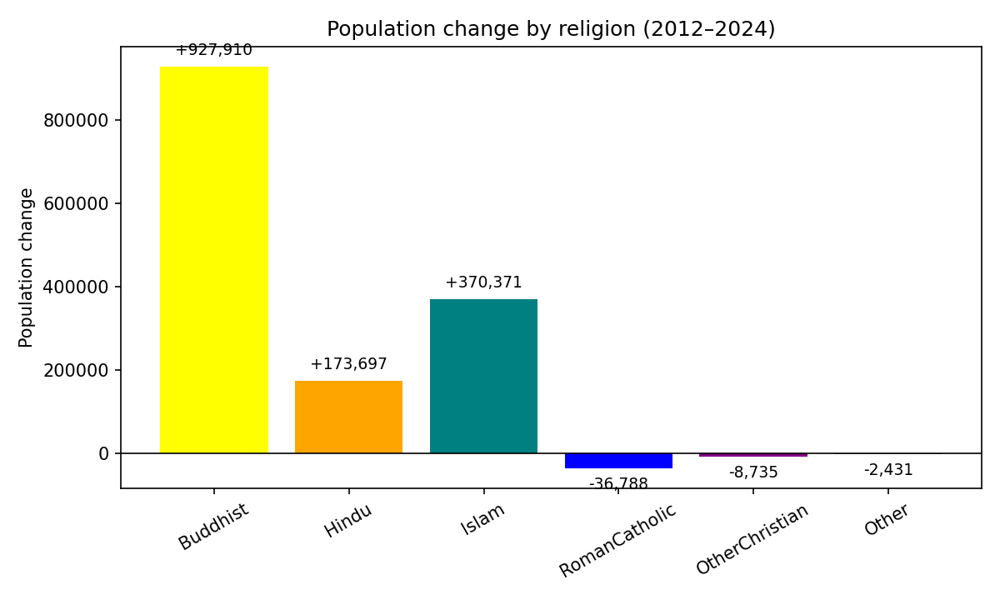
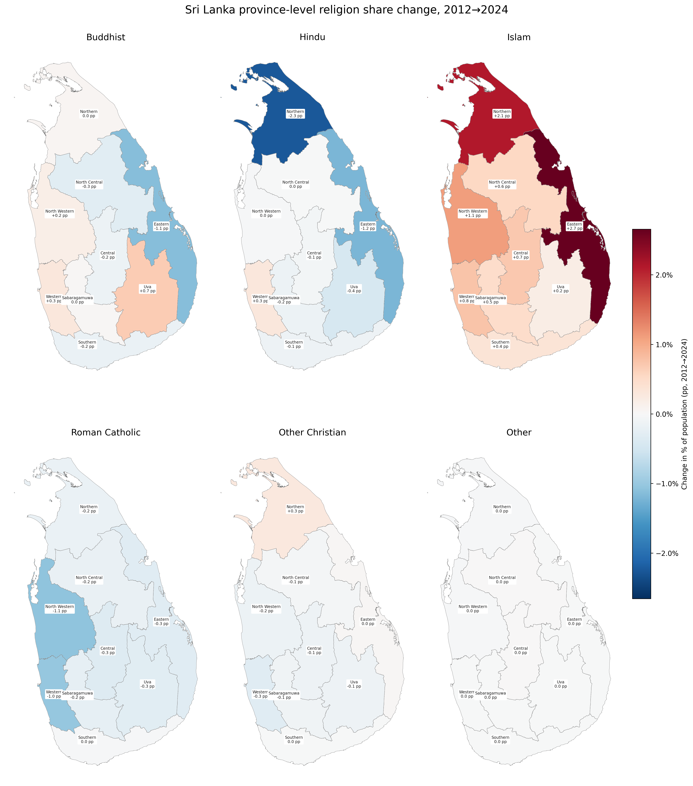
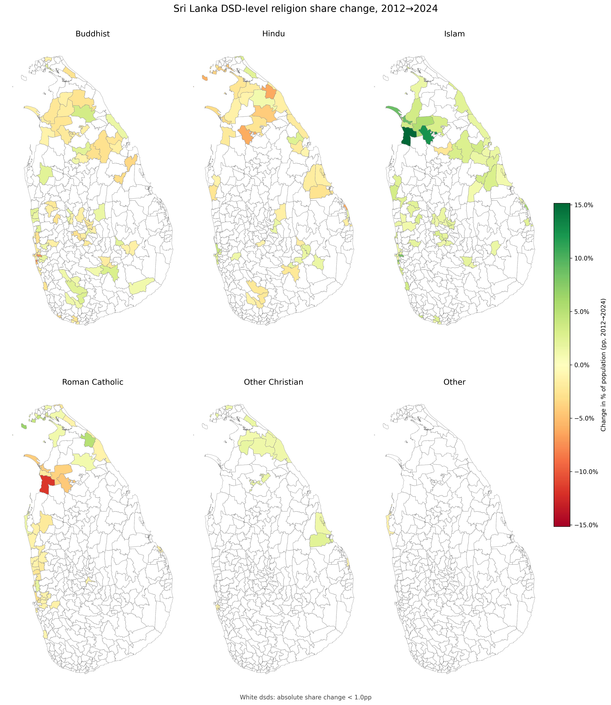

# lk_religion

Analyses of Sri Lanka's religious demographics, comparing the **2012 Census** and **2024 Census**.

Each analysis now lives in its own folder under [`analyses/`](analyses/), together with its own README, workflow script, and related data files. The sections below are copied from those child READMEs.

- [`analyses/a0-national-population-by-religion/`](analyses/a0-national-population-by-religion/)
- [`analyses/a1-religion-by-country-key-trends/`](analyses/a1-religion-by-country-key-trends/)
- [`analyses/a2-religion-by-province-key-trends/`](analyses/a2-religion-by-province-key-trends/)
- [`analyses/a3-religion-by-district-key-trends/`](analyses/a3-religion-by-district-key-trends/)
- [`analyses/a4-religion-by-dsd-key-trends/`](analyses/a4-religion-by-dsd-key-trends/)

---

## A0. National Population by Religion

### Commentary

- Sri Lanka's total population grew from **20,357,776** (2012) to **21,781,800** (2024), an increase of **+1,424,024** at an annual rate of **+0.57%**.
- **Buddhism** remains the dominant religion, accounting for **69.8%** of the population in 2024, growing at **+0.53%** per year.
- **Islam** has the fastest growth rate among major religions at **+1.45%** per year, reaching a share of **10.7%** in 2024.
- **Roman Catholic** and **Other Christian** communities show slight declines over the period.

---

## A1. National Religion Share Change (pp)

### Commentary

- Sri Lanka's total population grew from **20,357,776** (2012) to **21,781,800** (2024), an increase of **+1,424,024** at an annual rate of **+0.57%**.
- **Islam** recorded the largest increase in national share at **+1.1pp**, reaching **10.7%** in 2024.
- **Roman Catholic** recorded the largest decline in national share at **-0.6pp**, with a 2024 share of **5.6%**.
- Religions with near-stable national shares (change within ±0.1pp): **Hindu**, **Other**.

---

## A2. Religion by Province: Key Trends

Province labels show the **province name** and **change in share of population (pp)**. Provinces are shaded by **change in share of population (pp)** from **blue (decline)** to **red (growth)**.

### Buddhist

***Uva** had the highest pp change at **+0.7pp**. **Eastern** had the lowest pp change at **-1.1pp**.*

### Hindu

***Western** had the highest pp change at **+0.3pp**. **Northern** had the lowest pp change at **-2.3pp**.*

### Islam

***Eastern** had the highest pp change at **+2.7pp**. **Uva** had the lowest pp change at **+0.2pp**.*

### Roman Catholic

***Northern** had the highest pp change at **-0.2pp**. **North Western** had the lowest pp change at **-1.1pp**.*

### Other Christian

***Northern** had the highest pp change at **+0.3pp**. **Western** had the lowest pp change at **-0.3pp**.*

### Other

*No provinces exceed the **0.1pp** share-change threshold.*

---

## A3. Religion by District: Key Trends

District labels show the **district name** and **change in share of population (pp)**. Districts are shaded by **change in share of population (pp)** from **blue (decline)** to **red (growth)**.

### Buddhist

***Puttalam** had the highest pp change at **+0.9pp**. **Trincomalee** had the lowest pp change at **-2.0pp**.*

### Hindu

***Nuwara Eliya** had the highest pp change at **+1.0pp**. **Mannar** had the lowest pp change at **-2.9pp**.*

### Islam

***Mannar** had the highest pp change at **+10.8pp**. **Jaffna** had the lowest pp change at **+0.3pp**.*

### Roman Catholic

***Mullaitivu** had the highest pp change at **+1.6pp**. **Mannar** had the lowest pp change at **-6.0pp**.*

### Other Christian

***Mullaitivu** had the highest pp change at **+1.2pp**. **Colombo** had the lowest pp change at **-0.5pp**.*

### Other

*No districts exceed the **0.1pp** share-change threshold.*

---

## A4. Religion by DSD: Key Trends

DSDs are shaded by **change in share of population (pp)** from **blue (decline)** to **red (growth)**. DSD labels are omitted due to map density.

*New, removed, and altered DSDs are excluded to avoid boundary-change artifacts.*

### Buddhist

***Vavuniya North** had the highest pp change at **+3.4pp**. **Dehiwala** had the lowest pp change at **-7.9pp**.*

### Hindu

***Wattala** had the highest pp change at **+3.9pp**. **Puthukkudiyiruppu** had the lowest pp change at **-6.2pp**.*

### Islam

***Musali** had the highest pp change at **+15.1pp**. **Rambewa** had the lowest pp change at **-2.3pp**.*

### Roman Catholic

***Delft** had the highest pp change at **+6.6pp**. **Musali** had the lowest pp change at **-11.8pp**.*

### Other Christian

***Koralai Pattu South** had the highest pp change at **+2.3pp**. **Dehiwala** had the lowest pp change at **-1.4pp**.*

### Other

***Palugaswewa** had the highest pp change at **+0.2pp**. **Kalpitiya** had the lowest pp change at **-1.2pp**.*

---

*Data from the 2012 and 2024 Sri Lanka Census, accessed via [lanka_data](https://pypi.org/project/lanka-data/). Raw data and derived tables live in the corresponding directories under [`analyses/`](analyses/).*
