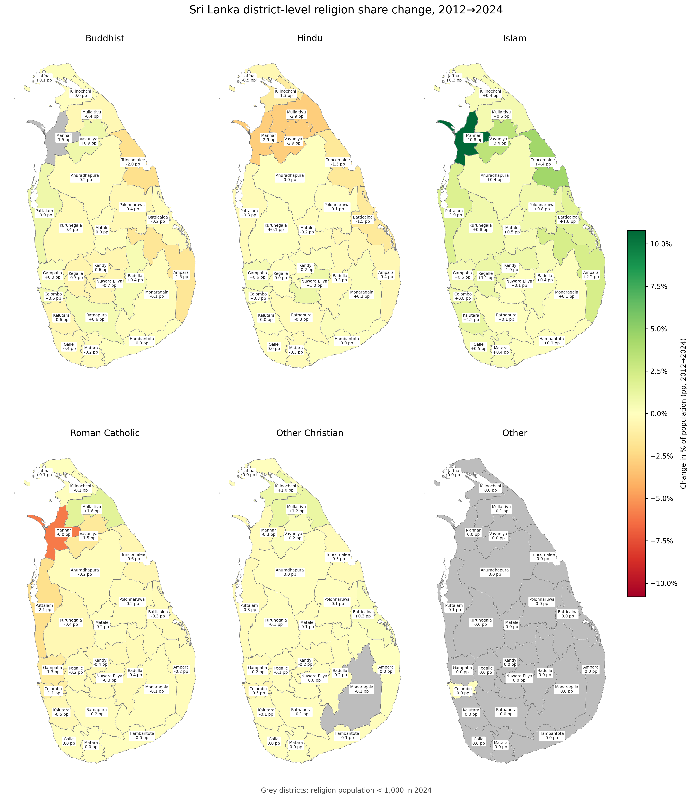

## A2. Religion by District: Key Trends

District labels show the **district name** and **change in share of population (pp)**. Districts are shaded by **change in share of population (pp)** from **red (decline)** to **green (growth)**. Districts with absolute share change **< 1.0pp** are shown in **white**.

Tables list only rows where absolute share change is **> 1.0pp**.

### Buddhist

| District | % of Population (2012) | % of Population (2024) | Change in % of Population (pp) | 2012 | 2024 | Change |
|---|---:|---:|---:|---:|---:|---:|
| Mannar `LK-42` | 1.8% | 0.3% | -1.5pp 🟥 | 1,809 | 382 | -1,427 🟥 |
| Ampara `LK-52` | 38.7% | 37.1% | -1.6pp 🟥 | 251,427 | 276,176 | +24,749 🟩 |
| Trincomalee `LK-53` | 26.2% | 24.1% | -2.0pp 🟥 | 99,344 | 106,919 | +7,575 🟩 |

***Trincomalee** saw the steepest share decline at **-2.0pp**. **Ampara** had the largest absolute increase (**+24,749**).*

### Hindu

| District | % of Population (2012) | % of Population (2024) | Change in % of Population (pp) | 2012 | 2024 | Change |
|---|---:|---:|---:|---:|---:|---:|
| Kilinochchi `LK-45` | 81.9% | 80.7% | -1.3pp 🟥 | 92,986 | 110,258 | +17,272 🟩 |
| Batticaloa `LK-51` | 64.4% | 62.9% | -1.5pp 🟥 | 338,882 | 374,836 | +35,954 🟩 |
| Trincomalee `LK-53` | 25.9% | 24.4% | -1.5pp 🟥 | 98,442 | 108,050 | +9,608 🟩 |
| Mullaitivu `LK-44` | 75.3% | 72.4% | -2.9pp 🟥 | 69,377 | 88,738 | +19,361 🟩 |
| Vavuniya `LK-43` | 69.4% | 66.5% | -2.9pp 🟥 | 119,400 | 114,504 | -4,896 🟥 |
| Mannar `LK-42` | 24.1% | 21.2% | -2.9pp 🟥 | 24,027 | 26,214 | +2,187 🟩 |

***Mannar** saw the steepest share decline at **-2.9pp**. **Batticaloa** had the largest absolute increase (**+35,954**).*

### Islam

| District | % of Population (2012) | % of Population (2024) | Change in % of Population (pp) | 2012 | 2024 | Change |
|---|---:|---:|---:|---:|---:|---:|
| Mannar `LK-42` | 16.6% | 27.4% | +10.8pp 🟩 | 16,512 | 33,883 | +17,371 🟩 |
| Trincomalee `LK-53` | 42.0% | 46.5% | +4.4pp 🟩 | 159,418 | 205,664 | +46,246 🟩 |
| Vavuniya `LK-43` | 7.0% | 10.3% | +3.4pp 🟩 | 11,972 | 17,775 | +5,803 🟩 |
| Ampara `LK-52` | 43.4% | 45.7% | +2.2pp 🟩 | 281,987 | 339,896 | +57,909 🟩 |
| Puttalam `LK-62` | 19.7% | 21.6% | +1.9pp 🟩 | 150,404 | 176,963 | +26,559 🟩 |
| Batticaloa `LK-51` | 25.5% | 27.1% | +1.6pp 🟩 | 134,065 | 161,494 | +27,429 🟩 |
| Kalutara `LK-13` | 9.4% | 10.6% | +1.2pp 🟩 | 114,556 | 138,230 | +23,674 🟩 |
| Kegalle `LK-92` | 7.3% | 8.3% | +1.1pp 🟩 | 61,164 | 72,616 | +11,452 🟩 |

***Mannar** gained the most share at **+10.8pp**. **Kegalle** had the smallest share gain at **+1.1pp**. **Ampara** had the largest absolute increase (**+57,909**).*

### Roman Catholic

| District | % of Population (2012) | % of Population (2024) | Change in % of Population (pp) | 2012 | 2024 | Change |
|---|---:|---:|---:|---:|---:|---:|
| Mullaitivu `LK-44` | 9.8% | 11.4% | +1.6pp 🟩 | 9,063 | 13,982 | +4,919 🟩 |
| Colombo `LK-11` | 7.0% | 5.9% | -1.1pp 🟥 | 162,260 | 139,882 | -22,378 🟥 |
| Gampaha `LK-12` | 19.5% | 18.2% | -1.3pp 🟥 | 449,398 | 442,291 | -7,107 🟥 |
| Vavuniya `LK-43` | 8.9% | 7.4% | -1.5pp 🟥 | 15,305 | 12,785 | -2,520 🟥 |
| Puttalam `LK-62` | 31.5% | 29.4% | -2.1pp 🟥 | 240,221 | 240,975 | +754 🟩 |
| Mannar `LK-42` | 52.6% | 46.6% | -6.0pp 🟥 | 52,415 | 57,713 | +5,298 🟩 |

***Mullaitivu** gained the most share at **+1.6pp**. **Mannar** saw the steepest share decline at **-6.0pp**. **Mannar** had the largest absolute increase (**+5,298**).*

### Other Christian

| District | % of Population (2012) | % of Population (2024) | Change in % of Population (pp) | 2012 | 2024 | Change |
|---|---:|---:|---:|---:|---:|---:|
| Mullaitivu `LK-44` | 4.0% | 5.2% | +1.2pp 🟩 | 3,664 | 6,315 | +2,651 🟩 |

***Mullaitivu** gained the most share at **+1.2pp**.*

### Other

| District | % of Population (2012) | % of Population (2024) | Change in % of Population (pp) | 2012 | 2024 | Change |
|---|---:|---:|---:|---:|---:|---:|

*No regions exceed the table share-change threshold.*
