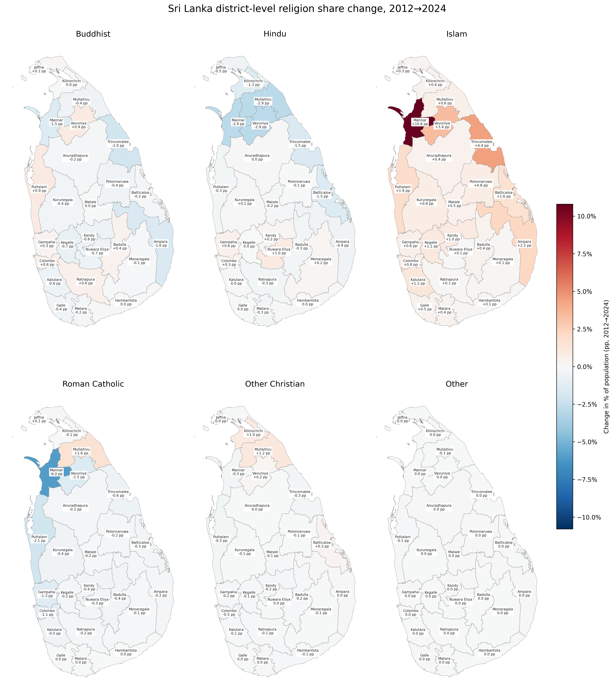

## A3. Religion by District: Key Trends

District labels show the **district name** and **change in share of population (pp)**. Districts are shaded by **change in share of population (pp)** from **blue (decline)** to **red (growth)**.

### Buddhist

***Puttalam** had the highest pp change at **+0.9pp**. **Trincomalee** had the lowest pp change at **-2.0pp**.*

### Hindu

***Nuwara Eliya** had the highest pp change at **+1.0pp**. **Mannar** had the lowest pp change at **-2.9pp**.*

### Islam

***Mannar** had the highest pp change at **+10.8pp**. **Jaffna** had the lowest pp change at **+0.3pp**.*

### Roman Catholic

***Mullaitivu** had the highest pp change at **+1.6pp**. **Mannar** had the lowest pp change at **-6.0pp**.*

### Other Christian

***Mullaitivu** had the highest pp change at **+1.2pp**. **Colombo** had the lowest pp change at **-0.5pp**.*

### Other

*No districts exceed the **0.1pp** share-change threshold.*
