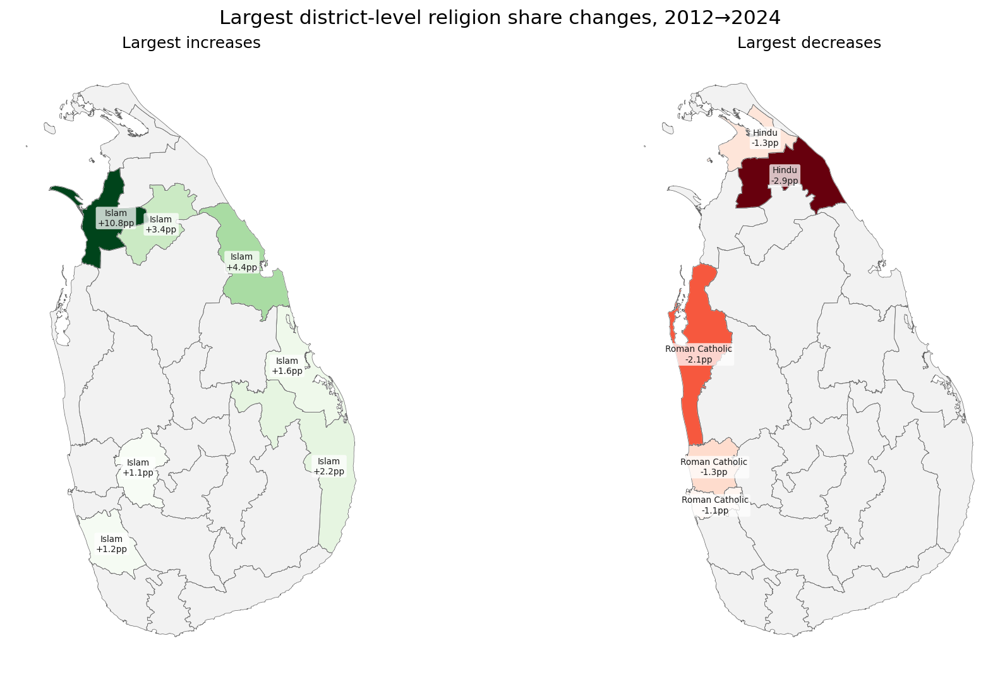

## A3. Largest Change in Religious Proportion

For each district, the religion whose share of the local population changed most between 2012 and 2024.

### By District

| District | Religion | Share 2012 | Share 2024 | Change |
|---|---|---:|---:|---:|
| Mannar | Islam | 16.6% | 27.4% | +10.8% 🟩 |
| Trincomalee | Islam | 42.0% | 46.5% | +4.4% 🟩 |
| Vavuniya | Islam | 7.0% | 10.3% | +3.4% 🟩 |
| Mullaitivu | Hindu | 75.3% | 72.4% | -2.9% 🟥 |
| Ampara | Islam | 43.4% | 45.7% | +2.2% 🟩 |
| Puttalam | RomanCatholic | 31.5% | 29.4% | -2.1% 🟥 |
| Batticaloa | Islam | 25.5% | 27.1% | +1.6% 🟩 |
| Gampaha | RomanCatholic | 19.5% | 18.2% | -1.3% 🟥 |
| Kilinochchi | Hindu | 81.9% | 80.7% | -1.3% 🟥 |
| Kalutara | Islam | 9.4% | 10.6% | +1.2% 🟩 |
| Colombo | RomanCatholic | 7.0% | 5.9% | -1.1% 🟥 |
| Kegalle | Islam | 7.3% | 8.3% | +1.1% 🟩 |
| Kandy | Islam | 14.3% | 15.3% | +1.0% 🟩 |
| Nuwara Eliya | Hindu | 51.0% | 52.0% | +1.0% 🟩 |
| Kurunegala | Islam | 7.3% | 8.1% | +0.8% 🟩 |
| Polonnaruwa | Islam | 7.5% | 8.3% | +0.8% 🟩 |
| Ratnapura | Buddhist | 86.7% | 87.3% | +0.6% 🟩 |
| Galle | Islam | 3.7% | 4.2% | +0.5% 🟩 |
| Matale | Islam | 9.4% | 9.9% | +0.5% 🟩 |
| Jaffna | Hindu | 82.8% | 82.3% | -0.5% 🟥 |
| Badulla | Buddhist | 72.6% | 73.0% | +0.4% 🟩 |
| Anuradhapura | Islam | 8.3% | 8.7% | +0.4% 🟩 |
| Matara | Islam | 3.1% | 3.6% | +0.4% 🟩 |
| Monaragala | Hindu | 2.7% | 2.8% | +0.2% 🟩 |
| Hambantota | Islam | 2.5% | 2.7% | +0.1% 🟩 |
