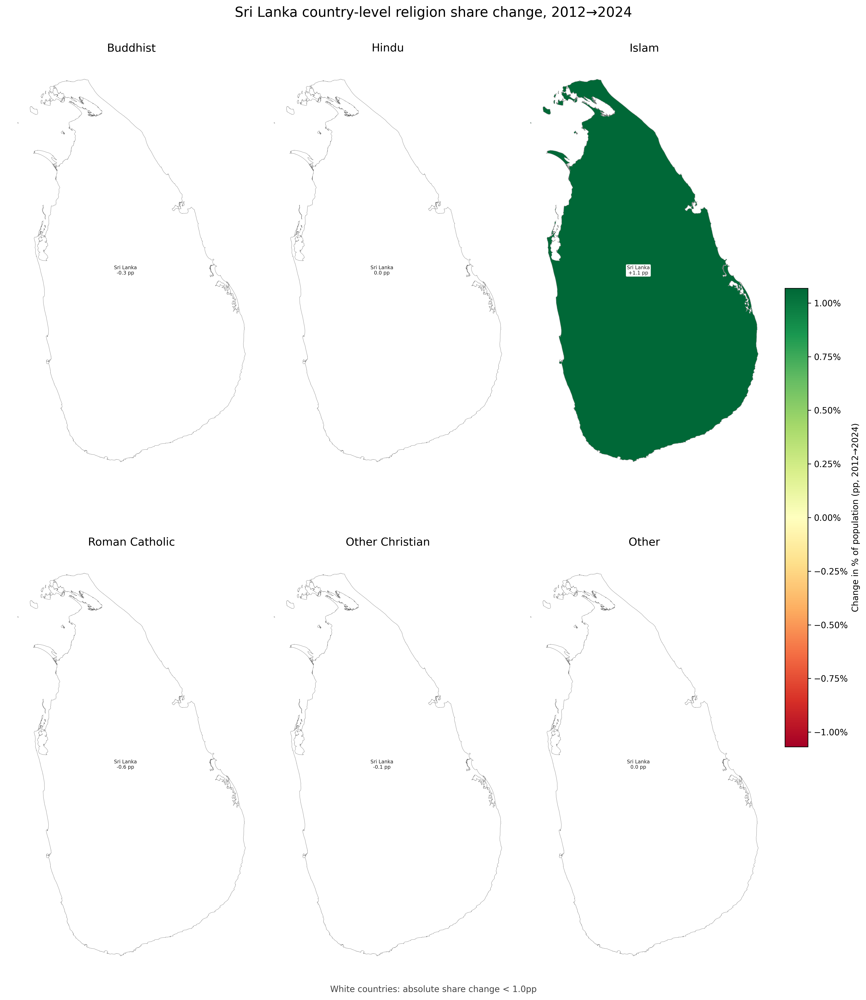

## A8. Religion by Country: Key Trends

Country labels show the **country name** and **change in share of population (pp)**. Countries are shaded by **change in share of population (pp)** from **red (decline)** to **green (growth)**. Countries with absolute share change **< 1.0pp** are shown in **white**.

Tables list only rows where absolute share change is **> 1.0pp**.

### Buddhist

| Country | % Nationally | % of Population (2012) | % of Population (2024) | Change in % of Population (pp) | 2012 | 2024 | Change |
|---|---:|---:|---:|---:|---:|---:|---:|

*No regions exceed the table share-change threshold.*

### Hindu

| Country | % Nationally | % of Population (2012) | % of Population (2024) | Change in % of Population (pp) | 2012 | 2024 | Change |
|---|---:|---:|---:|---:|---:|---:|---:|

*No regions exceed the table share-change threshold.*

### Islam

| Country | % Nationally | % of Population (2012) | % of Population (2024) | Change in % of Population (pp) | 2012 | 2024 | Change |
|---|---:|---:|---:|---:|---:|---:|---:|
| Sri Lanka `LK` | 100.0% | 9.7% | 10.7% | +1.1pp 🟩 | 1,967,008 | 2,337,379 | +370,371 🟩 |

***Sri Lanka** gained the most share at **+1.1pp**.*

### Roman Catholic

| Country | % Nationally | % of Population (2012) | % of Population (2024) | Change in % of Population (pp) | 2012 | 2024 | Change |
|---|---:|---:|---:|---:|---:|---:|---:|

*No regions exceed the table share-change threshold.*

### Other Christian

| Country | % Nationally | % of Population (2012) | % of Population (2024) | Change in % of Population (pp) | 2012 | 2024 | Change |
|---|---:|---:|---:|---:|---:|---:|---:|

*No regions exceed the table share-change threshold.*

### Other

| Country | % Nationally | % of Population (2012) | % of Population (2024) | Change in % of Population (pp) | 2012 | 2024 | Change |
|---|---:|---:|---:|---:|---:|---:|---:|

*No regions exceed the table share-change threshold.*
